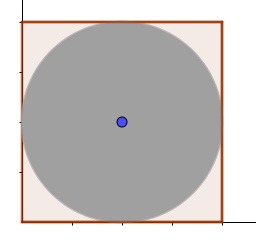
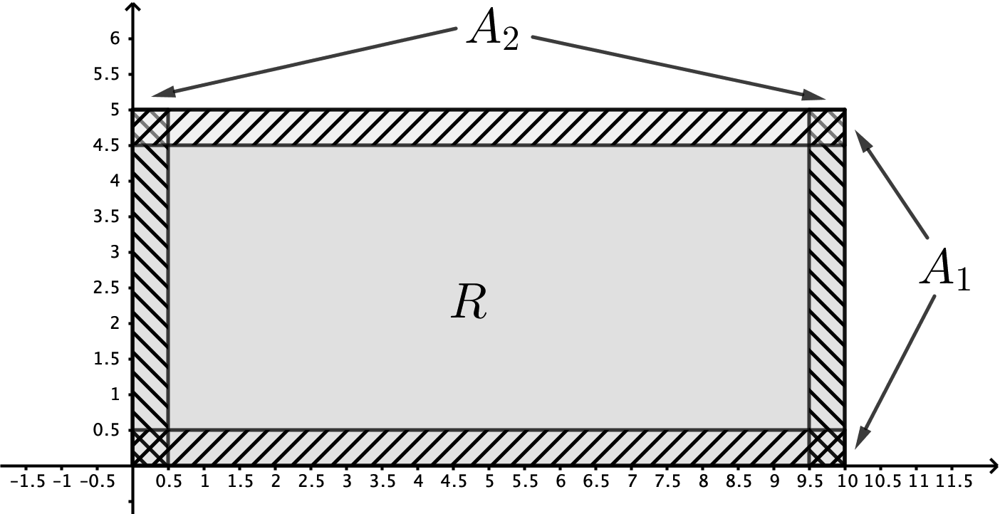

# Bogus chapter

# Experiments with random outcomes {#chap:randomoutcomes}

**Chapter outcomes**

At the end of the chapter you should:

- Know the definitions of sample space, sample point, event and probability measure.
- Be able to analyse and then formulate problems in terms of sample spaces, events and probability measures.
- Be able to select and apply appropriate theory to determine probabilities.


**Chapter Statistician: Florence Nightingale**

Although Florence Nightingale is remembered for her role in founding the modern nursing profession, she was a gifted mathematician being described as `a true pioneer in the graphical representation of statistics'.  She used the graphical representations in presentations to Parliament and civil servants. Her work improved public health through, for example, the Public Health Acts of 1874 and 1875. In 1859, she was elected a member of the Royal Statistical Society. In 1874, she became an honorary member of the American Statistical Association.
```{r, out.width = "30%", fig.align='center', fig.cap="Florence Nightingale", echo=FALSE} 
knitr::include_graphics('images/ST111_Florence_Nightingale_(H_Hering_NPG_x82368).jpg')
```
Image available [online](https://en.wikipedia.org/wiki/File:Florence_Nightingale_(H_Hering_NPG_x82368).jpg).
Image licence: The image is in the public domain.


## Chapter 1 content summary

The follow section outlines the key topics studied in this chapter.


#### Definitions {-}

An **experiment with a random outcome** is any procedure that involves making observations of something that is random and cannot be predicted precisely in advance.

The **sample space**, usually denoted by $\Omega$, is a set whose elements, called \emph{sample points}, each correspond to a possible outcome of the experiment.

An **event** is a property that the outcome of the experiment may or may not have. We identify events with the subset of $\Omega$ containing those sample points with the relevant property.

#### Set operations{-}

Sets provide a language to describe events


Event as a set  | Events as properties of the outcome 
|---------------|-------------------------------------|
|$A\cup B$      |  At least one of $A$ or $B$ occurs 
|$A\cap B$      |$A$ and $B$ both occur 
|$A^c$          |$A$ does not occur 
|$A\subseteq B$ |If $A$ occurs, then $B$ occurs


#### Probability in some simple experiments {-}

For a finite sample space where, for reasons of symmetry, we treat outcomes as equally likely we define the probability of an event $A$ by
\[
\mathbf{P}(A) = \frac{\mbox{number of sample points in }A}{\mbox{number of sample points in }\Omega}
\]
For the experiment of picking a point uniformly at random from a subset $\Omega$ of the plane, we define the probability of an event $A$ by
\[
\mathbf{P}(A) = \frac{\mbox{Area of } A}{\mbox{Area of }\Omega}
\]
Sampling from a large population consisting of individuals of type $a$ and individuals of type $b$ in the proportion $p:1-p$. We can take $\Omega = \{a, b\}$ and assign probabilities $\mathbf{P}(\{a\}) = p$ and $\mathbf{P}(\{b\}) = 1 - p.$

#### Definition of a probability measure. {-}
 
A probability measure on a sample space $\Omega$ is a function $A\mapsto \mathbf{P}(A)$ defined for some collection of events which are subsets of $\Omega$, that satisfies the following two properties.

1. For every event $A$ for which $\mathbf{P}(A)$ is defined, $0 \leq \mathbf{P}(A) \leq 1$, with $\mathbf{P}(\emptyset) = 0$ and $\mathbf{P}(\Omega) = 1$.

2. For a finite or infinite sequence of **mutually disjoint events** $A_1, A_2 , \dots , A_n , \dots$ for which $\mathbf{P}(A_i)$ is defined for all $i$,
\[
\mathbf{P} \left( \bigcup_{i=1}^n A_i\right) = \sum_{i=1}^n \mathbf{P} (A_i),
\]
and, in the case of an infinite sequence,
\[
\mathbf{P} \left( \bigcup_{i=1}^{\infty} A_i\right) = \sum_{i=1}^{\infty} \mathbf{P} (A_i).
\]


#### Interpretation of probability {-}

- _Frequentist:_ $\mathbf{P}(A)$ is the long run frequency of $A$ occurring in many repetitions of the experiment.
- _Bayesian:_ $\mathbf{P}(A)$ quantifies belief in $A$ occurring---as can be measured by considering betting odds.

#### Properties of probability measures {-}

1. $\mathbf{P}(A^c) = 1 - \mathbf{P}(A)$,
2. If $A\subseteq B$ then $\mathbf{P}(A) \leq \mathbf{P}(B)$.
3. $\mathbf{P}(A \cup B) = \mathbf{P}(A) + \mathbf{P}(B) - \mathbf{P}(A \cap B)$.
4. For general sequences of events that are not necessarily disjoint,
\[
\mathbf{P} \left( \bigcup_{i=1}^n A_i\right) \leq \sum_{i=1}^n \mathbf{P} (A_i),
\]
and, in the case of an infinite sequence,
\[
\mathbf{P} \left( \bigcup_{i=1}^{\infty} A_i\right) \leq \sum_{i=1}^{\infty} \mathbf{P} (A_i).
\]
5. The inclusion-exclusion formula:
\[
\mathbf{P} \left( \bigcup_{i=1}^{n} A_i\right) = \sum_{1\leq i \leq n} \mathbf{P} (A_i) - \sum_{1\leq i_1< i_2 \leq n} \mathbf{P} (A_{i_1} \cap A_{i_2}) + \sum_{1\leq i_1 < i_2 < i_3 \leq n} \mathbf{P} (A_{i_1} \cap A_{i_2} \cap A_{i_3}) - \dots
\]

## Class 1: Equally likely events {#sec:equallylikely}

### Introduction 

Probability is used to quantify uncertainty in the real world. Consider the following examples.

1. Roll a pair of dice, then the probability of outcome being a pair of sixes is $\frac{1}{36}$. On the other hand the probability of a total score of 11 is $\frac{1}{18}$. This statement was not obvious to the first mathematicians to study probability.
2. The probability of detecting an electron at varying locations in the two slit experiment. 
3. A lottery winner is accused of cheating based on the improbability of winning. At the trial, the prosecutor calculates the (very small) probability of winning the lottery without cheating and argues that this is the chance of innocence. Should the jury find this person guilty?
4. A crime-scene DNA sample is compared against a database of 20,000 people. A match is found, that person is accused. At his trial, it is testified that the probability that two DNA profiles matching by chance is only 1 in 10,000. Based on this evidence, should the jury find this man guilty?
5. During a trial, it is claimed that, for an affluent non-smoking family, the probability of a single cot death is 1 in 8,543, so the probability of two cot deaths in the same family is around "1 in 73 million" (8543 $\times$ 8543). Given that there are around 700,000 live births in Britain each year, an expert medical witness argues that a double cot death would be expected to occur once every hundred years. Based on this evidence, should the jury convict?

For a real life activity with an uncertain outcome, we build a mathematical model or representation, within which we calculate mathematical probabilities. These are then interpreted as descriptions of the uncertainty in the real world.

#### Interpreting probability {-}

How do we interpret what a probabilistic statement says about the real world? 

- _Frequentist interpretation_ In the frequentist interpretation we consider many repetitions of the activity with the uncertain outcome, and then there is some characteristic frequency with which a particular outcome tends to occur. This is known as the phenomenon of _statistical regularity_. For example in 36,000,000 rolls of dice we expect to see approximately 1,000,000 occurrences of double sixes. But note that the probability of getting exactly 1,000,000 sixes is actually very low, and there is even the possibility, although it is extremely unlikely indeed, of every roll resulting in a double six. So it's actually not straightforward to describe precisely what `statistical regularity' means. 
- _Bayesian or subjective interpretation_ An alternative interpretation is called Bayesian or subjective. This is more appropriate if it is not sensible to imagine repetitions. According to this interpretation probability quantifies a belief about uncertainty that can be tested by considering bets: would you rather bet on a situation happening or on rolling 9 or less on a pair of dice? However, different individuals may have different beliefs, and so this interpretation has the downside that it's not objective.

In order to build mathematical models for uncertainty, we formalise the setting so that  an experiment with a set of possible outcomes, one and only one of which will occur when the experiment is conducted.

#### Familiar examples in a formal setting {-}

Previous academic encounters with probability focus on the idea that probability is a ratio between _favourable outcomes_ and _possible outcomes_. We want to create formal mathematical models that codify outcomes, but the idea of "favourable outcomes" and "possible outcomes" is not precise enough and needs revisiting. One of the conceptual issues when revisiting establish methods and providing a rigorous reformulation is that it can seem that nothing is achieved. During the formalisation process, situation will arise that the _old_ setting cannot resolve.

:::{.definition}
The _sample space_, usually denoted by $\Omega$, is a set whose elements, called _sample points_, correspond to the possible outcomes of the experiment being considered.
:::


Choosing a sample space is about mathematically encoding the possible outcomes of the experiment.

:::{.example}
Determine the sample space and illustrate a sample point for the following.

1. Roll a pair of (standard) dice, where we can distinguish the dice and both contain 1 to 6 on their six faces.

2. More generally, roll a die $n$ times. 
:::


:::{.solution}
&nbsp;

1. Assuming the dice can be distinguished we can take  $\Omega = \{1, 2, 3, 4, 5, 6\}^2$ . A sample point  $\omega = (i, j)$ corresponds to the outcome that the roll on the first die results in $i$ and that on the second dice $j$.

2. We can take  $\Omega = \{1, 2,3, \dots , 6\}^n$ . Then a sample point is a sequence  $\omega = (\omega_1, \dots, \omega_n)$ whose terms are integers between 1 and 6. The outcome corresponding to a sample point  is the one in which the score obtained on the $k$th roll of the die is given by $\omega_k$.
:::


:::{.definition}
An _event_ is a property that the outcome of the experiment may or may not have. We identify an event with the subset of  $\Omega$ containing those sample points with the relevant property.
:::


:::{.example}
&nbsp;

1. Consider forty cards that are all labelled. From these cards 7 are labelled $W$, 6 are labelled $X$, 4 are labelled $Y$ and 8 are labelled $Z$. The remainder (15) are labelled using other letters of the alphabet. Suppose a card is drawn (uniformly) at random. Determine a representation for the sample space.

2. Formally write down the event that the randomly selected card is labelled $W$ or $X$.

3. Formally write down the event that the distance of a point selected at random from the unit disc is greater than $\frac{1}{2}$.
:::


:::{.solution}
&nbsp;

1. Note, the representation is not unique.The sample space $\Omega$ contains all card outcomes, but we cannot just use letters to denote outcomes; the set $\{W,W\}= \{W\}$, so we must distinguish the cards to create the sample space. There are many ways to accomplish this, for example, $(W,i)$ denotes the $i$th card labelled $W$, then two different cards $(W,i)$ and $(W,j)$ ($i\neq j$), although labelled identically are distinguished. 

2. This would be the subset of $\Omega$ contains only cards labelled $W$ or $X$ which would correspond to the property that the outcome is a card labelled $W$ or $X$; that is, using the above notation to describe $\Omega$, this event is the set
\begin{align*}
\{ & (W,1), (W,2), (W,3), (W,4), (W,5), (W,6), (W,7), \\
& (X,1), (X,2), (X,3), (X,4), (X,5), (X,6)\}.
\end{align*} 
3. The sample space is $\Omega = \{ (x,y) \in \mathbf{R}^2 :  x^2 + y^2 \leq 1 \}$. The event is the set
\begin{align*}
A &= \left\{ (x,y) \in \mathbf{R}^2 : \frac{1}{2} < \sqrt{ x^2 + y^2} \leq 1 \right\} \\
&= \left\{ (x,y) \in \mathbf{R}^2 : \frac{1}{4} < x^2 + y^2 \leq 1 \right\}.
\end{align*}
:::

Making an identification between a subset and the property that it represents allows us to manipulate events with set operations. There is a "dictionary":

Event as a set        | Events as properties of the outcome 
|---------------------|-------------------------------------|
|$A\cup B$            |  At least one of $A$ or $B$ occurs 
|$A\cap B$            |$A$ and $B$ both occur 
|$A^c$                |$A$ does not occur 
|$A\subseteq B$       |If $A$ occurs, then $B$ occurs
|$A \setminus B$      |$A$ occurs by $B$ does not.
|$A\cap B = \emptyset$|$A$ and $B$ are disjoint or mutally exclusive

You are asked to recall the following set properties. In the following $A$, $B$, $C$ and $A_1, A_2, \dots$ are sets.

- *Commutative law* $A \cup B = B \cup A$, $A\cap B = B \cap A$.
- *Associative law* $A \cup (B \cup C) = (A \cup B) \cup C$, $A \cap (B \cap C) = (A \cap B) \cap C$.
- *Distributive law* $A \cup (B \cap C) = (A \cup B) \cap (A \cup C)$, $A \cap (B \cup C) = (A \cap B) \cup (A \cap C)$.
- *De Morgan's laws* $(A \cap B)^c = A^c \cup B^c$, $(A \cup B)^c =A^c \cap B^c$. More generally
\[
\left(\bigcap_{i=1}^{\infty} A_i\right)^c = \left(\bigcup_{i=1}^{\infty} A_i^c\right)\quad 
\left(\bigcup_{i=1}^{\infty} A_i\right)^c = \left(\bigcap_{i=1}^{\infty} A_i^c\right)
\]


:::{.example}
Consider the throw of two standard fair six-sided dice one is red and one is green. (So the dice are numbered 1 to 6.) Let $\Omega$ be the sample space. Let $A$ be the event that the sum of the numbers on the two dice is 7. Let $B$ be the event that the number shown on the green die is less than or equal to 3.

Write down using suitable set-operations

1. The sum of the two dice is 7 and the green die shows no more than 3.

2. The sum of the two dice is not 7 and the green die shows more than 3.
:::

:::{.solution}
\ 

1. This is the event $A \cap B$.

2. This is the event $A^c \cap B^c$.
:::


### Equally likely events

Let $A$ and $B$ be events. We say that $A$ and $B$ are equally likely if $\mathbf{P}(A) = \mathbf{P}(B)$.

:::{.definition}
In situations where $\Omega$ is a finite set, and every outcome is considered equally likely (for reasons of symmetry typically) we define the probability of an event $A\subseteq \Omega$ to be
\[
\mathbf{P}(A) = \frac{|A|}{|\Omega|}
\]
where $|A|$ denotes the number of sample points belonging to $A$. Such probabilities are called the uniform probabilities on $\Omega$.
:::

:::{.example}
Consider rolling a dice $n$ times. The sample space  $\Omega = \{1, 2, \dots , 6\}^n$ contains $6^n$ sample points.

1. Determine the probability that the $k$th roll of the die results in a 6.

2. Determine the probability that at least one roll results in a 6.
:::


:::{.solution}
&nbsp;

1. For $k = 1, 2,\dots , n$ let $A_k = \{ \omega = (\omega_1 , \omega_2 , \dots , \omega_n )  : \omega_k = 6\}$. This is the event that $k$th roll of the die results in a 6. We have $|A_k | = 6^{n-1}$ (there are $n-1$ free choices), and taking the probabilities to be uniform we have
\[
\mathbf{P}(A_k ) = \frac{|A_k |}{\Omega} = \frac{6^{n-1}}{6^n} = \frac{1}{6},
\]
as we would expect.

2. For $k = 1, 2,\dots , n$ let $A_k = \{ \omega = (\omega_1 , \omega_2 , \dots , \omega_n )  : \omega_k = 6\}$. The set $B=\displaystyle\bigcup_{k=1}^n A_k$ is the event that at least one roll results in a 6. We must determine 
\[
\mathbf{P}\left(B \right) 
= 
\frac{\left|B \right|}{|\Omega|}.
\]
Note that that number of elements of $\Omega$ not in $B$ is
\[
B^c = 
\left(
\bigcup_{k=1}^n A_k
\right)^c
=
\bigcap_{k=1}^n A_k^c.
\]
The event $A_k^c$ is the event that the $k$th roll is not a 6 and thus $\displaystyle\bigcap_{k=1}^n A_k^c$ is the event that no roll results in a 6. The number of sample points is $5^n$; that is, there are $n$ choices of which we may select $1,2,3,4,5$. Thus
\[
\mathbf{P} \left(
B
\right)
=
\frac{|\Omega| - \left|B^c \right|}{|\Omega|}
=
\frac{6^n - 5^n}{6^n} = 1 - \left( \frac{5}{6} \right)^{n}.
\]
:::


### Class 1 Exercises

:::{.exercise #cards40}
Consider forty cards that are all labelled. From these cards 7 are labelled $W$, 6 are labelled $X$, 4 are labelled $Y$ and 8 are labelled $Z$. The remainder (15) are labelled using other letters of the alphabet. Suppose a card is drawn (uniformly) at random. Formally write down the following events:

1. The randomly selected card shows a "W" and "X".

2. The randomly selected card does not show a "W".
:::

:::{.exercise #dice1}
Consider a (standard) dice and roll the dice once. Formally write down the event: if the dice shows a "2" or "4", then the dice also shows an even number.
:::

:::{.exercise #dice2}
Suppose that a fair die is rolled once. Let 

1. $A$ be the event that an even number is obtained.

2. $B$ be the event that an odd number is obtained.

3. $C$ be the event that a prime number is obtained.

4. $D$ be the event that the number obtained is divisible by 3.

Let $E_k$ be the event that the number `k' is obtained, where $k=1,2, \dots 6$. Express $E_k$, for $k=1, 2, \dots 6$ in terms of the events $A$, $B$, $C$ or $D$.
:::

:::{.exercise #dice3}
Consider rolling a dice $n$ times. The sample space  $\Omega = \{1, 2, \dots , 6\}^n$ contains $6^n$ sample points. Determine the probability that every roll results in a 6.
:::

:::{.exercise #integer}
An integer is selected at random from 1 to 50 inclusive. Determine the probability that the selected integer is divisible by 12. 
:::


## Class 2: Beyond equally likely events

We have described how probabilities are defined on a sample space when its appropriate to model all outcomes as being equally likely---uniform probabilities. We look to extend this idea to other situations.

### Motivating examples 


:::: {.example}
Suppose a population consists of $n$ individuals, each of whom has one of $k$ possible types. There are
$n_i$ individuals of type $i$ with $n = n_1 + n_2 + \dots + n_k$. If an individual is chosen uniformly at random then the probability they are of type $i$ is given by the proportion $p_i = \frac{n_i}{n}$.
::::


:::{.solution}
We may only be concerned with observing the type of the individual chosen and thus represent the experiment with the sample space $\Omega = \{1 , 2 , \dots , k \}$, where the sample point $i$ corresponds to the outcome that the chosen individual is of type $i$. On this
sample space we should not use uniform probabilities but rather if $A\subseteq \Omega$  then the probability that $A$
occurs is the proportion of the population that have the corresponding types and
\[
\mathbf{P}(A) = \sum_{\omega_i \in A} p_i.
\]
For example, suppose we have 1000 individuals, with $126$ of type 1, $357$ of type 2 and $517$ of type 3. Then the probability of $A=\{1,2\}$ is
\[
\mathbf{P}(A) = \frac{126}{1000} + \frac{357}{1000} = \frac{483}{1000}.
\]
:::

:::: {.example}
Suppose we break an (idealised) stick of length $L$ into two pieces by snapping at a position $x$ measured from a fixed end. We can
take as the sample space $\Omega = \{x\in \mathbf{R} : 0  \leq x  \leq L\}.$ Pick positions $a$ and $b$ with $0  \leq a \leq b \leq L$. Some motivational questions are

1. What should the probability be that the break occurs between $a$ and $b$?

2. Determine the probability of snapping the stick exactly in half.

3. Suppose we snap the stick at two points. How could we model this?
::::


:::{.solution}
&nbsp;

1. If we break the stick uniformly at random then this probability could be modelled as being given by the proportion of the total stick length that lies between $a$ and $b$, so if $A = [a, b]$  then
\[
\mathbf{P}(A) = \frac{\mbox{length}(A)}{L}.
\]

2. By taking $a = b$ in the previous formula we deduce that $\mathbf{P}(\{a\}) = 0$ for every $a$. 

3.  One reasonable possibility (there are many others!) is to take the sample space to be $\Omega= \{(x, y)\in  \mathbf{R}^2 : 0\leq x\leq L,\ 0\leq y\leq L\}$, with probabilities given by
\[
\mathbf{P}(A) = \frac{\mbox{area}(A)}{L^2}.
\]
:::

### Probability measures 

Notice that in all our examples probabilities have been given by proportions, and given by real
numbers between 0 and 1. In general probabilities are assigned to events. The stick breaking example
shows it's not enough to just consider the probabilities of sample points. The question that arises is:


_What properties must a function $A\mapsto \mathbf{P}(A)$ possess in order for it to be meaningfully be able to be interpreted as specifying probabilities?_


For example, if   $A\subseteq\Omega \subseteq \mathbf{R}^2$, would the function
\[
\mathbf{P}(A) = \left(
\frac{\mbox{area}(A)}{\mbox{area}(\Omega)}
\right)^2
\]
make sense as probabilities, where the areas are defined?

The next definition formalises the properties we expect.

:::{.definition}
A _probability measure_ on a sample space $\Omega$ is a real-valued function $A\mapsto \mathbf{P}(A)$ defined
on a collection of subsets of $\Omega$ that satisfies the following properties.

1. For all $A$, for which $\mathbf{P}(A)$ is defined, $0\leq \mathbf{P}(A) \leq 1$. Moreover $\mathbf{P}(\emptyset) = 0$ and $\mathbf{P}(\Omega) = 1$.

2. (Additivity) For a finite or infinite sequence of mutually disjoint events $A_1, A_2 , \dots,$
\[
\mathbf{P} \left( \bigcup_{i=1}^n A_i\right) = \sum_{i=1}^n \mathbf{P} (A_i),
\]
and, in the case of an infinite sequence,
\[
\mathbf{P} \left( \bigcup_{i=1}^{\infty} A_i\right) = \sum_{i=1}^{\infty} \mathbf{P} (A_i).
\]
in the finite and infinite cases respectively.
:::

Recall, the sets $A_1, A_2, \dots A_n , \dots$ are mutually disjoint if $A_i  \cap A_j = \emptyset$  whenever $i \neq j$. 

(We provide some additional comments on this definition in the class footnotes, specifically regarding the
definition^[
**Comments on the definition of probability measure** For finite or countably infinite $\Omega$, probabilities will be defined on all subsets of $\Omega$; but this will not be so for uncountably infinite sample spaces. Indeed length, area and volume cannot be defined for all subsets of $\mathbf{R}$, $\mathbf{R}^2$ and $\mathbf{R}^3$ without generating paradoxes. Sets for which length, area or volume can be defined are called _measurable_ and includes all sets that you will come across in practice.If these comments interest you, then look up the Banach--Tarski theorem, von Neumann paradox or a Vitali set.
]
and additivity^[
**Some comments on additivity** For a finite or countably infinite sample space additivity implies, by forming
a sequence from the sample points, that the probability of any event is the sum of the probabilities of the sample points it contains. For an uncountably infinite sample space we cannot make the same argument because we cannot make a sequence of all the sample points in a general event. Additivity for infinite sequences of events is very useful in uncountable sample spaces though. For example it allows us to argue that the area of a disc can be calculated by covering the disc with an infinite sequence of rectangles of decreasing size, and computing the sum of their areas. As an example of additivity failing to hold we can consider the following attempt to define probabilities:
\[
\mathbf{P}(A) = \lim_{n\rightarrow \infty} \frac{1}{n} |A \cap \{1, 2, \dots , n\}|
\]
for any $A\subseteq \mathbf{N}$ for which the limit exists. This looks like it might define appropriate probabilities for choosing a random number `uniformly from $\mathbf{N}$'--- but such a notion is not useful. Indeed, if we could define such an idea, then if $B_i=\{i\}$, then $\mathbf{P}(B_i)=\mathbf{P}(B_j)$ for any $i$, $j$ (the probability is meant to be uniform). Specifically, $\mathbf{P}(B_i) = \mathbf{P}(B_1)$. Suppose $\mathbf{P}(B_1) =p > 0$. Then for some natural number $n$, additivity implies the probability of the event  that a number between 1 and $n$ is selected must exceed $1$. (Eventually, $np>1$ no matter how small $p$ is.)
].)

:::{.example}
The sample point $(x,y)\in \Omega$ corresponds to the outcome in which the dart lands at the point $(x,y)$. Probabilities are assigned to events so that they are proportional to the area of the corresponding subset of $\Omega$.  Determine the probability that the point lies in one of the four regions outside the circle and inside the square.
::::

:::{.solution}
A diagram is presented on Figure \@ref(fig:sqcircle).

```{r sqcircle, out.width = "30%", fig.align='center', fig.cap = 'Geometry of circle and square', echo=FALSE} 

```

Let $L$ be the side length of the square. Let $\Omega=\{ (x,y) \in \mathbf{R}^2 \mid 0\leq x \leq L \mbox{ and } 0 \leq y \leq L\}$. Probabilities are assigned to events so that they are proportional to the area of the corresponding subset. Let $A$ be the event $\left\{ (x,y) \in \Omega \mid (x - \frac{L}{2})^2 + (y - \frac{L}{2})^2 \geq \frac{L^2}{4} \right\}$. That is, $A$ is the set of points in the four shaded regions. Then
\[
\mathbf{P}(A) = \frac{ \mbox{Area A} }{\mbox{Area }\Omega} = \frac{L^2 - \pi \left(\frac{L}{2}\right)^2}{L^2} = 1 - \frac{\pi}{4}.
\]
:::


:::{.theorem #propertiesofmeasures}
For any probability measure the following properties hold. (We assume the probabilities are defined.)

1. For any $A$, $\mathbf{P}(A^c) = 1 - \mathbf{P}(A)$.

2. If $A\subseteq B$ then $\mathbf{P}(A) \leq \mathbf{P}(B)$.

3. For any two events $A$ and $B$, not necessarily disjoint,
\[
\mathbf{P}(A \cup B) = \mathbf{P}(A) + \mathbf{P}(B) - \mathbf{P}(A \cap B).
\]

4. For a general sequence of events $A_1 , A_2 , \dots,$ not necessarily disjoint,
\[
\mathbf{P} \left( \bigcup_{i=1}^n A_i \right) \leq \sum_{i=1}^n \mathbf{P} (A_i),
\]
and, 
\[
\mathbf{P} \left( \bigcup_{i=1}^{\infty} A_i \right) \leq \sum_{i=1}^{\infty} \mathbf{P} (A_i).
\]
for finite and infinite sequences respectively.
:::

:::{.proof}
&nbsp;

1. Note that $A$ and $A^c$ are disjoint, $A\cap A^c = \emptyset$ and $A\cup A^c = \Omega$. By additivity $\mathbf{P}(A^c ) + \mathbf{P}(A) = \mathbf{P}(\Omega)$, and this latter probability is equal to 1 by definition of a probability measure.

2. If $A \subseteq B$ then we can write $B = A \cup (B \cap A^c )$ and since $A$ and $B\cap A^c$ are disjoint we have by
additivity that $\mathbf{P}(B) = \mathbf{P}(A) + \mathbf{P}(B \cap A^c )$. The desired inequality follows since $P(B \cap A^c ) \geq 0$.

3. Let $A_1 = A \cap B^c$ , $B_1 = B \cap  A^c$ and $C = A \cap B$ (draw a Venn diagram). Then these three sets are disjoint and their union
is $A \cup B$, so by additivity,
\[
\mathbf{P}(A \cup B) = \mathbf{P}(A_1 ) + \mathbf{P}(B_1 ) + \mathbf{P}(C).
\]
We also have $A = A_1 \cup C$ and $B = B_1 \cup C$ which gives
\[
\mathbf{P}(A) = \mathbf{P}(A_1 ) + \mathbf{P}(C)
\]
and
\[
\mathbf{P}(B) = \mathbf{P}(B_1 ) + \mathbf{P}(C)
\]
Substituting from these two equations into the previous equation for $\mathbf{P}(A \cup B)$ so as to eliminate
$\mathbf{P}(A_1 )$ and $\mathbf{P}(B_1 )$ gives the result.

4. (Taking motivation from definition of $B$ above.) Let $B_1 = A_1$ and then for $k\geq  2$,
\[
B_k = A_k \cap (A_1\cup  A_2 \cup \dots \cup  A_{k-1} )^c
\]
then $B_1 , B_2 , \dots$ form a sequence of disjoint events, and $\displaystyle \bigcup_{i=1}^n A_i = \displaystyle \bigcup_{i=1}^n B_i$ , so by additivity
\[
\mathbf{P}\left(
\bigcup_{i=1}^n A_i 
\right)
=
\mathbf{P}\left(
\bigcup_{i=1}^n B_i 
\right)
=
\sum_{i=1}^n \mathbf{P}(B_i) 
\leq 
\sum_{i=1}^n \mathbf{P}(A_i) 
\]
where the last inequality follows by applying the property $A\subseteq B$ then $\mathbf{P}(A) \leq \mathbf{P}(B)$ since $B_i \subseteq A_i$ for every $i$. For an infinite sequence of events the argument is the same.
:::

::::{.example}
Ten players enter a tournament in which they each play each other player once. Assume all outcomes are equally likely and there are no ties. Determine the probability that some player wins all their games?
::::


:::{.solution}
First note that we can count the games that get played by considering the set $\{(i, j) : 1 \leq i < j \leq 10\}$
which has 45 elements; that is, $\frac{1}{2}(9\times 10)$, the 10 players play 9 games because they do not play themselves. A game between player $i$ and player $j$ has two outcomes (we assume no ties
here!) and so the sample space contains $2^{45}$ sample points. 

Let $A_i$ denote for $i = 1, 2, \dots , 10$, the event
that player $i$ wins all their games. A tournament outcome such that $A_i$ occurs consists 9 games where
the result is determined (player $i$ wins all their games) and 36 games where the result isn't determined. So $|A_i | = 2^{45-9} = 2^{36}$,
and consequently $\mathbf{P}(A_i ) = \frac{2^{36}}{2^{45}} = 2^{-9}$ . 

The event that some player wins all their games is
\[
E=
\bigcup_{i=1}^{10}
A_i
\]
and the key observation to make is that $A_i  \cap A_j = \emptyset$ whenever $i \neq j$ because it is impossible for both $i$
and $j$ to win the game that takes place between the two of them. Consequently
\[
\mathbf{P}(E) = \sum_{i=1}^{10} \mathbf{P}(A_i ) = 10\times 2^{-9}.
\]
:::


:::{.example}
Let $\Omega$ be a sample space of an experiment. Suppose $| \Omega | = n$. Suppose for every $\omega_1, \omega_2 \in \Omega$ that events $\{ \omega_1 \}$ and $\{ \omega_2 \}$ are equally likely. Prove using the properties of probability measures that for any $\omega \in \Omega$, $\mathbf{P}(\{\omega\}) = \frac{1}{| \Omega |}$.
::::


:::{.solution}
Write $\Omega = \{ \omega_1, \dots \omega_n \}$. Then $\Omega = \cup_{i=1}^n \{ \omega_i \}$. The properties of a probability measures imply
\begin{align*}
1 &= \mathbf{P} (\Omega) \\
&= \mathbf{P} \left( \cup_{i=1}^n \{ \omega_i \} \right) \\
&= \sum_{i=1}^n \mathbf{P}( \{ \omega_i \}) \quad \mbox{using additivity} \\
&= n\mathbf{P}( \{ \omega \})
\end{align*}
Here we have used the fact $\mathbf{P}(\{ \omega_1 \})=\mathbf{P}(\{ \omega_i \})$ for $i=1,2,\dots, n$. Therefore, 
\[
\mathbf{P}( \{ \omega_1 \} ) = \frac{1}{n}.
\]
Whence, $\mathbf{P}( \{ \omega_i \} ) = \mathbf{P}( \{ \omega_1 \} )= \frac{1}{n} = \frac{1}{| \Omega |}$, for $i=1,\dots n$.

Therefore, $\omega \in \Omega$, $\mathbf{P}(\omega) = \frac{1}{| \Omega |}$.
:::


### Class 2 Exercises {#ex2}

:::{.exercise #twoevents}
Let $A$ and $B$ be two events in a suitable sample space such that $\mathbf{P}(A) = \frac{1}{4}$, $\mathbf{P}(B) = \frac{8}{10}$ and $\mathbf{P}(A \cap B^c) = \frac{1}{10}$. Calculate 

1. $\mathbf{P}(A \cap B)$

2. $\mathbf{P}(A^c \cap B^c)$.
:::

:::{.exercise #satprobmeasure}
Does 
\[
\mathbf{P}(A) = \left(
\frac{\mbox{area}(A)}{\mbox{area}(\Omega)}
\right)^2
\]
satisfy the definition of a probability measure?
:::

:::{.exercise #equallylikely}
Let $\Omega$ be a sample space of an experiment. Suppose $| \Omega | = n$. Suppose for every $\omega_1, \omega_2 \in \Omega$ that events $\{ \omega_1 \}$ and $\{ \omega_2 \}$ are equally likely. We have proved that for any $\omega \in \Omega$, $\mathbf{P}(\omega) = \frac{1}{| \Omega |}$. Using this result, prove using the properties of probability measures that for any event $A$, $\mathbf{P}(A) = \frac{| A |}{| \Omega |}$.
:::

:::{.exercise #twoevents2}
Let $A$ and $B$ be two events in a suitable sample space such that $\mathbf{P}(A) = \mathbf{P}(B) = 1$. Prove that $\mathbf{P}(A \cap B) =1$. 
:::


## Class 3: The inclusion-exclusion formula

The next proposition generalises the result $\mathbf{P}(A \cup B) = \mathbf{P}(A) + \mathbf{P}(B) - \mathbf{P}(A \cap B)$; it is called the _inclusion-exclusion formula_.

:::{.theorem}
\[
\mathbf{P} \left( \bigcup_{i=1}^{n} A_i\right) = P_1 - P_2 + P_3 - \dots + (-1)^{n+1}P_n
\]
where for $1\leq k \leq n$
\[
P_k = \sum_{1\leq i_1 < i_2 < \dots < i_k \leq n} \mathbf{P} (A_{i_1} \cap A_{i_2} \cap \dots \cap A_{i_k}) 
\]
:::

:::{.proof}
As stated, the case $n = 2$ is from the previous proposition. In general we proceed by induction on $n$.  Assume the formula holds for $\displaystyle \mathbf{P} \left( \bigcup_{i=1}^{n} A_i\right)$. Treating $\displaystyle \bigcup_{i=1}^{n+1} A_i$ as the union of $\displaystyle \bigcup_{i=1}^{n} A_i$ and $A_{n+1}$. Using the result $\mathbf{P}(A \cup B) = \mathbf{P}(A) + \mathbf{P}(B) - \mathbf{P}(A \cap B).$
gives
\begin{align*}
\mathbf{P} \left( \bigcup_{i=1}^{n+1} A_i\right) &=
\mathbf{P} \left( \bigcup_{i=1}^{n} A_i\right) + \mathbf{P}(A_{n+1}) - \mathbf{P}  \left(\left(\bigcup_{i=1}^{n} A_i  \right)\bigcap A_{n+1} \right) \\
&=
\mathbf{P} \left( \bigcup_{i=1}^{n} A_i\right) + \mathbf{P}(A_{n+1}) - \mathbf{P}  \left(\bigcup_{i=1}^{n} (A_i \cap A_{n+1}) \right)
\end{align*}
Now apply the induction hypothesis; that is, the inclusion-exclusion formula for the union of $n$ event to expand the first and third terms 
\[
\mathbf{P} \left( \bigcup_{i=1}^{n} A_i\right) = P_1 - P_2 + P_3 - \dots + (-1)^{n+1}P_n
\]
and
\[
\mathbf{P} \left(\bigcup_{i=1}^{n} (A_i \cap A_{n+1}) \right)
= Q_1 - Q_2 + Q_3 - \dots + (-1)^{n+1} Q_n
\]
where 
\[
Q_k =
\sum_{1\leq i_1 < i_2 < \dots < i_k \leq n} \mathbf{P} (A_{i_1} \cap A_{i_2} \cap \dots \cap A_{i_k} \cap A_{n+1}) 
\]
Now observe that,
\[
P_1 + \mathbf{P}(A_{n+1}) = \sum_{i=1}^{n+1} \mathbf{P} (A_i),
\]
and that for $k = 2, 3, \dots , n$
\[
P_k + Q_{k-1} =
\sum_{1\leq i_1 < i_2 < \dots < i_k \leq n+1} \mathbf{P} (A_{i_1} \cap A_{i_2} \cap \dots \cap A_{i_k} ) 
\]
and finally that
\[
Q_n = \mathbf{P}(A_1 \cap A_2 \dots  \cap  A_{n+1} )
\]
and we have obtained the inclusion-exclusion formula for the union $\displaystyle \bigcup_{i=1}^{n+1} A_i$.
:::

### Examples

We finish with some examples that apply the inclusion-exclusion formula.

:::{.example}
An integer is selected at random from the set $\{ 1, 2, \dots , 100 \}$. Assume that all numbers are equally likely to be selected.

1. Determine the probability that the selected number is a multiple of 4 or 5 or 7.

2. Determine the probability that the selected number is divisible by 4, but not by 5 or by 7.
::::


:::{.solution}
&nbsp;

1. Let $A$ be the event the selected integer is a multiple of 4, $B$ be the event the selected integer is a multiple of 5 and $C$ be the event the selected integer is a multiple of 7. By the inclusion-exclusion formula,

\[
\mathbf{P} (A \cup B \cup C) = \mathbf{P}(A) + \mathbf{P}(B) + \mathbf{P}(C) - \mathbf{P}(A \cap B) - \mathbf{P}(A \cap C) - \mathbf{P}(B \cap C) + \mathbf{P}(A \cap B \cap C)
\]

Since all numbers are equally likely to be selected we obtain 
\[
\mathbf{P}(A) = \frac{25}{100}, \quad \mathbf{P}(B) = \frac{20}{100}, \quad \mathbf{P}(C) = \frac{14}{100}
\]
Similarly,
\[
\mathbf{P}(A \cap B) = \frac{5}{100}, \quad \mathbf{P}(A \cap C) = \frac{3}{100}, \quad \mathbf{P}(B \cap C) = \frac{2}{100}, \quad \mathbf{P}(A \cap B \cap C) = \frac{0}{100}.
\]
Therefore,
\[
\mathbf{P} (A \cup B \cup C) = \frac{25}{100} + \frac{20}{100} + \frac{14}{100} - \frac{5}{100} - \frac{3}{100} - \frac{2}{100} + 0 = \frac{49}{100}.
\]

2. We require $\mathbf{P}(A \cap B^c \cap C^c)$. Using De Morgan's law and additivitiy
\begin{align*}
\mathbf{P}(A \cap B^c \cap C^c) &= \mathbf{P}(B^c \cap C^c) - \mathbf{P}(A^c \cap B^c \cap C^c) \\
&= 1 - \mathbf{P}(B \cup C) - (1 - \mathbf{P} (A \cup B \cup C) ) \\
&= \mathbf{P} (A \cup B \cup C) - \mathbf{P} ( B \cup C) \\
&= \frac{49}{100} - \frac{32}{100} \\
&= \frac{17}{100}
\end{align*}

_Note_ You can solve both parts by writing down the numbers between 1 and 100 with the required properties. For example,
\[
A \cap B^c \cap C^c = \{ 4,8,12,16,24,32,36,44,48,52,64,68,72,76,88,92,96 \}
\]
which contains 17 outcomes.
:::

:::{.example}
Suppose that an $n$ digit numerical code is generated uniformly at random from the set $\{0, 1, 2, 3, 4, 5, 6, 7, 8, 9\}^n$. Determine the
probability that each of the digits 1,2 and 3 occurs at least one in the code?
::::

:::{.solution}
There are two potential approaches, attempt to enumerate all the possibilities where at least one of 1, 2, 3 occur, or consider the complementary case where numbers 1, 2, 3 do not occur in the code. 

Let $A_i$ be the event that the digit $i$ does not occur in the code. Then there are $9^n$ such codes out of a
total of $10^n$ possible codes and so $\mathbf{P}(A_i ) = \left(\frac{9}{10}\right)^n$. 

The event of interest is $A^c_1 \cap A^c_2 \cap A^c_3 = (A_1\cup A_2\cup A_3 )^c$; that is, the complement of the event that 1, 2 or 3 do not appear in the code. 

Overall, we wish to determine
\[
\mathbf{P}(A^c_1 \cap A^c_2 \cap A^c_3 ) = 1 - \mathbf{P}(A_1\cup  A_2 \cup A_3 ) 
\]
The events $A_1$, $A_2$ and $A_3$ are not disjoint but we can calculate the probability of their union using the inclusion-exclusion formula; that is,
\[
\mathbf{P}(A_1\cup  A_2 \cup A_3 ) = \mathbf{P}(A_1) + \mathbf{P}(A_2) + \mathbf{P}(A_3) - \mathbf{P}(A_1 \cap A_2) - \mathbf{P}(A_1 \cap A_3) - \mathbf{P}(A_2 \cap A_3) + \mathbf{P}(A_1\cap A_2 \cap A_3).
\]
There are $8^n$ codes that do not contain either of the digits 1 or 2 and so
$\mathbf{P}(A_1\cap  A_2 ) = \left(\frac{8}{10}\right)^n$. Likewise $\mathbf{P}(A_2\cap  A_3 ) = \mathbf{P}(A_1 \cap A_3 ) = \left(\frac{8}{10}\right)^n$. Finally, there are $7^n$ codes that do not contain either of the digits 1, 2 or 3 and so $\mathbf{P}(A_1 \cap A_2 \cap A_3 ) = \left(\frac{7}{10}\right)^n.$
Thus
\[
\mathbf{P}(A^c_1 \cap A^c_2 \cap A^c_3 ) = 1 - \mathbf{P}(A_1\cup  A_2 \cup A_3 ) = 1 - 3\times\left(\frac{9}{10}\right)^n + 3\times\left(\frac{8}{10}\right)^n - \left(\frac{7}{10}\right)^n.
\]
:::

:::{.example}
A game consists of a rectangular table. The table is ruled into 5cm by 10 cm rectangles. A player throws a circular counter with diameter 1cm onto the table. The player wins if the coin crosses a side of one of the rectangles.  Probabilities are assigned to events so that they are proportional to the area of the corresponding subset of the rectangle. Determine the probability that the player wins. (We assume the coin always lands on the table!)
::::


:::{.solution}
The centre $x$ of the coin must land in one rectangle so we may consider this single rectangle. Since the points in the rectangle correspond to the possible landing positions of the centre of the coin, the sample space is the set of points $R$ in this rectangle. The problem is equivalent to randomly choosing a point $x$ in a geometric region $R$. If $r$ is a subregion of $R$, what is the probability that the point $x$ belongs to $r$, it seems reasonable that this is
\[
\frac{\mbox{Area of }r}{\mbox{Area of }R}.
\] 
The sides of the rectangle can be viewed as a pair of horizontal and vertical line segments.  Let $B$ be the event the player wins. Let $A_1$ be the the event that the coin crosses a horizontal side and $A_2$ the event that the coin crosses a vertical side. Then the probability that the coin will cross a side is $\mathbf{P}(B) = \mathbf{P}(A_1\cup A_2)$. The following diagram on figure \@ref(fig:table) illustrates the sample space and the events $A_1$ and $A_2$.

```{r table, out.width = "50%", fig.align='center', fig.cap = 'Geometry of the problem.', echo=FALSE} 

```

Observe that the player loses if the centre of the coin lands in the unshaded rectangle 4cm by 9cm.  Therefore, 
\[
\mathbf{P} ( B^c) = \frac{4\times 9}{5\times 10} = \frac{18}{25}.
\]
Since $\mathbf{P}(B) + \mathbf{P}(B^c) = 1$, it follows that $\mathbf{P}(B) = 1 - \frac{18}{25} = \frac{7}{25}$. 
:::


### Class 3 Exercises {#ex3}


:::{.exercise #tablecoin}
This question builds on the previous example. Let $A_1$ be the the event that the coin crosses a horizontal side and $A_2$ the event that the coin crosses a vertical side. Compute $\mathbf{P}(A_1)$, $\mathbf{P} (A_2)$ and $\mathbf{P}(A_1\cap A_2)$ and thus $\mathbf{P}(A_1 \cup A_2).$
:::

:::{.exercise #newgame}
A new game show is based entirely on chance. Four participants are selected from the audience. Each participants selects a prize from a list of available prizes, the prizes are on a first-come basis. Since the prizes vary in size from vouchers to a car, each prize is allocated a unique number. The participants select their prize by picking up the unique number written on a piece of card that corresponds to the prize that want to select.  Once each participant has selected a prize they place card with the number in a small envelope. All envelopes are identical and the participants cannot determine the envelope's contents without opening the envelop. The host places the envelopes in a bag, shakes the bag so the envelopes are in a random order. Each participant picks an envelope from the bag. Once every participant has removed an envelop, the envelops are opened. Each participant win their prize if and only if none of the participants selects their own prize. (That is, everyone selects an envelop that contains a number different to the one they selected.) 

Determine the probability of winning the game show.
:::


## Chapter 1 Consolidation Questions {#cons1}


Chapter Consolidation Questions provide additional practice covering the entire chapter. The questions may require you to evaluate information to determine the appropriate approach to solve a problem. For this reason, you may find these questions best saved for revision.


**Chapter outcomes review**

Having reviewed the material and completed the assessment (formative and summative) material, you should be able to:

- Know the definitions of sample space, sample point, event and probability measure.

- Analyse and then formulate problems in terms of sample spaces, events and probability measures.

- Select and apply appropriate theory to determine probabilities.


:::{.exercise #repeatedroll}
Suppose you repeatedly roll a fair six-sided die with numbered faces 1 to 6. Determine the following

a. The probability the $n$th roll produces the first 6.

b. You roll at least one 5 before the first 6.
:::

:::{.exercise #fourplayers}
A game involves four players. Label the players $P_1$, $P_2$, $P_3$ and $P_4$. Each player selects a sequence of heads and tails and then a coin is tossed until one of the selects sequences occurs. The player whose sequence is the first to appear wins. Suppose $P_1$ selects the sequence HHT, $P_2$, THH, $P_3$, TTH and $P_4$, HTT.

a. If only $P_1$ and $P_2$ play, determine the probability that $P_1$ wins.

b. If all four players play together, determine the probabilities of each one winning.
:::

:::{.exercise #cardcollection}
Consider a collection of cards whose faces are labelled $1, 2, \dots, m$. The cards are shuffled and then spread in a row across a table. Shuffling the cards means we can assume that any card is equally likely to be in any position in the row of cards. 

Determine the probability that at least one card is in the same position as the number on its face.
:::

:::{.exercise #largesquare}
Consider a large square table divided into smaller squares of side length $a>0$. A coin of diameter $2r < a$ is thrown and lands randomly on the table. Probabilities are assigned to events so that they are proportional to the area of the corresponding subset. Determine the probability that

a. The coin falls entirely in the interior of one of the squares;

b. The coin intersects no more than one side of the square.

(Here `randomly' means all landing spots on the table are equally likely.)
:::

:::{.exercise #largesquare2}
Consider a large square table divided into smaller squares of side length $a>0$. A coin of diameter $2r < a$ is thrown and lands randomly on the table. Probabilities are assigned to events so that they are proportional to the area of the corresponding subset. Determine the probability that

a. The coin falls entirely in the interior of one of the squares;

b. The coin intersects no more than one side of the square.

(Here `randomly' means all landing spots on the table are equally likely.)
:::


