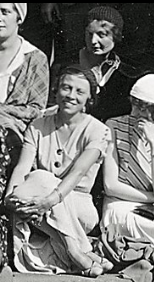

# Enumeration and counting

**Chapter outcomes**

At the end of the chapter you should be familiar with and be able to:

- Recognise and apply appropriate sampling techniques.

- Analyse situations to determine appropriate techniques and apply these techniques to enumerate possibilities.

- Apply enumeration principles to determine probabilities.


**Chapter Statistician: Hilda Geiringer**

Hilda Geiringer was born in 1893 in Vienna and studies mathematics at the University of Vienna. In 1959, Geiringer was elected a Fellow of the American Academy of Arts and Sciences. Hilda spoke openly about academic discrimination against women and worked to improve the situation for future generations. The German mathematician, theoretical physicist and philosopher Hermann Weyl wrote `In her field of applied mathematics, and especially in mathematical statistics, she is a first-rate scholar of great experience and accomplishment.'
```{r, out.width = "20%", fig.align='center', fig.cap="Dr. Hilda Pollaczek (upper right) at the International Congress of Mathematicians 1932.", echo=FALSE} 

```
Image available [online](https://en.wikipedia.org/wiki/Hilda_Geiringer\#/media/File:Saks_Pollaczek_Zurich1932.tif).
Image licence: The image is in the public domain.


## Chapter 2 content summary

The follow section outlines the key topics studied in this chapter.

#### The Fundamental Multiplication rule {-}

Suppose a procedure consists of $k$ steps with $n_1$ choices of how to perform the first step, $n_2$ choices of
how to perform the second step, through to $n_k$ ways of performing the $k$th step. Then the total number
of different ways the procedure can be carried out is $n_1 \times n_2 \times \ldots \times n_k$. For example,  the number of permutations of $\{1, 2, \ldots, n\}$ is $n!$. The number of subsets of $\{1, 2,\ldots, n\}$ having $k$ elements is given by the Binomial coefficient
\[
\displaystyle{n \choose k} = \frac{n!}{k!(n-k)!}
\]

#### Applications {-}

_Sampling with replacement._ Suppose a population of size $N = K_1 + K_2$ contains $K_1$ individuals
of type 1 and $K_2$ individuals of type 2. If sample of size $n$ is drawn with replacement from this
population it contains $k_1$ individuals of type 1 and $k_2 = n - k_1$ individuals of type 2 with probability
\[
\frac{n!}{k_1!k_2!}\frac{K_1^{k_1} K_2^{k_2}}{N^n}.
\]

_Sampling without replacement._  Suppose a population of size $N = K_1 + K_2$ contains $K_1$ individuals
of type 1 and $K_2$ individuals of type 2. If sample of size $n$ is drawn without replacement from this
population it contains $k_1$ individuals of type 1 and $k_2 = n - k_1$ individuals of type 2 with probability
\[
\left.\frac{K_1!}{(K_1 - k_1)!k_1!}\frac{K_2!}{(K_2 - k_2)!k_2!}\right/ \frac{N!}{(N-n)!n!}.
\]


## Class 4: Enumeration and counting

### Introduction 

We consider a situation illustrating _sampling without replacement_ and some enumeration principles that motivates this chapter's material.

:::{.example}
Suppose that we select 200 students at random and give each one a ticket. One week later 300 students are once again selected at random and 11 are found to have a ticket. (Here random means that each possibility is equally likely.) Determine the probability that the sample of 300 students contains 11 tickets.
::::

:::{.solution}
Tere are two questions to answer: 

1. Suppose there is a total of $n$ different students. Selecting $200$ students generates a sequence $(\omega_1,\ldots, \omega_{200})$ of length 200. There are $n$ different choices for $\omega_1$, $n-1$ different choices for $\omega_2$. Therefore, the number of distinct sequences is
\[
n \times (n - 1) \times (n - 2) \times \ldots \times (n - 200 + 1) = \frac{n!}{(n - 200)!}.
\]
But the order in which these 200 students are selected does not matter, so the number of distinct sequences in which the order of selection does not matter is
\[
\frac{n!}{200!(n - 200)!} = {n \choose 200}
\]

2. Once again, the population consists of $n$ individuals, the population consists of two different types, 200 that have tickets and $n - 200$ that do not have tickets. From this population a sample is taken that contains 300 individuals of which 11 have tickets and 289 do not. We claim that the number of ways in which this can happen is
\[
{200 \choose 11} \times {n-200 \choose 289}.
\]
For each sequence of students that contains 11 tickets, there are ${n-200} \choose {289}$ ways to select the remaining students so that they do not have a ticket. There are $\displaystyle {200} \choose {11}$ ways to choose a sequence of 200 students so that 11 have a ticket, so overall, there are
\[
{200 \choose 11}\times {n-200 \choose 289}
\]
ways to select 300 students so that 11 have a ticket.

Overall, the probability of that the sample of 300 students contains 11 with tickets is
\[
\frac{{200 \choose 11}\times {n-200 \choose 289}}{{n \choose 300}}
\]
:::

### Fundamental multiplication rule

Having motivated some key principles, we provide a formal statement. The _fundamental multiplication rule_ for counting is as follows. Suppose $\Omega$ is a set of sequences
$(\omega_1 ,\omega_ 2 , \ldots, \omega_k )$ of length $k$, with $n_1$ possible values for $\omega_1$, and then $n_2$ possible values for $\omega_2$ (irrespective of the value of $\omega_1$) and so on. Then $\Omega$ contains  $n_1 \times n_2 \times \ldots \times  n_k$ sequences.

:::{.example}
Let $S$ be a set with $n$ elements. 

1. Determine the number of sequences $(\omega_1 , \omega_2 , \ldots , \omega_k)$ with each $\omega_i\in S$.

2. Determine the number of sequences $(\omega_1 , \omega_2 , \ldots , \omega_k)$ with each $\omega_i\in S$ and $\omega_1 , \omega_2 , \ldots , \omega_k$  distinct.
::::

:::{.solution}
&nbsp;

1. Let 
\[
\Omega = \{ (\omega_1, \omega_2, \ldots , \omega_k) : \omega_i \in \{ 1, 2, \ldots n\}, i = 1, 2, \ldots k \} = \{ 1,2,\ldots ,n\}^k.
\]
Let $(\omega_1, \ldots , \omega_k) \in \Omega$. There are $n$ choices for $\omega_1$, $n$ choices for $\omega_2$ and so on until $\omega_k$. The fundamental multiplication rule implies the total number of choices for $(\omega_1, \ldots , \omega_k)$ is 
\[
\underbrace{n\times n\times \ldots \times n}_{k \mbox{ times}} = n^k.
\]
Therefore, $|\Omega| = n^k$.

2. Fix $k$ with $1\leq k \leq n$. Let
\[
\Omega = \{ (\omega_1, \omega_2, \ldots , \omega_k) : \omega_i \in \{ 1, 2, \ldots n\}, i = 1, 2, \ldots k, \omega_i \neq \omega_j \mbox{ for all } i \neq j \}.
\]
There are $n$ choices for $\omega_1$, $n-1$ for $\omega_2$ and so on until $n -k + 1$ choices for $\omega_k$. (Note, since $1\leq k \leq n$, $6 - k + 1 \geq 1$.) Therefore, by the fundamental multiplication rule implies the total number of choices for $(\omega_1, \ldots , \omega_k)$ is $n\times (n-1) \times \ldots \times n - k + 1$. Therefore, 
\[
|\Omega| = n \times (n - 1) \times (n - 2) \times \ldots \times (n - k + 1) = \frac{n!}{(n - k)!}
\]
If $n = k$ (note $0! = 1$) then we have the number of ways of ordering the set $S$ is $n!$. If $S = \{1, 2, \ldots , n\}$ then we are counting bijections from $S$ to itself---also know as permutations.
:::

:::{.example}
Suppose there are $n$ students in the room.

1. Determine the probability that no student has a birthday today. Estimate this probability if $n=365$.

2. Determine the probability that no two students have the same birthdays. Estimate this probability if $n=20$.

(In each case, assume uniform probabilities.)
::::

:::{.solution}
&nbsp;

1. Consider sequences of length $n$ with $\omega_i \in \{1, 2, 3, \ldots , 365\}$ being the birthday of student $i$. The probability is the ratio
\[
\frac{\mbox{Number of sequences with no term equal to `today'}}{\mbox{Total number of sequences}}
=
\frac{364^n}{365^n}
\]
Estimate this probability if $n = 365$, we have
\[
\left(
1 + \frac{x}{n} \right)^n\rightarrow e^x
\]
and so
\[
\frac{364^{365}}{365^{365}} =\frac{(365-1)^{365}}{365^{365}}
=
\left(1- \frac{1}{365}\right)^{365} \approx e^{-1} \approx 0.4.
\]

2. What's the probability that no two students have the same birthdays? The probability (assuming
uniform probabilities) is the ratio
\[
\frac{\mbox{Number of sequences with no two terms equal}}{\mbox{Total number of sequences}}
=
\frac{365 \times 364 \times \ldots \times (365 - n + 1)}{365^n}
\]
Note, if $n\geq 366$, then the the probability is 0.

Estimate this if $n = 20$. We have $(1 - x)\approx  e^{-x}$ when $x$ is small. So
\begin{align*}
\frac{365 \times 364 \times \ldots \times (365 - n + 1)}{365^n} &= 
\underbrace{\left(1- \frac{1}{365}\right)\times
\left(1- \frac{2}{365}\right)\times
\ldots
\times
\left(1- \frac{n-1}{365}\right)}_{n-1\mbox{ terms}} \\
&\approx 
\left[e^{\left(-\frac{1}{365}\right)}\right] \times \left[e^{\left(-\frac{2}{365}\right)}\right] \times \ldots \left[e^{\left(-\frac{n-1}{365}\right)}\right]
\\
&\approx e^{\left(-\frac{1}{365}(1+2+\ldots + (n-1))\right)} \\
&\approx
e^{-n(n-1)/730} \\
&\approx e^{-0.5} \quad (n=20)\\
&\approx 0.6.
\end{align*}
:::

:::{.example}
Let $X = \{ 1, \ldots, n \}$, where $n\geq 1$ is an integer. Determine the number of subsets of $X$.
:::

:::{.solution}
Let $X = \{ 1, \ldots , n \}$, where $n\geq 1$ is an integer. Consider
\[
A = \{ Y : Y \subseteq X \}.
\]
Each $i \in X$ is either an element of a given subset $Y$ of $X$, or it is not contain in $Y$. (The element $i$ cannot be both in $Y$ and not in $Y$.) Since there are $n$ elements in $X$, define,
\[
\Omega = \{ (\omega_1, \omega_2, \ldots , \omega_n) : \omega_i \in \{ 0,1 \}, i = 1, 2, \ldots n \}.
\]
Define $f: \Omega \rightarrow A$ by $f((\omega_1, \omega_2, \ldots , \omega_n)) = \{ i : \omega_i = 1, i=1, 2, \ldots n\}.$ The function $f$ is a bijection and hence $|A| = |\Omega|$. Thus, we determine $|\Omega|$. For each $i=1, \ldots n$, $\omega_i = 0$ or $1$. Therefore, by the fundamental multiplication rule
\[
|\Omega | = \underbrace{2\times2\times \ldots \times 2}_{n \mbox{ times}} = 2^n.
\]
Therefore, $|A| = 2^n$. 
:::

### Combinations

Recall, that if a set contains $n$ distinct elements, then an ordered arrangement of all $n$ elements is a permutation. Another way to say this is that a permutation is a bijection from the set to itself. In particular, the number of permutations of elements of a set with $n$ elements is $n!$. 

:::{.theorem}
Let $S$ be a set with $n$ elements and let $0 \leq k \leq n$. The number of subsets of $S$ having
exactly $k$ elements is
\[
{n \choose k} = \frac{n!}{(n-k)!k!}.
\] 
(Sometimes you will also see the notation $^nC_r$.)
:::

:::{.proof}
(Quick version) For each subset $T \subseteq S$ having $k$ elements there are $k!$ sequences $(t_1 , t_2, \ldots , t_k)$ such that $T =
\{t_1 , t_2 , \ldots , t_k \}$. These sequences give the $k!$ possible ways of ordering the elements of $T$. Hence
$k! \times \mbox{number of possibilities for }T$ equals
\[
\mbox{number of sequences of length }k\mbox{ with distinct terms belonging to }S =
\frac{n!}{(n-k)!}
\]
from which the proposition follows.

(More details) Fix $k$ such that $1 \leq k \leq n$ and let $T$ be the set of all subsets of size $k$ of $S$. That is,
\[
T = \{ X \subseteq \{ 1, 2, \ldots, n \} : |X| = k\}.
\]
Let $\Omega$ be the ordered list of length $k$ from the set $\{ 1, 2, \ldots n \}$ that is,
\[
\Omega = \{ (\omega_1, \omega_2, \ldots, \omega_k) : \omega_i \in \{ 1,2, \ldots n \}, i = 1, 2, \ldots k, \omega_i \neq \omega_j, i\neq j \}.
\]
To determine $|T|$ we first determine $|\Omega|$. The number of elements in $\Omega$ is equal to the number of ways to form an ordered list $( \omega_1, \omega_2, \ldots, \omega_k)$ of length $k$ from the set $\{1, 2, \ldots n\}$. We have seen this is equal to $n(n-1)(n-2)\times (n-k+1) = \frac{n!}{(n-k)!}$.

Define $f:\Omega \rightarrow T$ by $f ( (\omega_1, \omega_2, \ldots, \omega_k) ) = \{ \omega_1, \omega_2, \ldots , \omega_k\}$. The function $f$ is surjective. Given any $X \in T$, there are $k!$ elements in $\Omega$ that are mapped to $X$. Therefore, $|\Omega| = k! |T|$. Therefore,
\begin{align*}
|T| &= \frac{|\Omega|}{k!} \\
&= \frac{n!}{(n-k)!}\frac{1}{k!} \\
&= \frac{n!}{k!(n-k)!}.
\end{align*}

The numbers ${n \choose k} = \dfrac{n!}{(n-k)!k!}$ are known as _Binomial coefficients_ and they appear in the Binomial expansion
\[
(x + y)^n = \sum_{k=0}^n {n \choose k} x^k y^{n-k}.
\]
:::

:::{.example}
There are 59 balls in a lottery from which 6 are drawn at random. Before the draw you select 6 different numbers (from the list of 59 numbers). Determine the probability that your numbers match the randomly selected ones.
:::

:::{.solution}
The probability that your particular ticket matches all 6 numbers is
\[
\frac{1}{\mbox{number of subsets of }\{1, 2, \ldots , 59\}\mbox{ having 6 elements}}
= \frac{1}{{59\choose 6}} = \frac{1}{45 057 474}
\]
:::


### Class 4 Exercises

:::{.exercise #finitesets}
Let $A$ and $B$ be finite sets. Suppose $|A| = n$ and $|B| = m$. Determine how many functions $f: A \rightarrow B$ exist. (That is, functions that can be defined.)
:::

:::{.exercise #finitesets2}
Let $A$ and $B$ be finite sets. Suppose $|A| = n$ and $|B| = m$. 

1. Suppose $m \geq n$. Determine the number of injective functions $f:A \rightarrow B$ that exist. (That is, injective functions that can be defined.)

2. Suppose $m = n$. Determine the number of surjective functions $f:A \rightarrow B$ that exist. (That is, surjective functions that can be defined.)
:::

:::{.exercise #paths}
Consider only paths which follow the edges of the chess squares, which start at the bottom/left and finish at the top/right of the board, and which always move in an upwards or rightwards direction.

1. How many such paths are there in total? 

2. If a path is selected at random what is the probability that it passes through the centre of board?
:::


## Class 5: Samples

:::{.example}
A _sample_ drawn from a population is some selection of individuals from that population.

1. A sample can be made _without replacement_ meaning individuals once selected are removed from population and cannot be selected again, or _with replacement_ meaning selected individuals are returned to the population and may be selected multiple times. 
2. A sample can also be _ordered_ meaning the individuals are selected one at a time, and the order in which they are chosen is recorded, or _unordered_
meaning that either all the individuals in the sample were selected simultaneously, or that they were chosen one by one, but the order in which this occurred has been forgotten.
:::

Bringing together the fundamental multiplication rule, and our earlier work gives the following summary.

Suppose the individuals in the population correspond to a set $S$ having $n$ elements.

1. Possible ordered samples of size $k$ made from the population with replacement correspond to sequences of elements of $S$ of length $k$ (sequences belonging to $S^k$). There are $n^k$ such sequences.

2. Possible ordered samples of size $k$ made from the population without replacement correspond to sequences of distinct elements of $S$ of length $k$. There are $\dfrac{n!}{(n - k)!}$ such sequences.

3. Possible unordered samples of size $k$ made from the population without replacement correspond to subsets of $S$ having $k$ elements. There are ${n \choose k}$ such subsets.

4. Possible unordered samples of size $k$ made from the population

with replacement correspond to sequences of non-negative integers $k_1 , k_2 , \ldots  , k_n$ with $\sum {k_i} = k$. Here $k_i$ denotes the number of times individual $i$ is sampled where we take $S = \{1, 2, 3, \ldots , n\}$. There are ${n+k-1 \choose k}$ such sequences.

Notice that when sampling without replacement the ratio of number of ordered samples to unordered samples is $k! : 1$. This is because each unordered sample can be ordered in $k!$ ways. Consequently if an ordered sample is chosen uniformly at random with every possibility equally likely, and then the order forgotten, the result is an unordered sample which is chosen uniformly at random too.

:::{.example}
Consider a random sample of 11 letters chosen from the alphabet with replacement. What is the probability that the letters can be arranged to spell 'Mississippi'? 
::::

:::{.solution}
_Correct approach_ There are $26^{11}$ sequences of length 11 that can be selects from the 26 letter alphabet. 

There are 11 letters in MISSISSIPPI, of which 1 is M, 2 are P, 4 are S and 4 are I. There are $11!$ ways to select 11 letters, but some letters are repeated and interchanging them makes no difference. Thus for every arrangement, we can make an identical arrangement by interchange the two Ps, giving 
\[
\frac{11!}{2!}
\]
In a similar manner, for every arrangement we can make an identical arrangement by interchange the four I's, giving
 \[
\frac{11!}{2!4!}
\]
Hence, the total arrangements of MISSISSIPPI are 
 \[
\frac{11!}{2!4!4!1!} = 34,650.
\]
Therefore, the probability that the letters can be arranged so as to spell 'Mississippi' is
\[
\frac{11!}{4!4!2!1!}26^{-11}.
\]
_Wrong approach_ There are a total of ${26+11-1 \choose 11}$ possible unordered samples of letters that may be chosen. The probability of the sample containing the required letters to spell `Mississippi' should not be taken to be 
\[
\frac{1}{{26+11-1 \choose 11}},
\]
The total of ${26+11-1 \choose 11}$ tells us how many of the $26^{11}$ sequences contains blocks of length $k_i$ of identical letters with $\sum_{k_i} = 11$.
:::

An unordered sample in which individual $i$ from the population is selected $k_i$ times, can be ordered in
\[
\frac{k!}{k_1!k_2!\ldots k_n!}
\]
different ways. This quantity is known as a _multinomial coefficient_. Because this number varies between different unordered samples, if an ordered sample is chosen uniformly at random with every possibility equally likely and then the order forgotten, the result is NOT an unordered sample for which every possibility is equally likely.

Consider an experiment with two outcomes which are equally likely. Call these outcomes $A$ and $B$. Then $\mathbf{P}(A) = \mathbf{P}(B) = \frac{1}{2}$. Suppose the experiment is repeated twice and the outcomes of the first turn do not influence the outcome of the second.

_Ordered sample_ If we sample with ordering, then $\Omega = \{A, B \}^2$. Furthermore, 
\[
\mathbf{P}( \{ (A,A) \}) = \mathbf{P}( \{ (A,B) \}) = \mathbf{P}( \{ (B,A) \}) = \mathbf{P}( \{ (B,B) \}) = \frac{1}{4}.
\]
_Unordered sample_ If we sample without ordering, then we are counting the number of times the outcomes $A$ and $B$ occur. Let $n_A$ and $n_B$ denote the number of times the outcomes $A$ and $B$ occur, respectively. Then $\Omega = \{ 0,1,2 \}^2$, where a sample point $\omega = (n_A,n_B)$. In this notation we have $\mathbf{P}(n_A = 2, n_B = 0) = \mathbf{P}( \{ (2,0) \})$.
\begin{align*}
\mathbf{P}( \{ (2,0) \} ) &= \mathbf{P}( \{ (A,A) \}) = \frac{1}{4}. \\
\mathbf{P}( \{ (0,2) \} ) &= \mathbf{P}( \{ (B,B) \}) = \frac{1}{4}. \\
\mathbf{P}( \{ (1,1) \} ) &= \mathbf{P}( \{ (A,B) \}) + \mathbf{P}( \{ (A,B) \}) = \frac{1}{2}. \\
\end{align*}

Thus we see in the unordered sample the events are not all equally likely.

**Key point for the future** In future unless made explicitly stated otherwise a `random sample' means every ordered sample is equally likely, which means that that every unordered sample is equally likely also only in the case of sampling without replacement. 

:::{.theorem}
Suppose a population consists of $n$ individuals each of whom is one of two types. Let
the number of individuals of type $i$ be $n_i$ for $i = 1, 2$, with $n_1 + n_2 = n$. Suppose further that a random sample of size $k$ is chosen from the population and consider the event that this sample consists of $k_i$ individuals of type $i$ with $k_1 + k_2 = k$. Then

1. sampling without replacement this event has probability
\[
\frac{{n_1 \choose k_1}\times {n_2 \choose k_2}}{{n \choose k}},
\]
(hypergeometric probabilities given for sampling without replacement);
2. sampling with replacement this event has probability
\[
{k \choose k_1}\left( \frac{n_1}{n}\right)^{k_1} \left( \frac{n_2}{n} \right)^{k_2}
\]
(Binomial probabilities given for sampling with replacement).
:::


:::{.proof}
We take each part in turn.

1. When sampling without replacement each possible unordered sample will be equally likely and so the probability of the event is given by the ratio
\[
\frac{\mbox{Number of possible unordered samples with }k_i\mbox{ individuals of type }i\mbox{ for }i = 1, 2}{\mbox{Number of possible unordered samples of size }k}.
\]
We know the denominator of this ratio is given by ${n \choose k}$. To choose a sample with the correct number of individuals of the two types we may first choose $k_1$ individuals from the sub-population of type 1 and then choose $k_2$ individuals from the sub-population of type 2. In total there are therefore
\[
{n_1 \choose k_1}\times {n_2 \choose k_2}
\]
possible ways of choosing the sample, which gives the value of the numerator. That is, for a fixed individual of type $k_1$ there are ${n_2\choose k_2}$ different choices for the individuals of type 2.

2. When sampling with replacement we consider ordered samples, all of which are equally likely, and so probability of the event is given by the ratio
\[
\frac{\mbox{Number of possible ordered samples with }k_i\mbox{ individuals of type }i\mbox{ for }i = 1, 2}{\mbox{Number of possible ordered samples of size }k}.
\]
We know the denominator of this ratio is given by $n^k$. To choose an ordered sample with the correct number of individuals of the two types we may first pick a subset $S\subseteq  \{1, 2, \ldots , k \}$ with exactly $k_1$ elements, and then choose the $i$th individual in the sample from the subpopulation of type 1 whenever $i \in S$ and from the subpopulation of type 2 whenever $i\in  S^c$ . In total there are therefore
\[
{k \choose k_1} \times \prod_{i\in S} n_1 \times \prod_{i\in S^c} n_2
\]
possible ways of choosing the sample, which gives the value of the numerator.
:::


If $k \ll n_1, n_2$ ($k$ is much less than $n_1$, $n_2$, or let $k$ be as small as needed for the following to hold) then the hypergeometric probabilities given for sampling without replacement agree closely with the Binomial probabilities given for sampling with replacement. A later question sketches the ideas necessary to show this result.

:::{.example}
Consider a committee of 16 MPs, consisting of 8 from party A and 8 from party B. If a subcommittee of 8 is chosen at random from the 16, what is the probability that it contains an equal number of MPs from both parties?
::::

:::{.solution}
The total population has size 16 of which there are 8 of type A and 8 of type B. A random sample is taken without replacement, where the size of the type is 8. For there to be an equal number of both parties there must be 4 of type A and 4 of type B. Therefore, 
the probability of this event is
\[
\frac{{8\choose 4}\times {8\choose 4}}{{16\choose 8}} = \frac{70^2}{12870} \approx 0.38.
\]
:::

:::{.example}
10\% of the UK population carry a certain gene. In a random sample of ten individuals what is the probability that exactly one carries the gene?
::::

:::{.solution}
Since the UK's population is so larger, we may assume this is sampling without replacement. We do not know the total size of the UK's population, but this will not matter.

If $n$ is the total size of the UK's population and $n_1$ is the total number of individuals with the selected gene, then $\dfrac{n_1}{n} = 0.1$. Similarly, if $n_2$ is the total number of individuals without the selected gene, then $\dfrac{n_2}{n} = 0.9$. 

In our sample of size 10, we wish 1 to have this gene and the remaining 9 to not have this gene. Therefore, the probability is
\[
{10 \choose 1} (0.1)^1 (0.9)^9 \approx 0.39.
\]
:::


### Class 5 Exercises

:::{.exercise #twins}
A tutorial class has 6 pairs of twins. The class tutor intends to run a quick quiz and would like to avoid putting any pair of twins into the same team. 

1. Determine, subject to the stated conditions, in how many ways the class tutor split the class into two teams of six?

2. Determine, subject to the stated conditions, in how many ways the class tutor split the class into three teams of four?
:::

:::{.exercise #gardenparty}
At garden party the tables are round with six chairs. Three pairs of twins are allocated on one table. All of the possible seating  arrangements of the six people are equally likely.

1. Show that the probability that each twin sits next to each other is $\frac{2}{15}$.

2. Determine the probability that exactly two pairs of twins sit next to each other.

3. Determine the probability that no twins sit next to each other.
:::

:::{.exercise #internships}
Following applications for summer internships, a total of $N$ individuals were selected for the first stage. During the first stage of the application process each individual takes a series of numeracy and statistical tests. Using the results  each individual is ranked according to their score. The resulting ranking contains no ties, so there each individual is uniquely ranked after stage 1. The second stage is an interview where the individuals are selected at random; that is, each possible order is equally likely.

The first $n$ individuals are interviewed and _this group_ contains a unique highest ranked candidate from stage 1.

1. Determine the probability that the highest ranked individual in this group of $n$ individuals is the overall highest ranked from stage 1.

2. Determine the probability that the highest ranked individual in this group of $n$ individuals is the overall highest or second-highest ranked from stage 1.
:::


## Class 6: Extended examples

We bring together some extended examples that illustrate the ideas covered so far.

:::{.example}
You have $n$ prizes that are to be distributed at random to $r$ people (where $n>r$). It is possible for each person to recieve more than one prize.

1. Determine the probability that every person gets a prize. 

2. Determine the probability that exactly one person does not get a prize.
::::

:::{.solution}
&nbsp;

1. Let $A_i$, $i=1,2, \ldots r$ be the event that the $i$th person gets at least one prize. We want to determine $\mathbf{P} (A_1 \cap A_2 \cap \ldots \cap A_r) = 1 - \mathbf{P} (A_1^c \cup A_2^c \cup \ldots \cup A_r^c)$. By the inclusion-exclusion formula
\[
\mathbf{P} (A_1^c \cup A_2^c \cup \ldots \cup A_r^c) = \sum_{k=1}^r (-1)^{k-1} \sum_{1 \leq i_1 < i_2 < \ldots < i_k \leq r} \mathbf{P} (A_{i_1}^c \cap A_{i_2}^c \cap \ldots \cap A_{i_k}^c). 
\]
Using the Fundamental multiplication rule we have
\[
\mathbf{P} (A_i^c) = \left( \frac{r-1}{r} \right)^n, \quad i=1, 2, \ldots, r;
\]
that is, person $i$ does not get a prize if at each stage any one of the other $r-1$ people recieves a prize each of the $n$ times a prize is allocated.
    In a similar manner, the Fundamental multiplication rule we have
\[
\mathbf{P} (A_i^c\cap A_j^c) = \left( \frac{r-2}{r} \right)^n, \quad i,j =1, 2, \ldots, r\quad i\neq j;
\]
that is, person $i$ and person $j$ do not get a prize if at each stage any one of the other $r-2$ people recieves a prize each of the $n$ times a prize is allocated. In general,
\[
\mathbf{P} (A_{i_1}^c \cap A_{i_2}^c \cap \ldots \cap A_{i_k}^c) = \left( \frac{r-k}{r} \right)^n, \quad 1 \leq i_1 < i_2 < \ldots < i_k \leq r,\ k=1, \ldots r.;
\]
Therefore, 
\[
\sum_{1 \leq i_1 < i_2 < \ldots < i_k \leq r} \mathbf{P} (A_{i_1}^c \cap A_{i_2}^c \cap \ldots \cap A_{i_k}^c) = {n \choose k} \left( \frac{r-k}{r} \right)^n.
\]
That is, there are $\displaystyle {r \choose k}$ ways to choose $1 \leq i_1 < i_2 < \ldots < i_k \leq r,\ k=1, \ldots r$. Therefore,
\[
\mathbf{P} (A_1^c \cup A_2^c \cup \ldots \cup A_r^c) = \sum_{k=1}^r (-1)^{k-1} {r \choose k} \left( \frac{r-k}{r} \right)^n.
\]
Finally, we have
\[
\mathbf{P} (A_1 \cap A_2 \cap \ldots \cap A_r) = 1 - \mathbf{P} (A_1^c \cup A_2^c \cup \ldots \cup A_r^c) = 1 - \sum_{k=1}^r (-1)^{k-1} {r \choose k} \left( \frac{r-k}{r} \right)^n.
\]

2. There are $\displaystyle {r \choose 1}$ ways to choose a person who does not get a prize. The probability this person does not get any prizes is $\displaystyle \left( \frac{r-1}{r} \right)^n$. If exactly one person does not get any prizes, that means the remaining $r-1$ people gets a prize. Hence, the $n$ prizes are distributed to the $r-1$ people so that they each get at least one prize. 
    By part 1 we know that when allocated $n$ prizes to $r$ people, the probability that every person gets at least one prize is 
\[
1 - \sum_{k=1}^r (-1)^{k-1} {r \choose k} \left( \frac{r-k}{r} \right)^n.
\]
So, the probability that when allocated $n$ prizes to $r$ people, the probability that $r-1$ people gets at least one prize is
\[
1 - \sum_{k=1}^{r-1} (-1)^{k-1} {r-1 \choose k} \left( \frac{r - 1 -k}{r - 1} \right)^n.
\]
Therefore, the probability that one person does not get any prize is
\[
r \left( \frac{r-1}{r} \right)^n\left( 1 - \sum_{k=1}^{r-1} (-1)^{k-1} {r-1 \choose k} \left( \frac{r - 1 -k}{r - 1} \right)^n \right).
\]
:::

:::{.example}
&nbsp;

1.  Prove by induction on $n$ that if  $A_1, A_2, \ldots, A_n$ is a sequence of events  then
\begin{equation}
 \sum_{i=1}^n {\mathbf P}(A_i) \geq {\mathbf P} \left ( \bigcup_{i=1}^n A_i \right) \geq \sum_{i=1}^n {\mathbf P}(A_i)- \sum_{1\leq i<j \leq n}  {\mathbf P}(A_i\cap A_j).
 (\#eq:inequality)
\end{equation}


2. The first 50 digits of $\pi$, after the decimal point,  are 
\[
1415926535897932384626433832795028841971693993751
\]
Reading from the left you need to read to the $32$th place before you have seen at least one of all $10$ possible digits $0,1,2,3,4,5,6,7,8,9$. (The last digit to appear reading from the left is $0$.) 

   Suppose  a random sequence of digits  is   being generated. Use the inequalities you proved in  part (1) to estimate  the probability  that more than $30$ digits  need to be generated before each of the 10 possible digits has appeared.  Estimate  the probability  that more than $60$ digits  need to be generated before each of the 10 possible digits has appeared.
::::

:::{.solution}
&nbsp;

1. It will help to write $\bigcup_{i=1}^{n+1} A_i$ as the union of $A=\bigcup_{i=1}^{n} A_i$ and $B=A_{n+1}$, and consider an equation for  ${\mathbf P}(A\cup B)$. First note that the case $n=2$ is verified by  taking $A=A_1$ and $B=A_2$ in the equality 
\[
{\mathbf P}(A\cup B)= {\mathbf P}(A)+{\mathbf P}(B) -{\mathbf P}(A \cap B)
\]
together with  the inequality  ${\mathbf P}(A\cup B)\leq {\mathbf P}(A)+{\mathbf P}(B)$ which follows because  ${\mathbf P}(A \cap B) \geq 0$.
Now assume the desired inequalities hold for $A_1,\ldots, A_n$  and use the $n=2$ case just considered with  $A=\bigcup_{i=1}^n A_i$ and $B=A_{n+1}$.  We have for the upper bound
\begin{align*}
{\mathbf P}\left( \bigcup_{i=1}^{n+1} A_i\right)  &= {\mathbf P}\left(  \left(\bigcup_{i=1}^n A_i \right) \cup A_{n+1}\right) \\
&\leq {\mathbf P} \left(\bigcup_{i=1}^n A_i \right)+{\mathbf P}(A_{n+1}) \\
&\leq
\sum_{i=1}^{n}{\mathbf P}\left(  A_i\right) +{\mathbf P}(A_{n+1}),
\end{align*}
using the induction hypothesis at the last step. Whilst the lower bound is derived via 
\begin{align*}
{\mathbf P}\left( \bigcup_{i=1}^{n+1} A_i\right)  &= 
{\mathbf P}\left( \bigcup_{i=1}^n A_i\right)+ {\mathbf P}(A_{n+1})- {\mathbf P} \left ( (\cup_{i=1}^n A_i )\cap A_{n+1}) \right) \\
&\geq 
 \sum_{i=1}^{n} {\mathbf P}(A_i)- \sum_{1 \leq i<j\leq n} {\mathbf P}(A_i \cap A_j) + {\mathbf P}(A_{n+1})- {\mathbf P} \left ( \cup_{i=1}^n (A_i\cap A_{n+1}) \right) \\
&\geq 
\sum_{i=1}^{n} {\mathbf P}(A_i)- \sum_{1 \leq i<j\leq n} {\mathbf P}(A_i \cap A_j)+ {\mathbf P}(A_{n+1})- \sum_{i=1}^n {\mathbf P}  (A_i\cap A_{n+1} ) \\
&=
\sum_{i=1}^{n+1} {\mathbf P}(A_i)- \sum_{1 \leq i<j\leq {n+1}} {\mathbf P}(A_i \cap A_j),
\end{align*}
where in the second to  last line we have applied the inductive hypothesis  to the sequence $A_1 \cap A_{n+1},  \ldots, A_n \cap A_{n+1}$.  

2. For $i=0,1,2,\ldots,9$ let $A_i$ be the event that no digit $i$ occurs  in the first  $30$ digits of the random sequence.   Then ${\mathbf P}(A_i)= (9/10)^{30}$, and ${\mathbf P}(A_i\cap A_j)=(8/10)^{30}$ provided $i\neq j$. This is because there are $10^{30}$ possibility for the sequence of length $n$ of which $8^{30}$ contain neither the digit $i$ nor $j$. (Independence is not something we have discussed yet.) 
Now the bounds 
\[
 \sum_{i=0}^9 {\mathbf P}(A_i) \geq {\mathbf P} \left ( \bigcup_{i=0}^9 A_i \right) \geq \sum_{i=0}^9 {\mathbf P}(A_i)- \sum_{0\leq i<j \leq 9}  {\mathbf P}(A_i\cap A_j).
\]
give 
\[10. (9/10)^{30} \geq {\mathbf P} \left ( \bigcup_{i=0}^9 A_i \right) \geq 10. (9/10)^{30} - 45. (8/10)^{30} 
\]
and the event $\bigcup_{i=0}^9 A_i$ is precisely that  more than $30$ digits  need to be generated before each of the 10 possible digits has appeared.  Using a calculator shows the probability  of this event is between $0.36$ and $0.42$. 
    For more  taking than $60$ digits, we have an upper bound of $10. (9/10)^{60}= 0.018 (3d.p.)$ and a lower bound of  $10. (9/10)^{60} - 45. (8/10)^{60}= 0.018 (3. d.p.).$ also.
:::


### Class 6 Exercises

:::{.exercise #die8}
A fair die is tossed eight times. What is the probability of exactly three 1's, two 2's and three 5's? (Assuming all outcomes are equally likely.)
:::

:::{.exercise #rolldie}
1.  A die is rolled twice. Describe the sample space and count how many sample points there are. Assuming that outcomes of the experiment are equally likely, determine the probability of the event that the scores in two throws are different.

2. A die is rolled three times. Describe the sample space and count how many sam- ple points there are. Assuming that outcomes of the experiment are equally likely, determine the probability of the event that all scores are different.
:::

:::{.exercise #books6}
There are 6 books on the shelf: 3 art books, 2 mathematics books and 1 science book. We pick two books from the shelf. Determine the probability that:

1. the books are on the same subject?

2. the books are not on the same subject?
:::

:::{.exercise #social}
At a social gathering $n$ individuals wish to play a game. Each individual places their mobile phone into a bag. Each individual then randomly selects a mobile phone from the bag. 

1. Determine an expression for the probability that at least one individual selects their own mobile phone. Let $L(n)$ denote this expression. 

2. Determine the exact value of $\displaystyle \lim_{n\rightarrow\infty} L(n)$. 
:::


:::{.exercise #coin100}
This question provides a further application of the inequality you derived in \@ref(eq:inequality). 

Suppose an unbiased coin is tossed  $n=100$  times  and assume all outcomes are equally probable. The purpose of this question is to  estimate the probability  of observing an  unbroken sequence of ten of more heads.

1. For $i=1,2,\ldots ,91$ let $A_i$ be the event that the $i$th,  $(i+1)$th, $(i+2)$th through to the $(i+9)$th tosses are all heads. Write the event $E$ that there is a run of ten  or more heads in term of the events  $A_1, A_2 \ldots, A_{91}$.

2. Determine the probability  of each  $A_i$ and  deduce that the probability  of a run of ten heads or more must be less than $91\times (1/2)^{10} = 0.089$ (to 3 d.p.).

3. For $i=1,2,\ldots, 90$ let $B_i$ be the event that  the  $i$th toss results in a tail, followed by   $(i+1)$th, $(i+2)$th through to the  $(i+10)$th tosses    all being heads.  For $1 \leq i<j \leq 90$ determine the probability  of $B_i \cap B_j$: you should distinguish carefully between the cases $j> i+10$ and $j \leq i+10$. Determine a lower bound for the  probability of a run of ten heads. (You will find the inequality from the earlier example userful.)

4. Explain what happens if you try to compute a lower bound for the probability of a run of ten heads using the $A_i$ events instead of the $B_i$?
:::


## Chapter 2 Consolidation Questions

Chapter Consolidation Questions provide additional practice covering the entire chapter. The questions may require you to evaluate information to determine the appropriate approach to solve a problem. For this reason, you may find these questions best saved for revision.

**Chapter outcomes review**

Having reviewed the material and completed the assessment (formative and summative) material, you should be able to:

- Recognise and apply appropriate sampling techniques.

- Analyse situations to determine appropriate techniques and apply these techniques to enumerate possibilities.

- Apply enumeration principles to determine probabilities.

:::{.exercise #smalltown}
In a small town, two candidate stand for the local village council elections. The candidate with the most votes wins. 

1. The winning candidate receives 100 votes and the second-placed candidate receives 80 votes. What is the probability of the winning candidate being ahead of the second-placed candidate throughout the counting of the votes?

2. If the winning candidate receives $n$ votes and the second-placed candidate $m$ votes ($n>m$), determine the probability that the winning candidate being ahead of the second-placed candidate throughout the counting of the votes.
:::

:::{.exercise #statdep}
The statistics department has $n$ students of whom $r$ play tennis, where $n\geq r\geq 2$. All $n$ students are randomly arranged in a row, where any arrangement is equally likely.

1. Determine the probability that there is a tennis player at each end of the row.

2. Determine the probability that all tennis players are next to each other. 

3. Determine the probability that no two tennis players are standing together. (You will need to distinguish different cases.) 
:::

:::{.exercise #nballs}
A drum contains $n$ balls, where $n\in \mathbf{Z}$ and $n\geq 5$. Each ball is labelled with a different positive integer. Five balls are selected at random without replacement. (So each ball is equally likely.) Determine the probability that from the five balls there exist three balls labelled with integers $x$, $y$ and $z$ so that $x+y+z$ is a multiple of 3.
:::

:::{.exercise #integers}
**Challenging question:** Let $n=n_1+n_2$ and $k=k_1+k_2$ for positive integers $n_1$, $n_2$, $k_1$, $k_2$. Let
\[
f(k_1) = \frac{{n_1 \choose k_1}{n - n_1 \choose k-k_1}}{{n \choose k}}
\]
Keep $p=\dfrac{n_1}{n}$ fixed, show that for large $n$,
\[
f(k_1) \approx {k \choose k_1}p^{k_1}(1 - p)^{k - k_1}.
\]
(Note, during the rough working stage you may find it useful to work from both ends and then use a large $n$ approximation to make the results meet in the middle.)
:::


