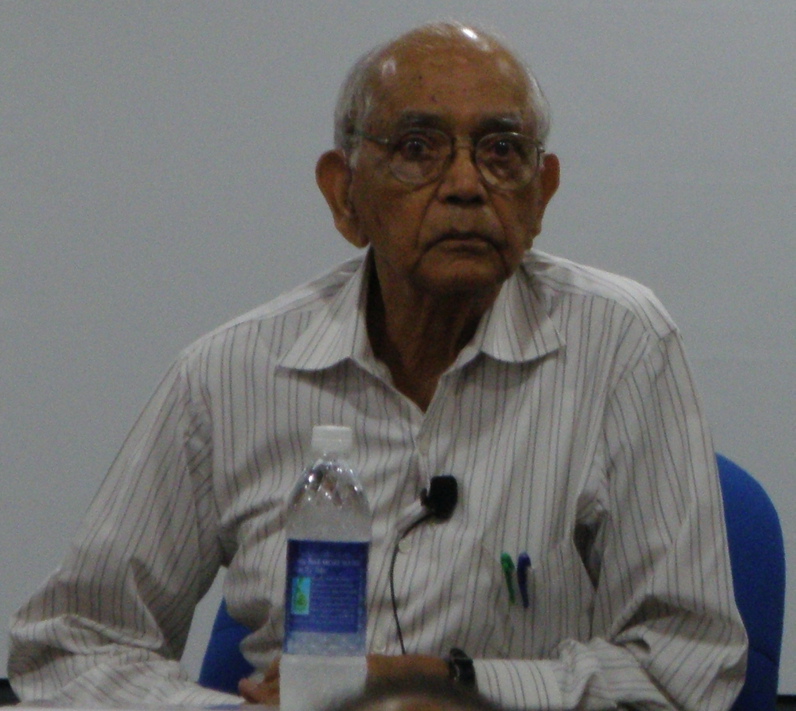
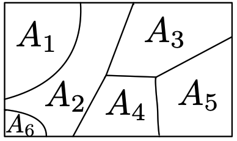
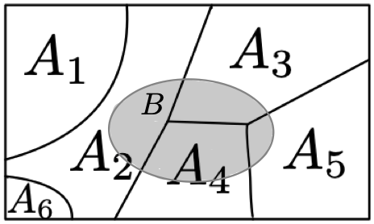
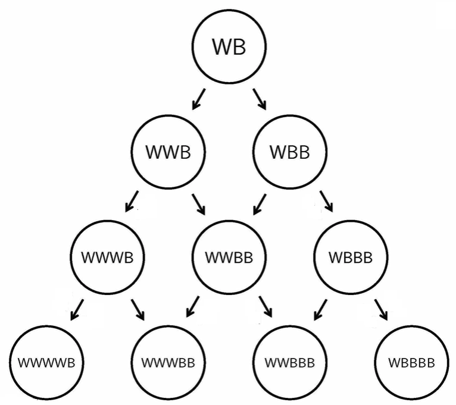

# Independence and conditioning

**Chapter outcomes**

At the end of the chapter you should be familiar with and be able to:

- Recognise and apply appropriate techniques to determine conditional probabilities.

- Analyse events to determine if they are independent and apply appropriate techniques to determine probabilities.


**Chapter Statistician: Calyampudi Radhakrishna Rao**

Calyampudi Radhakrishna Rao, FRS was born in the state Karnataka in southern Indian. Perhaps his most famous results are the Cram\'er--Rao bound, the Rao--Blackwell theorem, Fisher--Rao theorem and Rao distance. In 1991, The Journal of Quantitative Economics published a special issue in Rao's honour, including `\emph{Dr. Rao is a very distinguished scientist and a highly eminent statistician of our time. His contributions to statistical theory and applications are well known, and many of his results, which bear his name, are included in the curriculum of courses in statistics at bachelor's and master's level all over the world. He is an inspiring teacher and has guided the research work of numerous students in all areas of statistics. His early work had greatly influenced the course of statistical research during the last four decades. One of the purposes of this special issue is to recognize Dr. Rao's own contributions to econometrics and acknowledge his major role in the development of econometric research in India.
```{r, out.width = "20%", fig.align='center', fig.cap="Calyampudi Radhakrishna Rao.", echo=FALSE} 

```
Image available [online](https://upload.wikimedia.org/wikipedia/commons/9/97/Calyampudi_Radhakrishna_Rao_at_ISI_Chennai_\%28cropped\%29.JPG)
Image licence: Creative Commons.

## Chapter 3 content summary

The follow section outlines the key topics studied in this chapter.


#### Definition of conditional probability {-}
If $A$ and $B$ are events which are subsets of a sample space equipped with a probability measure $\mathbf{P}$, then the _conditional probability_ of $A$ given $B$ is defined by 
\[
\mathbf{P}(A \mid B) = \frac{\mathbf{P}(A \cap B)}{\mathbf{P}(B)}
\]
whenever $\mathbf{P}(B) > 0$.

#### Multiplication rule for conditional probabilities {-}

If $A_1, A_2 , \ldots , A_n$ is a sequence of events with $\mathbf{P}(A_1\cap \ldots \cap A_{n-1} ) > 0$ then 
\[
\mathbf{P}(A_1 \cap\ldots \cap A_n ) = \mathbf{P}(A_1)\times \mathbf{P}(A_2 \mid A_1 ) \times \mathbf{P}(A_3 \mid A_1 \cap A_2 )\times \ldots \times \mathbf{P}(A_n \mid A_1\cap \ldots \cap A_{n-1}) 
\]

#### Law of total probability {-}

Suppose that $A_1, A_2, \ldots A_n$ is a partition of the sample space, with $\mathbf{P}(A_i) > 0$ for all $i$. Then for any event $B$ 
\[
\mathbf{P}(B) = \sum_{i=1}^n \mathbf{P}(B \mid A_i )\mathbf{P}(A_i).
\]

#### Bayes formula {-}

Suppose that $A_1, A_2, \ldots A_n$ is a partition of the sample space, with $\mathbf{P}(A_i) > 0$ for all $i$. Then for any event $B$  with $\mathbf{P}(B) > 0$,
\[
\mathbf{P}(A_i \mid B) = \frac{\mathbf{P}(B\mid A_i )\mathbf{P}(A_i )}{\sum_{j=1}^n \mathbf{P}(B\mid A_j ) \mathbf{P}(A_j )}.
\]

#### Independent events {-}

Events $E_1 , E_2 , \ldots$ are mutually independent if for all choices of $i_1 < i_2 \ldots  < i_k$
\[
\mathbf{P}(E_{i_1} \cap E_{i_2}\cap \ldots \cap E_{i_k}) = \mathbf{P}(E_{i_1} )\mathbf{P}(E_{i_2} ) \ldots \mathbf{P}(E_{i_k} ).
\]

#### Examples of sequences of independent random events {-}

- Rolling a dice repeatedly, and letting $E_i$ be the event that the score obtained on the $i$th roll is a 6. 
- Picking a point uniformly at random from the $n$ dimensional hypercube $[0, 1]^n$ and letting $E_i$ be the event that the $i$th coordinate of the point chosen is less than $c_i$ , where $(c_1 , c_2 , \ldots , c_n )$ is some sequence of real numbers fixed in advance.
- Sampling with replacement from a population of different types and letting $E_i$ be the event that of the $i$th individual sampled is of some particular type specified in advance.
- Picking a real number uniformly at random from the interval $[0, 1)$, representing it via its decimal expansion, and letting $E_i$ be the event that $i$th digit in that expansion is a 0.


## Class 7: Conditional probability

We begin with two motivating examples.

:::{.example}
&nbsp;

1. Toss a coin three times with all outcomes all being equally likely. Take the sample space to be $\Omega = \{H, T \}^3$. Let $B$ be the event that we toss two or more heads; that is, 
\[
B = \{ (H,H,H), (H,H,T), (H,T,H), (T,H,H) \}.
\]
Suppose that we have made the first toss and observed a head. With this additional information what is the probability that we toss two or more heads?
2. Roll two (standard six-sided) dice. An appropriate sample space is $\Omega = \{1,2,3,4,5,6\}^2$. A sample point $\omega = (i,j)$ corresponds to the outcome that the first dice shows $i$ and the second $j$, where $1\leq i,j\leq 6$. We know that $|\Omega| = 6^2 = 36$. Let $B = \{ (3,4), (4,3) \}$. Then $B$ is the event that the dice show a 3 and a 4. We know how to find $\mathbf{P}(B)$. Suppose you are given an additional piece of evidence regarding the experiment's outcome, specifically that the total of the two dice is 7. 
::::

:::{.solution}
&nbsp;

1. Suppose that we have made the first toss and observed a head, given this knowledge the only possible outcomes are $A = \{(H,H,H), (H,H,T), (H,T,H), (H,T,T) \}$. Possible outcomes of the experiment are now described by $A$ rather than $\Omega$, and we assess the probability of $B$ occurring to be 
\[
\dfrac{|A\cap B|}{|A|} = \dfrac{3}{4}.
\]
Note that this ratio is also equal to $\dfrac{\mathbf{P}(A \cap B)}{\mathbf{P}(A)}$.

2. The new evidence requires a new probability model. Specifically, we know that the appropriate space is $A= \{ (6,1), (5,2), (4,3), (3,4), (2,5), (1,6) \}$. Schematically, we can visualise $\Omega$ and $A$ as follows
\[
\begin{array}{cccccc}
(1,1) & (1,2) & (1,3) & (1,4), & (1,5) & \fbox{(1,6)} \\
(2,1) & (2,2) & (2,3) & (2,4) & \fbox{(2,5)} & (2,6) \\
(3,1) & (3,2) & (3,3) & \fbox{(3,4)} & (3,5) & (3,6) \\
(4,1) & (4,2) & \fbox{(4,3)} & (4,4) & (4,5) & (4,6) \\
(5,1) & \fbox{(5,2)} & (5,3) & (5,4) & (5,5) & (5,6) \\
\fbox{(6,1)} & (6,2) & (6,3) & (6,4) & (6,5) & (6,6)
\end{array}
\]
The required probability is
\[
\frac{\mathbf{P}(A \cap B)}{\mathbf{P}(A)} = \dfrac{2}{6} = \frac{1}{3}. 
\]
:::

:::{.definition}
If $A$ and $B$ are events (subsets of a common sample space $\Omega$) with $\mathbf{P}(A) > 0$, we define the _conditional probability of $B$ given $A$_ as
\[
\mathbf{P}(B|A) = \frac{\mathbf{P}(A \cap B)}{\mathbf{P}(A)}
\]
:::

:::{.example}
I have 7 green and 8 red cards and place them in a bag.  Two cards are selected at random and without replacement. Determine the probability that both cards are red given that they are the same colour.
::::

:::{.solution}
This is sampling without replacement, 

We have
\[
\mathbf{P}(\mbox{both red})  = \frac{4}{15}.
\]
Note
\[
\mathbf{P}(\mbox{both green})  = \frac{3}{15}.
\]
Next, since the events are mutually disjoint
\begin{eqnarray*}
\mathbf{P}(\mbox{both the same color}) &=& \mathbf{P}(\mbox{both green}) + \mathbf{P}(\mbox{both red}) \\
&=& \frac{4}{15} + \frac{3}{15} = \frac{7}{15}.
\end{eqnarray*}
Finally, 
\begin{eqnarray*}
\mathbf{P}(\mbox{both red}|\mbox{both the same colour}) &=& \frac{\mathbf{P}(\mbox{both red and the same colour})}{\mathbf{P}(\mbox{both the same colour})} \\
&=& \frac{\frac{4}{15}}{\frac{7}{15}} = \frac{4}{7}.
\end{eqnarray*}
:::

:::{.example}
A box contains 4 black and 6 white balls. We take balls out of the box at random, one at a time without replacement, until we have got a ball of each colour. Determine the probability that

1. we need to make exactly two draws

2. we need to make two or three draws

3. we need to make exactly three draws if the first two balls drawn are of the same colour?
:::

:::{.solution}
Define the events $B_i$ is the event the $i$th ball drawn in black and $W_i$ is the event the $i$th ball drawn in white ($i=1,2, \ldots, 7$).

1. Computing we have
\[
\mathbf{P} \left( ( B_1 \cap W_2) \cup ( B_2 \cap W_1) \right) = \frac{ 4\times 6}{10 \times 9} + \frac{ 6\times 4}{10 \times 9} = \frac{8}{15}
\]

2. We have
\[
\mathbf{P}(\mbox{3 draws}) = \mathbf{P} \left( ( B_1 \cap B_2 \cap W_3) \cup ( W_1 \cap W_2  \cap B_3) \right) 
=
\frac{ 4\times 3\times 6}{10 \times 9 \times 8} + \frac{ 6\times 5\times 4}{10 \times 9 \times 8} 
= \frac{ 6\times 4\times 8}{10 \times 9 \times 8}
= \frac{4}{15}.
\]
Using the result from part 1 we have
\[
\mathbf{P}(\mbox{2 or 3 draws}) = \mathbf{P}(\mbox{2 draws}) + \mathbf{P}(\mbox{3 draws}) = \frac{8}{15} + \frac{4}{15} = \frac{4}{5}.
\]

3. We need to compute $\mathbf{P}( \mbox{3 draws} \mid (B_1 \cap B_2) \cup (W_1 \cap W_2) )$. Note that $\{\mbox{3 draws}\} \subseteq (B_1 \cap B_2) \cup (W_1 \cap W_2)$. Hence,
\begin{align*}
\mathbf{P}( \mbox{3 draws} \mid (B_1 \cap B_2) \cup (W_1 \cap W_2) ) &= \frac{ \mathbf{P}( \mbox{3 draws} \cap (B_1 \cap B_2) \cup (W_1 \cap W_2) )}{\mathbf{P}( (B_1 \cap B_2) \cup (W_1 \cap W_2) )} \\
&= \frac{\mathbf{P}( \mbox{3 draws} )}{\mathbf{P}( (B_1 \cap B_2) \cup (W_1 \cap W_2) )} \\
&= \frac{ \frac{4}{15} }{ \frac{4\times 3}{10\times 9} + \frac{6\times 5}{10\times 9} } \\
&= \frac{4}{7}.
\end{align*}
:::

:::{.example}
A fair coin is tossed three times. Let $H$ denote the outcome that the coin shows a head and $T$ denote the outcome that the coins shows a tail. Let $\Omega = \{ H, T \}^3$. Write, for example, $HTH$ for $(H,T,H)\in \Omega$. With this notation define the events
\begin{align*}
A &= \{ HHT, HTH, THH, HHH \}, \\
B &= \{HTT, HTH, HHT, HHH\} \\
C &= \{HHT, HTH, THH,TTH, TTT\} \\
D &= \{TTT, HHH\}
\end{align*}
Compute $\mathbf{P}(A|B)$, $\mathbf{P}(C|B)$ and $\mathbf{P}(D|B)$. Comment on the results.
::::

:::{.solution}
We have  
\[
\mathbf{P}(A|B)= \frac{ \mathbf{P}(A \cap B)}{\mathbf{P}(B)} = \frac{ \frac{3}{8} }{\frac{4}{8} }= \frac{3}{4} > \frac{1}{2} = \mathbf{P}(A).
\]
Next we compute $\mathbf{P}(C|B)$ 
\[
\mathbf{P}(C|B) = \frac{ \mathbf{P}(C \cap B) }{ \mathbf{P}(B) } = \frac{ \frac{2}{8} }{\frac{4}{8}} = \frac{1}{2} < \frac{5}{8} = \mathbf{P}(C).
\]
Finally
\[
\mathbf{P}(D|B) = \frac{ \mathbf{P}(D \cap B) }{ \mathbf{P}(B) } = \frac{ \frac{1}{8} }{\frac{4}{8}} = \frac{1}{4} = \mathbf{P}(D).
\]
We deduce that, depending on the choice of events, the knowledge that an event has occurred can increase or decrease the probability of another event occurring, or for some events the knowledge that an event has occurred does not change the probability of another event occuring.
:::

### Law of total probability

Rewriting the conditional probability definition gives $\mathbf{P}(A \cap B) = \mathbf{P}(A)\mathbf{P}(B|A)$, this result extends to any finite sequence of event.

:::{.theorem name="Multiplication rule"}
If $A_1, A_2,\ldots, A_n$ is a finite sequence of events with $\mathbf{P}(A_1 \cap A_2\cap \ldots\cap A_{j} ) > 0$ for $j\in \{1, \ldots, n-1 \}$, then,
\[
\mathbf{P}(A_1 \cap A_2\cap \ldots  \cap A_n) = \mathbf{P}(A_1 ) \times \mathbf{P}(A_2 |A_1 ) \times \mathbf{P}(A_3 | A_1 \cap A_2 ) \times \ldots \times \mathbf{P}(A_n |A_1 \cap \ldots \cap A_{n-1}).
\]
:::

:::{.proof}
Using the definition of conditional probabilities the RHS is
\begin{align*}
\mathbf{P}(A_1 ) &\times \mathbf{P}(A_2 |A_1 ) \times \mathbf{P}(A_3 | A_1 \cap A_2 ) \times \ldots \times \mathbf{P}(A_n |A_1 \cap \ldots \cap A_{n-1}) = \\
&\mathbf{P}(A_1 )
\times
\frac{\mathbf{P}(A_2 \cap  A_1 )}{\mathbf{P}(A_1)}
\times
\frac{\mathbf{P}(A_3 \cap A_2 \cap A_1 )}{\mathbf{P}(A_2 \cap A_1)} \\
&\times
\ldots \\
&\times
\frac{\mathbf{P}(A_n\cap  A_{n-1}\cap \ldots \cap  A_1)}{\mathbf{P}(A_{n-1}\cap A_{n-2}\cap\ldots \cap A_1)} \\
&= \mathbf{P}(A_1 \cap A_2 \ldots  A_n)
\end{align*}
with the final line following after cancelling.
:::

:::{.example}
I purchase two apples, three bananas and five plums. To keep healthy, every day I chooses at random one piece of fruit to eat. Assuming that all pieces of fruit are equally likely to be chosen, what is the probability that

1. the first day I eat a plum and the second day I eat a banana 

2. on the third day I will eat the last apple?
:::


:::{.solution}
&nbsp;

1. Define the events $A = \{ \mbox{I eat a plum on the first day} \}$ and $B = \{ \mbox{I eat a banana on the second day} \}$. We want to compute $\mathbf{P}(A \cap B )$. By the multiplication rule 
\[
\mathbf{P}(A \cap B ) = \mathbf{P}(A ) \mathbf{P}(B |A ) = \frac{5}{10}\times\frac{3}{9} = \frac{1}{6}.
\]

2. Define the events $A_i = \{ \mbox{I eat an apple on the ith day} \}$ 
and $A = \{ \mbox{I eat the last apple on the third day.} \}$. We want compute $\mathbf{P}(A)$. Since $A = (A_1 \cap A^c_2 \cap A_3 ) \cup (A^c_1 \cap A_2 \cap A_3)$,
we have that
\begin{align*}
\mathbf{P}(A) &= \mathbf{P} (A_1 \cap A^c_2 \cap A_3 ) \cup (A^c_1 \cap A_2 \cap A_3 ) \\
&= \mathbf{P}(A_1 \cap A^c_2 \cap A_3 ) + \mathbf{P}(A^c_1 \cap A_2 \cap A_3 ) \\
&= \mathbf{P}(A_1 ) \mathbf{P}(A^c_2 |A_1 ) \mathbf{P}(A_3 | A_1 \cap A^c_2 ) + \mathbf{P}(A^c_1 ) \mathbf{P}(A_2 |A^c_1 ) \mathbf{P}(A_3 |A^c_1 \cap A_2 ) \\
&= \frac{2}{10}\times \frac{8}{9}\times \frac{1}{8} + \frac{8}{10}\times \frac{2}{9} \times \frac{1}{8} \\
&= \frac{4}{90} \\
&= \frac{2}{45}
\end{align*}
:::

:::{.example}
A shopkeeper has $n$ keys in his pocket out of which only one opens the door of his shop. He tries the keys one by one, at random. For a fixed $k \in  \{1,2, \ldots ,n\}$, compute the probability that they will open the door at the $k$th attempt if they discard the keys that do not open the door.
:::

:::{.solution}
Let $A_k$, $k = 1, 2, \ldots , n$ be the event that the key that opens the
door was obtained in the $k$ th draw. Then the event that the correct key was obtained in the $k$ th
attempt can be written as
\[
A^c_1 \cap A^c_2 \cap \ldots  A^c_{k-1} \cap A_k.
\]
Thus, by the multiplication rule for conditional probabilities,
\begin{align*}
\mathbf{P}(A^c_1 \cap A^c_2 \cap \ldots A^c_{k-1}\cap A_k) &= \mathbf{P}(A^c_1) \mathbf{P}(A^c_2 |A^c_1 ) \mathbf{P}(A^c_3 |A^c_1 \cap A^c_2) \ldots \mathbf{P}(A_k |A^c_1 \cap A^c_2 \cap \ldots \cap A^c_{k-1}) \\
&= \frac{n-1}{n} \times \frac{n-2}{n-1} \times \frac{n-3}{n-2} \times \ldots \times \frac{n - (k-1)}{n - (k-2)} \times \frac{1}{n - (k-1)} \\
&= \frac{1}{n}
\end{align*}
:::

**Partition** A collection of events $A_1, A_2, \ldots, A_n$ is said to _partition_ a sample space $\Omega$ if

1. $\displaystyle \bigcup_{i=1}^n A_i =\Omega$.

2. $A_i \cap A_j = \emptyset$ for all $i \neq j$.

3. $A_i\neq \emptyset$ for all $i$.

Pictorially 

```{r, out.width = "50%", fig.align='center', fig.cap = "Partition", echo=FALSE, fig.pos='H'} 

```

Any event $B\subseteq \Omega$ can be expressed as the union of subsets
\[
B = (B\cap A_1) \cup (B \cap A_2) \cup \ldots \cup (B\cap A_n).
\]
The diagram below illustrates this equivalence

```{r, out.width = "50%", fig.align='center', fig.cap = "Partition equivalence", echo=FALSE, fig.pos='H'} 

```

Crucially, $(B \cap A_i) \cap (B \cap A_j) = \emptyset$ for $i\neq j$ and thus additivity applies, leading to the following result and proof.

:::{.theorem name="Law of Total Probability"}
If $A_1, A_2,\ldots, A_n$ is a partition of a sample space $\Omega$ with $\mathbf{P}(A_i ) > 0$ for all $i$, and $B\subseteq \Omega$ is any further event, then,
\[
\mathbf{P}(B) = \sum_{i=1}^n \mathbf{P}(A_i )\mathbf{P}(B|A_i ).
\]
:::


:::{.proof}
Note that $B = \displaystyle \bigcup_{i=1}^n (A_i \cap B)$, and this is a union of disjoint events. So by additivity
\[
\mathbf{P}(B) = \sum_{i=1}^n \mathbf{P}(A_i \cap B) = \sum_{i=1}^n \mathbf{P}(A_i )\mathbf{P}(B|A_i ),
\]
with the second equality following from the definition of the conditional probabilities $\mathbf{P}(B|A_i )$.
:::

***Extended example: Polya's urn.*** Often when building a model for an experiment with random outcomes, we are able to determine appropriate conditional probabilities for various events. Then we are able use the two previous propositions to calculate various probabilities. We illustrate this strategy with a famous example called Polya's urn.

:::{.example}
Begin with two balls, one black and one white, within an urn. Pick one at random, observe its colour and return it to the urn along with a new ball of the same colour. Repeat $N$ times, until there are $N + 2$ balls in the urn. A natural sample space is $\Omega = \{B, W\}^N$ where a sample point records the sequence of the colours of the chosen balls. Let $B_k$ be the event that the $k$th ball chosen is black.

1. Determine $\mathbf{P}(B_1)$, $\mathbf{P}(B_2 |B_1 )$, $\mathbf{P}(B_2 |B_1^c )$ and $\mathbf{P}(B_3 |B_1\cap  B_2 )$.

2. Determine $\mathbf{P}(B_1 \cap B_2 )$, $\mathbf{P}(B_1 \cap B_2 \cap B_3 )$ and $\mathbf{P}(B_2 )$.
:::

A binary tree for this experience is

```{r, out.width = "50%", fig.align='center', fig.cap = "Partition equivalence", echo=FALSE, fig.pos="H"} 

```


:::{.solution}
We now choose probabilities on $\Omega$ to model the experiment.

1. Note that $\mathbf{P}(B_1 ) = \dfrac{1}{2}$. This is because at step one we are choosing from one black and one white ball.

2. Suppose the outcome of step one is that $B_1$ occurs, then at step two we will be choosing from two
black balls and one white balls. So we let $\mathbf{P}(B_2 |B_1 ) = \dfrac{2}{3}$.

3. Alternatively suppose the outcome of step one is that $B_1$ doesn't occurs, then at step two we will
be choosing from one black balls and two white balls. So we let $\mathbf{P}(B_2 |B_1^c ) = \dfrac{1}{3}$.

4. Suppose the outcome of step one is that $B_1$ occurs and then after step two $B_2$ has occurred also. Then at step three we will be choosing from three black balls and one white balls. So we let $\mathbf{P}(B_3 |B_1\cap  B_2 ) = \dfrac{3}{4}$.

We can now use the propositions to calculate further probabilities. Using the multiplication rule gives
\[
\mathbf{P}(B_1 \cap B_2 ) = \mathbf{P}(B_1 ) \times \mathbf{P}(B_2 |B_1 ) = \frac{1}{2} \times \frac{2}{3} = \frac{1}{3},
\]
and
\[
\mathbf{P}(B_1 \cap B_2 \cap B_3 ) = \mathbf{P}(B_1 ) \times \mathbf{P}(B_2 |B_1 ) \times \mathbf{P}(B_3 |B_1\cap  B_2 ) =\frac{1}{2} \times \frac{2}{3} \times \frac{3}{4} = \frac{1}{4}.
\]
Using the law of total probability gives
\[
\mathbf{P}(B_2 ) = \mathbf{P}(B_1 ) \times \mathbf{P}(B_2 |B_1 ) + \mathbf{P}(B_1^c ) \times \mathbf{P}(B_2 |B_1^c ) = \frac{1}{2}\times \frac{2}{3} + \frac{1}{2}\times \frac{1}{3} = \frac{1}{2}. 
\]
This is exactly the result we would expect from the diagram at level 2, there are 3 Bs and a total of 6 balls.

We can visualise the possible outcomes of the experiment naturally using a binary tree. Note that
we attach conditional probabilities to edges of the tree, and we multiply these together along paths to
calculate the probabilities of individual sample points. The probability measure on $\Omega$ is not uniform!
:::


### Class 7 Exercises

:::{.exercise #balls}
An bag contains 30 balls, there are 10 red balls, 5 yellow balls and 15 black balls. A ball is selected at random from the bag. If the balls is not red, what is the probability that it is yellow? 
:::

:::{.exercise #myson}
My son mixes 10 good and 3 bad batteries. To find the dead batteries, I tests them one by one and without replacement. If the first four batteries tested are all good, what is the probability that the fifth one is dead?
:::

:::{.exercise #box46}
A box contains 4 red and 6 green balls. We take balls out of the box at random, one at a time without replacement, until we have got a ball of each colour. Compute the probability that

1. we need to make exactly two draws

2. we need to make two or three draws

3. we need to make exactly three draws if the first two balls drawn are of the same colour?
:::

:::{.exercise #shopkeeper}
Earlier we considered a shopkeeper has $n$ keys in his pocket out of which only one opens the door of his shop. He tries the keys one by one, at random. For a fixed $k \in  \{1,2, \ldots ,n\}$, compute the probability that they will open the door at the $k$th attempt if

1. they discard the keys that do not open the door, but this time use a combinatorial argument rather than the multiplication rule for conditional probabilities;

2. they return into their pocket the keys that do not open the door.
:::

:::{.exercise #paradox}
We next describe a famous paradox using conditional probabilities. The phenomena that is illustrated is common, and shows how important it is to evaluate information properly before making inferences. It's known as Simpson's paradox. The example is based on a real occurrence but with the numbers simplified.

Analysis of applications to a particular university showed that women applicants have a 50\% chance of being admitted. Male applicants to the same university have a 60\% chance of being admitted. The universities consists of two faculties: Science and Humanities. In Science, men have a 70\% chance of admission, and women a 80\% chance of admission. In Humanities, men have a 30\% chance of admission, and women a 40\% chance of admission. So in both faculties the effect of male/female gender is reversed from the overall university position. 

It is known that 75\% of male applicants applied to the Science faculty and 25\% of female applicants applied to the Science faculty.

Is their evidence of bias in the university's selection process?
:::


## Class 8: Bayes' theorem and Independence

The next result is often stated in a simplified form (see the front page of these notes). In general, one may view this result as the start of Bayesian inference. Intuitively, it states the probability the evidence supports a particular hypothesis (that is, the probability a hypothesis is true given the evidence) is the probability of a positive outcome from all the potential positives whether they are true positives or false positives.

Aspects of machine learning utilise Bayes' theorem, but we consider the result abstractly without a specific application in mind. Recall, if $A$ and $B$ are events (subsets of a common sample space $\Omega$) with $\mathbf{P}(A) > 0$, then the _conditional probability of $B$ given $A$_ is
\[
\mathbf{P}(B|A) = \frac{\mathbf{P}(A \cap B)}{\mathbf{P}(A)}
\]

:::{.theorem name="Bayes' formula"}
Let $A_1, A_2,\ldots A_n$ be a partition of a probability space with $\mathbf{P}(A_i ) > 0$
for every $i$. Let $B$ be a further event with $\mathbf{P}(B) > 0$. Then
\[
\mathbf{P}(A_j |B) = \frac{\mathbf{P}(B|A_j )\mathbf{P}(A_j )}{\mathbf{P}(B)} 
=
\frac{\mathbf{P}(B|A_j )\mathbf{P}(A_j )}{\displaystyle \sum_{i=1}^n \mathbf{P}(A_i )\mathbf{P}(B|A_i )}
\]
:::

:::{.proof}
By definition of conditional probabilities,
\[
\mathbf{P}(A_j |B) =\frac{\mathbf{P}(B \cap  A_j )}{\mathbf{P}(B)}
=
\frac{\mathbf{P}(B\cap  A_j )}{\mathbf{P}(A_j )} \frac{\mathbf{P} (A_j)}{\mathbf{P}(B)} = \frac{\mathbf{P}(B|A_j )\mathbf{P}(A_j )}{\mathbf{P}(B)}
\]
Now re-write the denominator using the law of total probability.
:::

Although Bayes' formula is mathematically straightforward it describes something that is very important in real life. The following example of false positives  illustrates this point.

:::{.example}
Suppose a test for a certain disease is 98\% effective at detecting the disease when the disease is present in a patient, but that the same test when applied to a healthy person has a 1\% chance of returning a false positive. If 0.1\% of the population  tested have the disease, what is the probability that a patient with a positive test result is actually ill?
:::

:::{.solution}
Consider a random patient chosen from the population that is being tested. Let $A_1$ be the event
that they are diseased, $A_2$ be the event that they are healthy. These events have probabilities
\[
\mathbf{P}(A_1 ) = 0.001\quad\mbox{ and }\quad \mathbf{P}(A_2 ) = 0.999.
\]
These are sometimes referred to as *prior probabilities*. Now we have "evidence" in the form that the event B, that the patient's test result is positive, has occurred. We know that
\[
\mathbf{P}(B|A_1 ) = 0.98 \quad\mbox{ and }\quad \mathbf{P}(B|A_2 ) = 0.01.
\]
Using Bayes' formula we can calculate a *posterior probability* for being ill:
\[
\mathbf{P}(A_1 |B) = \frac{\mathbf{P}(B|A_1 )\mathbf{P}(A_1 )}{\mathbf{P}(A_1 )\mathbf{P}(B|A_1 ) + \mathbf{P}(A_2 )\mathbf{P}(B|A_2 )} = \frac{0.98 \times 0.001}{0.001 \times 0.98 + 0.01 \times 0.999}\approx 0.1
\]
The patient with the positive result has a 90\% chance of being healthy!
:::

:::{.example}
On a multiple choice exam with four choices for each question, a student
either knows the answer to a question or chooses the answer at random, with all four offered choices being equally likely. The probability that the student knows the answer to a question is $\dfrac{2}{3}$. 

1. Determine the probability that the student answers correctly to a question.

2. Determine the probability that the student knew the answer to the question if they answered correctly?
:::

:::{.solution}
&nbsp;

1. Define the events $A = \{ \mbox{the student knows the answer to the question} \}$ and 
$B = \{\mbox{the student answers correctly}\}$. We want to compute $\mathbf{P}(B)$.
We know that 
\[
\mathbf{P}(A) = \frac{2}{3}, \mathbf{P}(B|A) = 1, \mathbf{P}(B|A^c) = \frac{1}{4}.
\]
The events $A$ and $A^c$ form a partition of $\Omega$. Hence, by the law of total probability,
\[
\mathbf{P}(B) = \mathbf{P}(A) \mathbf{P}(B|A) + \mathbf{P}(A^c ) \mathbf{P}(B|A^c ) =
\frac{2}{3}\times 1 + \frac{1}{3}\times \frac{1}{4} = \frac{2}{3} + \frac{1}{12} = \frac{9}{12} = \frac{3}{4}.
\]
2. We want to determine $\mathbf{P}(A|B)$. By the Bayes' formula,
\[
\mathbf{P}(A|B) = \frac{ \mathbf{P}(A)\mathbf{P}(B|A) }{ \mathbf{P}(A)\mathbf{P}(B|A) + \mathbf{P}(A^c)\mathbf{P}(B|A^c)} = \frac{ \mathbf{P}(A) \mathbf{P}(B|A)}{\mathbf{P}(B)} = \frac{\frac{2}{3} \times 1}{\frac{3}{4}} = \frac{8}{9}.
\]
:::

### Independence

Informally, when knowledge that one event has occurred does not affect the probability of a second event, then the events are independent. Alternatively, if the conditional probability of each event given the other is the same as the unconditional probability, then the events are independent. 

:::{.definition}
Events $A$ and $B$ are called _independent_ if $\mathbf{P}(A \cap B) = \mathbf{P}(A)\mathbf{P}(B)$.
:::

Notice the definition of independence is not formulated in terms of conditional probability, this approach ensure a valid definition even when  one or both of $\mathbf{P}(A)$, $\mathbf{P}(B)$ are 0. Provided $\mathbf{P}(A), \mathbf{P}(B) > 0$, the definition is equivalent to either of $\mathbf{P}(A|B) = \mathbf{P}(A)$ or $\mathbf{P}(B|A) = \mathbf{P}(B)$.

:::{.example}
&nbsp;

1. Model the experiment of tossing a coin twice with the sample space $\Omega = \{H, T \}^2$ . Let $A =
\{(H,H), (H,T) \}$, that the first toss is a head, and $B = \{ (H,H), (T,H)\}$, that the second toss is a head. Are $A$ and $B$ independent? 

2. Consider Polya's urn again with $B_k$ being the event that the $k$th ball drawn is black. Are $B_1$ and $B_2$ independent?

3.  Consider picking a point uniformly at random from the unit square 
\[
\Omega = \{(x, y) \in \mathbf{R}^2 : 0 \leq x \leq 1, 0 \leq  y \leq 1\}.
\]
Let $0 \leq a \leq b \leq 1$ and $0 \leq c \leq d \leq 1$, with $A = \{(x, y) \in \Omega  : a \leq x \leq b\}$ and $B = \{(x, y)\in \Omega : c \leq y \leq d\}$. Are $A$ and $B$ independent?
:::

:::{.solution}
&nbsp;

1.  Model the experiment of tossing a coin twice with the sample space $\Omega = \{H, T \}^2$ . The events $A =
\{HH, HT \}$, that the first toss is a head, and $B = \{HH, T H\}$, that the second toss is a head, are
independent because
\[
\mathbf{P}(A \cap B) = \mathbf{P}(\{(H,H)\}) = \frac{1}{4} = \frac{1}{2} \times \frac{1}{2} = \mathbf{P}(A)\mathbf{P}(B).
\]

2. Consider Polya's urn again with $B_k$ being the event that the $k$th ball drawn is black. Then we saw
that $\mathbf{P}(B_1 ) = \mathbf{P}(B_2 ) = \frac{1}{2}$ but also that $\mathbf{P}(B_1 \cap B_2 ) = \frac{1}{3}$. So $B_1$ and $B_2$ are not independent; in
fact $B_1$ occurring makes $B_2$ more likely to happen also.

3.  Consider picking a point uniformly at random from the unit square 
\[
\Omega = \{(x, y) \in \mathbf{R}^2 : 0 \leq x \leq 1, 0 \leq  y \leq 1\}.
\]
Let $0 \leq a \leq b \leq 1$ and $0 \leq c \leq d \leq 1$, with $A = \{(x, y) \in \Omega  : a \leq x \leq b\}$ and $B = \{(x, y)\in \Omega : c \leq
y \leq d\}$. We have
\[
\mathbf{P}(A \cap B) = \mbox{Area}([a, b] \times [c, d]) = (b - a) \times (d - c) = \mbox{Area}([a, b] \times [0, 1]) \times \mbox{Area}([0, 1] \times [c, d]) = \mathbf{P}(A)\mathbf{P}(B),
\]
and so $A$ and $B$ are independent.
:::

If we have more than two events, how should we approach independence? The next example motivates the appropriate definition.

:::{.example}
Once again model the experiment of tossing a coin twice with the sample space $\Omega = \{H, T \}^2$ . Let $A =
\{(H,H), (H,T) \}$, that the first toss is a head, and $B = \{ (H,H), (T,H)\}$, that the second toss is a head. Let $C = \{ (H,H), (T,T) \}$, the event that the two tosses agree. Are $A$ and $C$ independent? Are $B$ and $C$ independent? Are $A$, $B$ and $C$ independent?
:::

:::{.solution}
We know that events $A$ and $B$ are independent.

Let $C = \{(H,H), (T, T) \}$, the event that the two tosses agree. Once again we have
\[
\mathbf{P}(A \cap C) = \mathbf{P}(\{(H,H)\}) = \frac{1}{4} = \frac{1}{2} \times \frac{1}{2} = \mathbf{P}(A)\mathbf{P}(C).
\]
Thus $A$ and $C$ are independent: this is worth thinking about because both $A$ and $C$ are events whose occurrence depends on what happens in the first toss (you cannot decide whether $C$ has happened or not without knowing the result of the first toss). Note that similarly $B$ and $C$ are independent. Recall that $A$ and $B$ are independent too. 

So should we consider $A$, $B$ and $C$ to be three independent events? No, because $A$ and $B$ both occurring do
give information about whether $C$ occurs. That is, if you know that the first toss is a head, and  that the second toss is a head that tells you information that impacts your knowledge of whether $C$ occurs; that is, it occurs!

Note that
\[
\mathbf{P} (A \cap B \cap C) = \mathbf{P} ( \{(H,H)\}) = \frac{1}{4}.
\] 
But, 
\[
\mathbf{P}(A)\mathbf{P}(B)\mathbf{P}(C) = \frac{1}{2} \times \frac{1}{2} \times \frac{1}{2} = \frac{1}{8} \neq \frac{1}{4}.
\]
:::

:::{.definition}
A finite or infinite sequence of events $E_1, E_2 , \ldots$ is called _independent_ if for all choices of
$i_1 < i_2 < \ldots < i_k$, 
\[
\mathbf{P}(E_{i_1}\cap E_{i_2} \cap \ldots \cap E_{i_k}) = \mathbf{P}(E_{i_1} )\mathbf{P}(E_{i_2}) \ldots \mathbf{P}(E_{i_k}).
\]
:::

This definition means for example that for three events to be considered independent, a total of 4 equations have to hold (3 for pairs of sets and 1 for all three sets). In particular note that for a sequence of $n$ events to be independent it is not enough that just
\[
\mathbf{P}(E_1 \cap E_2 \cap \ldots  \cap E_n) = \mathbf{P}(E_1 )\mathbf{P}(E_2 ) \ldots \mathbf{P}(E_n).
\]
holds.

:::.example
Suppose we want to model tossing a biased coin $n$ times. Take $\Omega = \{H, T \}^n$, and let
$E_i = \{ \omega =(\omega_1, \ldots, \omega_n) \in \Omega  : \omega_i = H\}$; that is, the $i$th toss is a head. Define $\mathbf{P}(E_i ) = p$ for all $i$, where $p \in (0, 1)$; that is, the probability that a single toss of the coin results in a head. Show that if $E_1, E_2,\ldots, E_n$ are independent then the probability measure on  $\Omega$ is completely specified; that is, we can write down $\mathbf{P}(\{\omega\})$ for each $\omega \in \Omega$.
:::

:::{.solution}
This information does not determine the probabilities of all subset of $\Omega$, but if we add the natural assumption that the events $E_1, E_2,\ldots, E_n$ are independent then the probability measure on  $\Omega$ is completely specified. 

To see this note that we can use the independence to compute the probability of every sample point, and then additivity to compute the probability of any event. For any sample point $\omega \in \Omega$  we can write
\[
\{ \omega  \} =
\bigcap_{i\in S}
E_i
\bigcap_{i\not\in S}
E_i^c
\]
for $S = \{i \in \{1, 2, 3 \ldots, n\} : \omega_i = H\}$, and then using the following proposition we have 
\[
\mathbf{P}(\{\omega\}) = p^{|S|} (1 - p)^{n-|S|}.
\]
For example, if $n=5$ and $\omega = (H,T,T,H,T)$, then 
\[
\{ (H,T,T,H,T) \} = E_1 \cap E_4 \cap E_2^c \cap E_3^c \cap E_5^c
\]
and $\mathbf{P}(\{ \omega \}) = p^2 (1-p)^3$.
:::

The last example makes use of the following result, the proof of which we omit.

:::{.theorem #independentsequence}
Let $E_1, E_2,\ldots E_n$ be a sequence of independent events, and let $S\subseteq  \{1, 2, \ldots \}$. Suppose
events $A_1, A_2,\ldots A_n$ satisfy
\[
A_i 
=
\left\{
\begin{array}{lcl}
E_i & i\in S, \\
E_i^c &i \not\in S.
\end{array}
\right.
\]
Then $A_1, A_2,\ldots  A_n$ is a sequence of independent events.
:::

:::{.example}
A fair coin is tossed three times. Let $A_i$, $i = 1, 2, 3$, denote the event that a head was obtained on the $i$th toss. Are the events $A_1$, $A_2$ and $A_3$ independent?
:::

::{.solution}
Let $\Omega = \{H, T \}^3$. Then $|\Omega| = 8$, and
\[
\mathbf{P}(A_1) = \mathbf{P}(A_2) = \mathbf{P}(A_3)= \frac{4}{8} = \frac{1}{2}
\]
Next note that
\[
\mathbf{P}(A_1 \cap A_2 ) =  \mathbf{P}(A_2 \cap A_3 ) = \mathbf{P}(A_1 \cap A_3 )= \frac{2}{8} = \frac{1}{4}.
\]
Finally, we have
\[
\mathbf{P}(A_1 \cap A_2 \cap A_3 ) = \frac{1}{8}.
\]
Since
\[
\mathbf{P}(A_i \cap A_j ) = \mathbf{P}(A_i)\mathbf{P}(A_j)
\]
for $i\neq j$ and
\[
\mathbf{P}(A_1 \cap A_2 \cap A_3 ) = \mathbf{P}(A_1 ) \mathbf{P}(A_2 ) \mathbf{P}(A_3 )
\]
we conclude that the events $A_1$, $A_2$ and $A_3$ are independent.
:::

Some further examples of independent events are given below.

:::{.example}
&nbsp;

1. Rolling a dice $n$ times, tossing a fair coin $n$ times, or choosing an ordered sample of size $n$ from
population with replacement are all experiments where the sample space is of the form  $\Omega = S^n$ for
some finite set $S$, and all outcomes are equally likely. If for $i = 1, 2, \ldots , n$, $E_i$ is an event whose
occurrence is determined by what happens on the $i$th step of the experiment, such as the $i$th roll of
the dice resulting in a six, then $E_1,\ldots, E_n$ is a sequence of independent events.

2. Consider picking a real number uniformly at random from between 0 and 1:
\[
\mathbf{P}(\{x\in  \mathbf{R} : a \leq x \leq b\}) = b - a\quad\mbox{ for all }0 \leq a \leq  b \leq 1.
\]

For $i = 1, 2, \ldots$, let $E_i$ be an event whose occurrence is determined by the value of the $i$th digit in the
decimal expansion of the random number. Then $E_1, E_2, \ldots$, is an infinite sequence of independent
events.
:::


### Class 8 Exercises

:::{.exercise #cardsinbag}
Three cards are placed in a bag. One card is black on both sides, one card is white on both sides and the third card is black on one side and white on the other.  One card is selected uniformly at random (so all cards are equally likely to be selected) and placed on a table. You see a black face on the card, determine the probability the other side of the card is black.
:::

:::{.exercise #events}
&nbsp;

1. Suppose $A$ and $B$ are disjoint events with $0< \mathbf{P}(A) <1$ and $0< \mathbf{P}(B) <1$. Are $A$ and $B$ independent?

2. Suppose $A$ and $B$ are independent events with $0< \mathbf{P}(A) <1$ and $0< \mathbf{P}(B) <1$. Are $A$ and $B$ disjoint?
:::

:::{.exercise #eventsabc}
Suppose that the events $A$, $B$ and $C$ are independent. Are the events $A$ and $B \cup C$ independent?  Justify your answer.
:::

:::{.exercise #tossn}
A fair coin is tossed $n$ times. Let $A$ be the event "at least two heads" are tossed and $B$ be the event that "one or two tails’" are tossed. 

1. Suppose $n=3$, are $A$ and $B$ independent?

2. Suppose $n=4$, are $A$ and $B$ independent? 
:::

:::{.exercise #suitable}
Let $\mathbf{P}$ be a probability measure on a suitable sample space. Let $B$ be an event such that $\mathbf{P}(B)>0$. Define $\mathbf{P}_B$ on a suitable collection of subsets of $\Omega$ by $\mathbf{P}_B (A) = \mathbf{P}(A|B)$ for an event $A$. Show that $\mathbf{P}_B$ is a probability measure. 
:::


## Class 9: Application of independence

We end this chapter with a famous problem known as Gambler's ruin, in which independence plays an important role.

**Set-up** Consider repeatedly playing a gambling game such as roulette. Each time they play the gambler stakes 1 and if they win, then the receive back the stake and an additional 1. If they lose then they forfeit the stake. The probability of winning any game is $p\in  (0, 1)$, and the outcomes of individual games are mutually independent. The gamblers wealth evolves according to a very famous process called a _random walk_.

Suppose that the gambler starts with a wealth $k$ (where $k \geq 1$ and $k$'s units are a suitable measure of wealth, for example, dollars, rand, or pounds) and plays repeatedly until either their wealth has reached $m$ (where $m > k$) or they are ruined, meaning their wealth is zero. 

>The question is to determine the probability they leave with $m$. 

We take the following steps. 

1. Define the event that the gambler wealth reaches $m$ when they start with a wealth $k$. 

2. Define the related event that a gambler arriving after

the first game with $(k + 1)$, and who starts playing from the second game onwards, reaches a wealth $m$ without being ruined.

3. Make appropriate observations relating the two previous events. 

4. Discussion how to solve so-called "difference" equations.

5. Derive the required probability.

:::{.solution}
Let $E_{m,k}$ denote the event that the gambler wealth reaches $m$ when they start with a wealth $k$. Let $A_1$ denote the event that the first game played is won. Then $\{A_1 , A^c_1 \}$ is a partition of the sample space and
\begin{equation}
(\#eq:GRa)
\mathbf{P}(E_{m,k} ) = \mathbf{P}(E_{m,k} \cap  A_1 ) + \mathbf{P}(E_{m,k} \cap A^c_1).
\end{equation}
But notice that $E_{m,k} \cap A_1 = E'_{m,k+1} \cap A_1$ where $E'_{m,k+1}$ denotes the event that a gambler arriving after
the first game with $(k + 1)$, and who starts playing from the second game onwards, reaches a wealth $m$ without being ruined. Similarly $E_{m,k} \cap A^c_1 = E'_{m,k-1} \cap A^c_1$ where $E'_{m,k-1}$ denotes the event that a gambler arriving after the first game with $(k - 1)$, and who starts playing from the second game onwards, reaches a wealth $m$ without being ruined. We can take $E'_{m,0}$ to be the empty set, and $E'_{m,m}$ to be the entire sample space.

Now we make two observations about the events $E'_{m,j}$. Firstly whether or not $E'_{m,j}$ occurs depends only on which of the events $A_2, A_3, \ldots$ occur, and hence is independent of $A_1$. (This is true, and intuitive, but its actually quite complicated to give a full proof.) Secondly $E'_{m,j}$ depends on the sequence of events $A_2, A_3, \ldots$ in the same way as $E_{m,j}$ depends on the sequence $A_1, A_2,\ldots$ and so $\mathbf{P}(E'_{m,j}) = \mathbf{P}(E_{m,j})$.

Consequently \@ref(eq:GRa) becomes
\begin{equation}
(\#eq:GRdifference)
\mathbf{P}(E_{m,k} ) = p\mathbf{P}(E_{m,k+1} ) + (1 - p)\mathbf{P}(E_{m,k-1} ),
\end{equation}
where we take $\mathbf{P}(E_{m,0}) = 0$ and $\mathbf{P}(E_{m,m} ) = 1$.

The difference equation \@ref(eq:GRdifference) for the unknown probabilities $p(k) = \mathbf{P}(E_{m,k})$ has a general solution
\[
p(k) = C_1 \alpha^k + C_2 \beta^k ,
\]
where $\alpha$ and $\beta$ are the roots of $x = px^2 + (1 - p)$ provided these are distinct, and $C_1$ and $C_2$ don't depend on $k$. If the roots $\alpha$ and $\beta$ are equal then the general solution to the difference equation is $p(k) = (C_1 + C_2 k)\alpha^k$. Solving the quadratic we find $\alpha = 1$ and $\beta = (1 - p)/p$. Moreover we can deduce the values of $C_1$ and $C_2$ from the conditions that $p(0) = 0$ and $p(m) = 1$.

We obtain
\[
\mathbf{P} (E_{m,k}) = 
\left\{
\begin{array}{lcl}
\dfrac{k}{m} & & p= \frac{1}{2}, \\
&& \\
\dfrac{\left(\frac{1-p}{p}\right)^k -1}{\left(\frac{1-p}{p}\right)^{m} -1} & & \mbox{otherwise}
\end{array}
\right.
\]
:::

```{r, fig.align='center', out.width = "90%", fig.cap = "Simulation of the Gambler's Ruin.", echo=FALSE}
knitr::include_url("https://www.geogebra.org/material/iframe/id/rtqnwuvs/width/3000/height/1439/border/888888/sfsb/true/smb/false/stb/false/stbh/false/ai/false/asb/false/sri/true/rc/false/ld/false/sdz/true/ctl/false")
```

:::{.example}
As an example consider playing roulette in a casino and betting on `red'. Then $p = 18/37 \approx 0.486$ and
the game is slightly biased in the casino's favour. This bias can have quite a significant impact on the
ruin probabilities. Starting with a wealth of 50, the probability of reaching 100 without being ruined would be $1/2$
if the game were fair, but this probability falls to approximately $0.06$ because of the slight bias in the casino's favour.
:::


### Class 9 Exercises

:::{.exercise #biasgame}
A game uses a bias coin and a line of integers. The coin shows "heads" with probability $p$ and "tails" with probability $q$. You start by placing a counter a 0. Each turn consists of a toss of the coin and then a counter moves subject to a set of rules. Suppose the counter is currently located at $n\in\mathbf{Z}$, then the rules determining the counter's move are:

- if the coin shows a `head' then you move the counter to $n+1$;

- if the coin shows a `tail' then you move the counter to $n-1$.

1. Determine the probability that after 4 turns the counter is located at $-2$.

2. Determine the probability that after 6 turns the counter is located at $-3$.
:::

:::{.exercise #gambler}
Let $F_{m,k}$ be the event that the gambler who starts with $k$ is ruined
before reaching wealth of $m$. 

1. Explain why $F_{m,k}$ is _not_ the complement of $E_{m,k}$.

2. You are given that $\mathbf{P}(F_{m,k}) + \mathbf{P}(E_{m , k}) = 1$. Determine $\mathbf{P}(F_{m,k})$.

3. Explain why $F_{m,k} \subseteq F_{m+1,k}$.

4. Let
\[
F_k = \bigcup_{m\geq k} F_{m,k},
\]
Explain in your own words the event $F_k$.

5. It is a consequence of the additivity
of probabilities that $\mathbf{P}(F_k ) = \lim_{m\rightarrow \infty} \mathbf{P}(F_{m,k})$. By taking limits, determine $\mathbf{P}(F_k)$.
:::


## Chapter 3 Consolidation Questions

Chapter Consolidation Questions provide additional practice covering the entire chapter. The questions may require you to evaluate information to determine the appropriate approach to solve a problem. For this reason, you may find these questions best saved for revision.

**Chapter outcomes review**

Having reviewed the material and completed the assessment (formative and summative) material, you should be able to:

- Recognise and apply appropriate techniques to determine conditional probabilities.

- Analyse events to determine if they are independent and apply appropriate techniques to determine probabilities.

:::{.exercise #genes}
Suppose that each person carries two genes that can be one of two types, type 1 or type 2.  Research shows that:

- for $81\%$ of the population these two genes are both type 1; 

- for $18\%$ of the population one gene is type 1 and one gene is type 2;

- for $1\%$ of the population both genes are type 2;

A child inherits one gene from each parent (assuming just two parents), so if one parent has both genes of type 1 (2), then the child inherits a gene of type 1 (2) from that parent. If one parent has one gene of type 1 and one gene of type 2, then the child is equally likely to inherit a gene of type 1 or 2.

1. Suppose that two parents both have one gene of type 1 and one gene of type 2. Suppose these parents have four children. Determine the probability that two children both have two genes of type 1 and two children have two genes of type 2.

2. In a new situation it is known that one parent has one gene of type 1 and one gene of type 2 and their child has two genes of type 1. Determine the probability that the other parent has one gene of type 1 and one gene of type 2.
:::

:::{.exercise #clothing}
I possess a particularly interesting clothing selection. Each day, I choose at random between my black trousers, my blue trousers and my jeans. Also in my wardrobe, I have four shirts in different colours: black, white, blue and green. 

- With my black or blue trousers, I choose shirts at random, except of course that I don't wear the green shirt with the black trousers or the white shirt with the blue trousers. 
- With the jeans, the choice depends on whether it is Sunday or one of the six weekdays:
    - on weekdays, half the time I wear a cream-coloured sweat-shirt with "Maths is Cool" on the front and no shirt; 
    - otherwise, and on Sundays (when naturally I always wear a shirt), I just pick at random from my four shirts.

This morning, I received through the post a photograph of myself. I often receive such photographs and they are equally likely to have been taken on any day of the week. However, in this particular photograph, I am wearing my black shirt. 

1. Determine, on the basis of the above information, the probability that the photograph was taken on Sunday.
2. I forgot to mention that on Mondays I always wear my jeans. Determine, on the basis of the new complete information, the probability that the photograph was taken on Sunday.
:::

:::{.exercise #randomsol}
Consider the equation $x+y+z=20$, where $x,y,z\in \mathbf{Z}$ and $x,y,z\geq 0$. Suppose a solution $(x,y,z)$ is selected at random, with all solutions equally likely. 

1. Determine the probability that in the triple $(x,y,z)$, $x$ is divisible by $5$.

2. Let $X$ be the event that the integer $x$ is part of the solution $(x,y,z)$ and similarly with $Y$. Are the events $X$ and $Y$ independent?
:::

:::{.exercise #gameround}
In each round of a game you can score 1 point with probability $\frac{1}{2}$ and 2 points with probability $\frac{1}{2}$. Suppose you start with zero points. Determine the probability that your score is exactly $n\geq 0$ points after a certain number of rounds.
:::


