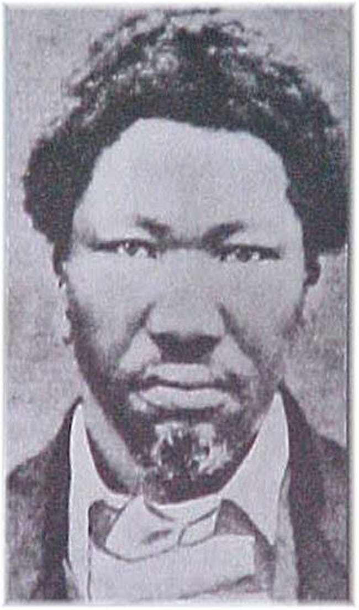
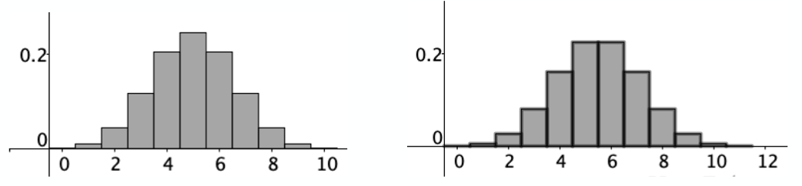
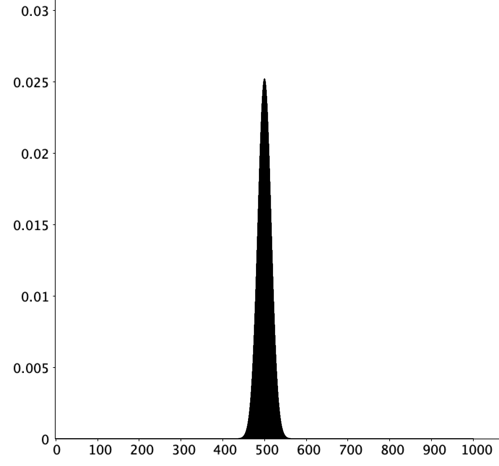
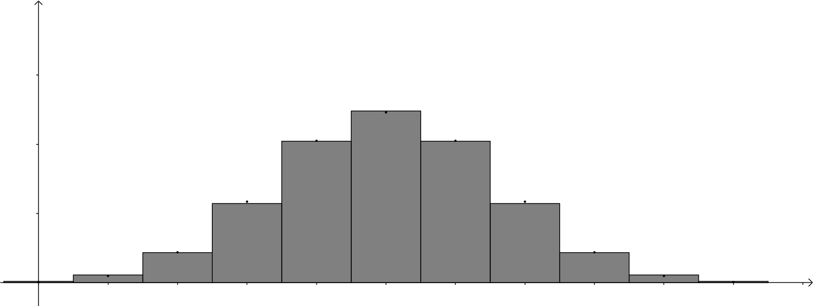
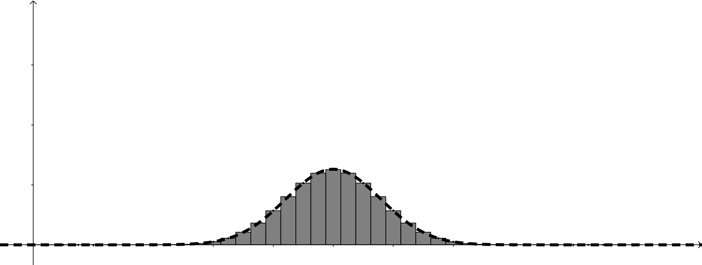

# Binomial, Poisson, Gaussian distributions

**Chapter outcomes**

At the end of the chapter you should be familiar with and be able to:

- Analyse problems then select and apply the Binomial, Poisson and Gaussian distributions as appropriate to determine solutions.

- Analyse problems to determine when the Poisson and Gaussian distribution are appropriate approximation to the Binomial distribution.

**Chapter Statistician: Abraham Manie `Abe' Adelstein**

Abe was a South African doctor who became the UK's Chief Medical Statistician. He held posts a Manchester and the London School of Hygiene and Tropical Medicine. His work included improving cancer research and had leading parts in World Health Organisation meetings that developed recommendations for health information systems across Europe. He was a Fellow of the Royal College of Physicians and held several other honours.
```{r, out.width = "20%", fig.align='center', fig.cap="Calyampudi Radhakrishna Rao.", echo=FALSE} 

```
Image available [online](https://imgix.ranker.com/user_node_img/20/392275/original/abraham-manie-adelstein-all-people-photo-u1?w=650\&q=50\&fm=pjpg\&fit=crop\&crop=faces). 
Image licence: Creative Commons licence.


## Chapter 4 content summary

The follow section outlines the key topics studied in this chapter.


#### Definition of the Binomial distribution {-}

A random variable $X$ has the Binomial distribution with parameters $n$ and $p$ if the probability
\[
\mathbf{P}(X=k)={n \choose k}p^k(1-p)^{n-k}\quad\mbox{for }k=0,1,2,\ldots n.
\]

*Genesis of the Binomial distribution* Suppose that $A_1, A_2 ,\ldots , A_n$ are independent events with $\mathbf{P}(A_i ) = p$ for every $i$. If $X$ denotes the
number of these events which occur, then $X$ has a Binomial distribution with parameters $n$ and $p$.

#### Poisson approximation to the Binomial distribution {-}

Fix $\lambda > 0$. For $n = 1, 2, 3,\ldots$ let $X_n$ have the Binomial distribution with parameters $n$ and $p = \lambda /n$.
Then for each $k = 0, 1, 2, \ldots ,$
\[
\mathbf{P}(X_n = k)\rightarrow \frac{\lambda^k}{k!}e^{-\lambda} 
\]
as $n$ tends to infinity.

#### Weak law of large numbers for the Binomial distribution {-}

Fix $p\in(0, 1)$. For $n = 1, 2, 3,\ldots$ let $X_n$ have the Binomial distribution with parameters $n$ and $p$. Then for any $\varepsilon>0$, $\mathbf{P}(np - n\leq X_n \leq np + n\varepsilon)\rightarrow 1$ as $n$ tends to infinity.

#### Gaussian approximation for the Binomial distribution {-}

Fix $p\in(0, 1)$. For $n = 1, 2, 3,\ldots$ let $X_n$ have the Binomial distribution with parameters $n$ and $p$.Then for each $z_1 < z_2$,
\[
\mathbf{P}(np + z_1\sqrt{np(1 - p)} \leq  X_n \leq  np + z_2 \sqrt{np(1-p)})\rightarrow \int_{z_1}^{z_2} \phi (z)dz
\]
as $n$ tends to infinity, where $\phi(z) = \dfrac{1}{\sqrt{2\pi}} e^{-z^2/2}$ is the standard Gaussian density.


## Class 10: Binomial distribution

**Motivating question** A fair coin is tossed six times. What is the probability that exactly three heads turn up? 

In this case each experiment is a Bernoulli trial, but we are interested in the number of success occurring in this experiment. Take heads as success, so $p=\frac{1}{2}$ and $q=\frac{1}{2}$. How many different ways are there to achieve 3 heads? Firstly, any set of tosses that gives 3 heads has probability
\[
    \left(\frac{1}{2}\right)^3\left(\frac{1}{2}\right)^{6-3}
\]
How many different ways are there to achieve this result? For example, we could have HHHTTT or TTTHHH. We have to pick, from the six tosses, the subsets containing three heads. This can be done in
\[
    {6 \choose 3}
\]
different ways, so the probability is
\[
    {6 \choose 3} \left(\frac{1}{2}\right)^3\left(\frac{1}{2}\right)^{6-3} = 20\times \frac{1}{64} = 0.3125.
\]

This motivates the following result.

:::{.theorem}
Fix $p\in  [0, 1]$. Let $A_1, A_2,\ldots , A_n$ be independent events each having probability $p$ of
occurring. Then the probability that exactly $k$ of these events occur is
\[ 
p(k, n, p) = {n\choose k}p^k(1 - p)^{n-k},
\]
for $k = 0, 1, \ldots , n.$
:::

:::{.proof}
Let $E_k$ denote the event that exactly $k$ of the events $A_1, A_2,\ldots , A_n$ occur. Then
\[
E_k
=
\bigcup_{\begin{array}{c}S\subseteq \{1,2,\ldots,n\}\\|S|=k\end{array}}
\bigcap_{i\in S}
A_i
\bigcap_{i \not\in S} 
A^c_i .
\]
This is a disjoint union so by additivity
\[
\mathbf{P}(E_k ) = \sum_{\begin{array}{c}S\subseteq \{1,2,\ldots,n\}\\|S|=k\end{array}}
\mathbf{P}\left(
\bigcap_{i\in S}
A_i
\bigcap_{i \not\in S} 
A^c_i .
\right)
\]
and by independence and Theorem~\@ref(thm:independentsequence) for each $S$,
\[
\mathbf{P}\left(
\bigcap_{i\in S}
A_i
\bigcap_{i \not\in S} 
A^c_i 
\right)
=
\prod_{i\in S} \mathbf{P}(A_i)
\prod_{i\not\in S} \mathbf{P}(A_i^c) =p^k (1-p)^{n-k}.
\]
Finally note that the sum consists of $\displaystyle {n\choose k}$ terms because there are this many subsets of $\{1, 2, 3,\ldots , n\}$ having $k$ elements.
:::

In the previous result if we denote the number of events that occur by $X$ then we may write
\[
 \mathbf{P}(X = k) 
 =
{n\choose k}p^k(1 - p)^{n-k},
\]
Here $X$ is a *random variable*---a quantity whose value depends on the outcome of the experiment. The result describes the probabilities of observing different possible values for $X$---we say it describes the distribution of $X$. In this case we say $X$ has the Binomial distribution with parameters $p$ and $n$.

Examples of random variables having a Binomial distribution are

- The number of '6's rolled when rolling a dice n times.

- The number of the individuals of a given type in a sample of size n, when sampling from a population
of two types with replacement.

:::{.example}
An express coach travels daily between Manchester and London. The coach calls at Birmingham
only when seats have been reserved in advance. On any day, the probability that the coach calls
at Birmingham is 0.5. Each day is considered independent of any other day. 

Determine the probability that, during a 14-day period, the coach calls at Birmingham on at most 10 days.
:::

:::{.solution}
Let $X$ be the random variable that denotes the number of times the coach calls at Birmingham. Then
\[
\mathbf{P}(X=k) = {14\choose k}\left(\dfrac{1}{2}\right)^k\left(\dfrac{1}{2}\right)^{14-k}
\]
The required probability is 
\[
\mathbf{P}(X=0) + \mathbf{P}(X=1) + \ldots + \mathbf{P}(X=10) = 0.9713.
\]
:::

:::{.example}
During the summer I asked my children to cut the lawn. I have three children and I forgot to state which one should undertake this exciting job. My children tossed a coin to determine the odd person out; that is, who must then cut the lawn. (The coin tosses are independent of each other.) In the case that all three get heads or tails, they continue tossing until they reach a decision. Let $p$ be the probability of heads and $q = 1 - p$ the probability of tails. 

1. Compute the probability that they reach a decision in less than $n$ tosses for any $n \in \mathbf{N}$. 

2. Compute the probability that it takes exactly $n$ tosses to reach a decision.
:::

:::{.solution}
&nbsp;

1. Let $A_i$, with $i\in \mathbf{N}$ and $i\geq 1$, be the event that the decision was reached in the $i$th toss. Since the trials are pefrormed independently of each other, we deduce that the events $A_i$, $i\geq 1$, are independent. In any given toss, no decision is reached if either three heads or three tails are obtained. We note that 
\[
\mathbf{P}(\mbox{they reach a decision in less than $n$ tosses}) = 1 - \mathbf{P}(\mbox{they reach a decision  $n$ or more tosses})
\]
Since, $\mathbf{P}(\mbox{they reach a decision in }n \mbox{ or more tosses}) = \mathbf{P}(A_1^c \cap A_2^c \ldots \cap A_{n-1}^c)$ we compute $\mathbf{P}(A_i^c) = p^3 + q^3,$ for $i\geq 1.$ Hence, by independence
\[
\mathbf{P}(A_1^c \cap A_2^c \ldots A_{n-1}^c) = \mathbf{P}(A_1^c)\mathbf{P}(A_2^c)\ldots  \mathbf{P}(A_{n-1}^c) = (p^3 + q^3)^{n-1}.
\]
Hence, the required probability is
\[
1 - (p^3 + q^3)^{n-1}.
\]
Note, since $1 = (p+q)^3$ we have by expanding and simplifying that $p^3 +q^3 = 1 - 3pq$, and so the probability is also given by $1 - (1 - 3pq)^{n-1}$.

2. By finite additivity
\[
\mathbf{P}(\mbox{they reach a decision in exactly $n$ tosses}) =  \mathbf{P}(\mbox{they reach a decision  $n$ or more tosses}) - \mathbf{P}(\mbox{they reach a decision  $n+1$ or more tosses}).
\]
Therefore, the required probability is
\begin{align*}
\mathbf{P}(\mbox{they reach a decision in exactly $n$ tosses}) 
&= (p^3 + q^3)^{n-1} - (p^3 + q^3)^{n} \\
&= (p^3 + q^3)^{n-1}( 1 - (p^3 + q^3) ) \\
&= (1 - 3pq)^{n-1}3pq,
\end{align*}
where we have used the result $p^3 +q^3 = 1 - 3pq$.
:::


### Class 10 Exercises

:::{.exercise #seeds}
The probability that a seed of a certain kind will germinate is $\dfrac{2}{3}$. Suppose
that six such seeds are planted. Compute the probability that

1. at least 2 seeds will germinate;

2. if at least 3 seeds germinate, at least one does not germinate.
:::

:::{.exercise #tables}
Experience shows that 20\% of the people reserving tables at a certain restaurant never show up. If the restaurant has 50 tables and takes 52 reservations what is the probability that it will be able to accommodate everyone? (There is no need to simplify your answer.)
:::


## Class 11: Weak Law of Large Numbers 

Suppose we toss a coin $n$ times. Let $X_n$ be number of times a head occurs in the $n$ tosses. The random variable $\dfrac{X_n}{n}$ represents the proportion (fraction) of heads that turn up and has a value between 0 and 1. A question is how $\dfrac{X_n}{n}$ behaves for large $n$? Simulations motivate the result. Running 1000 (bias with $p=0.4$) coin simulations and plotting $\dfrac{X_n}{n}$ against $n$ reveals that $\dfrac{X_n}{n}$ appears to converge as $n$ increases, in fact it appears to converge to $p$. The R code generates the simulation figure.

```{r, fig.align="center", echo=TRUE, results='hide'}
#setting a parameters of Bi(n, p)
n <- 1000
p <- 0.4
#dataframe
df <- data.frame(bi = rbinom(n, 1, p)  ,count = 0, mean = 0)
ifelse(df$bi[1] == 1, df[1, 2:3] <- 1, 0)
for (i in 2 : n){
  df$count[i] <- ifelse(df$bi[i] == 1, df$count[i]<-df$count[i - 1]+1, df$count[i - 1])
  df$mean[i] <- df$count[i] / i
}
#graph
plot(df$mean, type='l', ylim=c(0,1),
      main = "Simulation of bias coin flip.",
      xlab="Numbers", ylab=expression(X[n]/n))
abline(h = p, col="blue")
```

Proving this result requires consideration of the Binomial distribution's mode. Firstly, for $0<k\leq n$. Consider the function $f:\mathbf{Z}\rightarrow \mathbf{R}$ defined by  $f(k) =  p(k, n, p)$. The function $f$ is increasing provided $p(k, n, p) - p(k - 1, n, p) \geq 0$; that is, $R_k = \dfrac{p(k , n, p)}{p(k - 1, n, p)} \geq 1$. Consider the ratio
\[
R_k = \frac{p(k, n, p)}{p(k-1, n, p)} = \frac{ \frac{n!}{(n-k)!k!}}{\frac{n!}{(n-k+1)!(k-1)!}} \frac{p^{k} (1 - p)^{n-k}}{p^{k-1} (1-p)^{n-k+1}} = \frac{n-k+1}{k}\frac{p}{1-p}.
\]

:::{.theorem}
Fix $n > 1$ and $p \in (0, 1)$. Let $m = \left \lfloor{(n + 1)p} \right \rfloor$. If $(n + 1)p$ is an integer then the function $f$
defined above attains its maximum at both $k = m - 1$ and $k = m$, otherwise its maximum is uniquely attained at $k = m$.

(Recall, $\left \lfloor{x} \right \rfloor = \max \{ n\in \mathbf{Z} \mid n \leq x\}$.)
:::

This proposition states that if $(n+1)p$ is an integer then $m-1$ and $m$ are modes of the Binomial distribution, otherwise $m$ is the mode. The figures below illustrate this result.

```{r, out.width = "50%", fig.align='center', fig.show = "hold", fig.cap = "(left) The function $k\\mapsto p(k,10,0.5)$ with one mode and (right) $k\\mapsto p(k,11,0.5)$ with two modes.", echo=FALSE}

```

:::{.proof}
Observe that $R_k \geq 1$ if and only if, 
\[
\frac{n-k+1}{k}\frac{p}{1-p} \geq 1.
\]
Suppose $k<(n+1)p$, then $n-k+1 > n - (n+1)p + 1$ and $\dfrac{1}{k} > \dfrac{1}{(n+1)p}$. Thus
\[
R_k = \frac{n-k+1}{k}\frac{p}{1-p} > \frac{n-np -p +1}{(n+1)p}\frac{p}{1-p} = \frac{(n+1)(1-p)}{(n+1)(1-p)} =1.
\]
Similarly, if $k>(n+1)p$, then $R_k < 1$.

So, unless $k=(n+1)p$, we have $R_k > 1$ for $k<(n+1)p$. Therefore, $R_k$ increases (and $f$ increases) until $k$ reaches the value $(n+1)p$. For $k>(n+1)p$, $R_k < 1$ and the function $f$ decreases. Therefore, in the case when $(n+1)p$ is not an integer the mode is $m = \left \lfloor{(n + 1)p} \right \rfloor$. Now suppose $m = \left \lfloor{(n + 1)p} \right \rfloor$ is an integer, then $R_{(n+1)p} = 1$ and $p(m, n, p) = p(m-1, n, p)$; that is, both $m=(n+1)p$ and $m=(n+1)p-1$ are the maximum of the function $f$.
:::

We are interested in describing the function $f$; that is $k \mapsto p(k, n, p)$ when $n$ is large (for some fixed $p$). The figure below motivates our approach.

```{r, out.width = "30%", fig.align='center',  fig.cap = "Binomial distribution for large $n$.", echo=FALSE} 

```

In particular, for large $n$ the overall contribution to $f$ arise from $k$ values close to the mode, $m$. Let $E_k$ denotes the event that
a random variable $X$ having the Binomial distribution with parameters $n$ and $p$ is observed to take the value $k$. The events $E_0$, $E_1$, $\ldots E_n$ form a partition of the sample space. We know that
\begin{equation}
(\#eq:binomialsum)
\sum_{k=0}^n
p(k, n, p) = 1.
\end{equation}
It is important to realise that when $n$ is large enough all the probabilities $p(k, n, p)$ appearing
in the sum \@ref(eq:binomialsum) will be very small, but we can show that the contribution to the sum mostly comes from
terms with $k$ close to the value $m$ where the maximum is attained.

:::{.theorem name="Bernoulli's Weak Law of Large Numbers"}
Fix $p \in (0, 1)$. For $n = 1, 2, 3,\ldots$ let $X_n$ have the Binomial distribution with parameters $n$ and $p$. Then for any  $\varepsilon > 0$,
\[
\mathbf{P}(np - n\varepsilon \leq  X_n \leq  np + n\varepsilon )\rightarrow 1
\]
as $n$ tends to infinity.
:::

Note, we can also write
\[
\mathbf{P}\left(p - \varepsilon \leq \frac{X_n}{n}  \leq p + \varepsilon \right) \rightarrow 1
\]
as $n$ tends to infinity, which is consistent with frequentist interpretation of probability. Another alternative, is for any $\varepsilon >0$, 
\[
\mathbf{P}\left( \left| \dfrac{X_n}{n} - p \right| > \varepsilon \right)\rightarrow 0
\]
as $n$ tends to infinity.

This result is a specific case of more general theorems: the weak/strong law of large numbers.

An experiment consists of flipping a (bias) coin $n$ times. The probability of heads is $p$. This experiment is repeated $k$ times. Now compute the proportion for which $\dfrac{X_n}{n}$ (the sample mean deviates) from $p$ by more than $\varepsilon$; that is, $\left| \dfrac{X_n}{n} - p \right| > \varepsilon$. The following R code illustrates repeating this experiment $k = 1000$ with $p=0.4$ and $n=15000$. The choice of $\varepsilon$ is $0.01$. (This code is recomputed each times the notes are compiled, but in each case the probability should be close to zero.) 

```{r, comment=NA}
p <- 0.4
n <- 15000
k <- 1000
cointosses <- array( 0 + (runif(n*k) <= p), dim=c(n,k))
headstotal <- colSums(cointosses) 
# 0..n binomial rv sample, size k
epsilon <- 0.01 
mu <- p
probability <- sum( 0 + (abs( headstotal/n - mu ) > epsilon) )/k
cat(sprintf("Simulated probability: %f \n", probability ))
```

We finish with an example to illustrate application of the theorem. The proof will follow in the next section. 

:::{.example}
Suppose you toss a coin $n$ times. Then the number of heads in the $n$ tosses is modelled by $X_n$ with Binomial distribution with parameters $n$ and $p=\dfrac{1}{2}$. Bernoulli's Weak Law of Large Numbers states that
\[
\mathbf{P}(0.49n \leq X_n \leq 0.51 n) \rightarrow 1
\]
as $n\rightarrow \infty$. (Here we just happened to select $\varepsilon = 0.01$.)
::::


### Class 11 Exercises

:::{.exercise #gamblingvariant}
Consider the following variant on the gambling game from the tutorial exercise sheet. Each time you play, if you gamble $s$ units of wealth and win then your stake is returned to you together with winnings of $2s$. If you lose you forfeit your stake. Let the probability of winning each time you play be $p = 2/3$.

Suppose you stake a proportion $\alpha$ of your current wealth on each gamble. Using the weak law of large numbers describe how your wealth will behave after many gambles, and hence show that optimal choice for long term growth is to stake half of your current wealth on each game.
:::


## Class 12: Weak Law of Large Numbers: the proof

The purpose of this section is to prove the Weak Law of Large Numbers.

:::{.theorem name="(Bernoulli's) Weak Law of Large Numbers"}
Fix $p \in (0, 1)$. For $n = 1, 2, 3,\ldots$ let $X_n$ have the Binomial distribution with parameters $n$ and $p$. Then for any  $\varepsilon > 0$,
\[
\mathbf{P}(np - n\varepsilon \leq  X_n \leq  np + n\varepsilon )\rightarrow 1
\]
as $n$ tends to infinity.
:::


:::{.proof}
The proof is split into a series of steps. The overall strategy is as follows:

1. We prove the right tail probability $\mathbf{P} (X_n > np + n\varepsilon) \rightarrow 0$ as $n\rightarrow \infty$. 

2. We estimate $\mathbf{P} (X_n = r)$ for the smallest integer $r$ such that $r > np + p\varepsilon$.

3. We estimate $\mathbf{P} (X_n = j)$ for $j > r$ in terms of $\mathbf{P} (X_n = r)$.

4. Using this estimate permit us to estimate $\mathbf{P} (X_n \geq r)$.

5. Combining these estimates finally permits us to show that $\mathbf{P} (X_n > np + n\varepsilon) \rightarrow 0$ as $n\rightarrow \infty$. 

6. Finally, we create a lower bound on $X_n$ to show $\mathbf{P} (X_n < np - n\varepsilon) \rightarrow 0$ as $n\rightarrow \infty$. 

ST112 Probability B will have more to say about the WLLN, in particular, a quick proof once we have more theory available to us. The question is, why is the theorem called "weak", well there is a ["strong" version](https://en.wikipedia.org/wiki/Law_of_large_numbers#Strong_law) which is illustrated here for [random walks](https://en.wikipedia.org/wiki/Law_of_the_iterated_logarithm) of which the Gambler's ruin problem is an example.

We prove  $\mathbf{P}(X_n > np + n\varepsilon)$ tends to 0 as $n$ tends to infinity in a series of steps.

Firstly, we set-up the notation. Let $\varepsilon > 0$. Let $m= \left \lfloor{(n + 1)p} \right \rfloor$. Let $r$ be the smallest integer such that $r > np + n\varepsilon$.  Then for $j > r\geq  \left \lfloor{(n + 1)p} \right \rfloor$, we have that the function $x\mapsto p(x,n,p)$ decreases for $x$ from $r$ to $j$.  Therefore, for all, $r \leq i \leq j$ we have $\mathbf{P}(X_n = j) = p(j,n,p)\leq p(i,n,p) =\mathbf{P}(X_n = i)$, or equivalently, $R_j \leq R_{j-1} \leq \ldots R_i \leq \ldots \leq R_{r}$. 

We want to estimate $\mathbf{P}(X_n = r)$. We know $\displaystyle \sum_{i=0}^n p(i, n, p) = 1$, or equivalently $\displaystyle \sum_{i=0}^n \mathbf{P}(X_n =i ) = 1$. Therefore,
\[
\begin{array}{lcll}
1 &=& \sum_{i=0}^n \mathbf{P}(X_n =i ) &\\
&\geq& \sum_{i=m}^r \mathbf{P}(X_n =i ) & [\mbox{Concentrate on the right-tail to } r] \\
&\geq& \sum_{i=m}^r \mathbf{P}(X_n =r ) & [\mbox{The mass function is decreasing }] \\
&=& (r - m + 1)\mathbf{P}(X_n =r ) &[(n + 1)p \geq m= \left \lfloor{(n + 1)p} \right \rfloor, \mbox{so } r - m + 1 \geq r - (n+1)p +1]\\
&\geq& (r - (n+1)p + 1))\mathbf{P}(X_n =r ) &\\
&=& (r - np - p + 1)\mathbf{P}(X_n =r ) &\\
&\geq& (r - np)\mathbf{P}(X_n =r )& [1 - p\geq 0]  \\
&>& n\varepsilon P(X_n =r )& \\
\end{array}
\]
where the final inequality follows since $r > np + n\varepsilon$.
Therefore, 
\[
\mathbf{P}(X_n =r ) < \frac{1}{n\varepsilon}.
\]
Hence, this probability tends to zero as $n\rightarrow \infty$.

*Estimate $\mathbf{P}(X_n = j)$* Recall 
\[
R_k = \frac{p(k, n, p)}{p(k-1, n, p)} = \frac{\mathbf{P}(X_n = k)}{\mathbf{P}(X_n = k-1)}.
\]
Hence,
\begin{align*}
\mathbf{P}(X_n = j) &= \mathbf{P}(X_n = r) \times \frac{\mathbf{P}(X_n = r+1)}{\mathbf{P}(X_n = r)} \times \frac{\mathbf{P}(X_n = r+2)}{\mathbf{P}(X_n = r+1)}\times \ldots \times \frac{\mathbf{P}(X_n = j)}{\mathbf{P}(X_n = j-1)} \\
&= \mathbf{P}(X_n = r) \times \underbrace{R_{r+1} \times R_{r+2} \times \ldots \times R_{j} }_{j-r\mbox{ terms }} \\
&\leq \mathbf{P}(X_n = r) \times R_{r+1} \times R_{r+1} \times \ldots \times R_{r+1} \\
&\leq \mathbf{P}(X_n = r) \times R_{r+1}^{j - r}.
\end{align*}
Where we recall that $R_j \leq R_{j+1} \leq \ldots R_i \leq \ldots \leq R_{r}$. For notational ease, write $R = R_{r+1}$, then
\[
\mathbf{P}(X_n = j) \leq \mathbf{P}(X_n = r) \times R^{j - r}.
\]

*Estimate $\mathbf{P} (X_n \geq r)$* Applying the result $\mathbf{P}(X_n = j) \leq \mathbf{P}(X_n = r) \times R^{j - r}$ gives:
\begin{align*}
\mathbf{P} (X_n \geq r) &= \mathbf{P}(X_n = r) + \mathbf{P}(X_n = r+1) + \ldots + \mathbf{P}(X_n = n) \\
&=  \mathbf{P}(X_n = r) +  \mathbf{P}(X_n = r)R + \mathbf{P}(X_n = r)R^2 + \ldots + \mathbf{P}(X_n = r)R^{n-r} \\
&= \mathbf{P}(X_n = r) \left( 1 + R + R^2 + \ldots + R^{n-r}\right) \\
&= \mathbf{P}(X_n = r) \frac{1 - R^{n-r +1}}{1 - R} \\
&\leq \mathbf{P}(X_n = r) \frac{1}{1 - R}.
\end{align*}
where the final inequality follows since $R^{n-r +1} > 0$. 


*Estimate $\mathbf{P} (X_n > np + n\varepsilon)$* Recall that, by definition
\[
R:= R_{r+1} = \frac{n -(r+1) +1}{r+1}\frac{p}{1-p} = \frac{n-r}{r+1}\frac{p}{1-p}.
\]
Recall, $r > np + n\varepsilon$, thus $\dfrac{1}{np + n\varepsilon + 1}> \dfrac{1}{r+1}$. Hence,
\begin{align*}
R & = \frac{n-r}{r+1}\frac{p}{1-p} \\
&< \frac{n - np - n\varepsilon}{np + n\varepsilon + 1}\frac{p}{1-p} \\
&< \frac{n - np - n\varepsilon}{np}\frac{p}{1-p} \\
&=\frac{1 - p - \varepsilon}{1}\frac{1}{1-p} \\
&= 1 - \frac{ \varepsilon }{1 - p}.
\end{align*}
Hence
\[
\frac{1}{1 - R} < \frac{1}{1 - \left( 1 - \frac{ \varepsilon }{1 - p} \right)} = \frac{1-p}{\varepsilon}.
\]
Combining the results we have (recall $r$ is the smallest integer such that $r > np + n\varepsilon$)
\begin{align*}
\mathbf{P}(X_n > np + n\varepsilon) &\leq \mathbf{P}(X_n = r) \frac{1}{1 - R} \\
&< \frac{1}{n\varepsilon}\frac{1-p}{\varepsilon} \\
&= \frac{1-p}{n\varepsilon^2}
\end{align*}
The variables $p$, $\varepsilon$ are fixed, so as $n\rightarrow \infty$ the righthand side tends to zero, which gives the result since all probabilities are non-negative.

Finally, consider the left tail probability $\mathbf{P} ( np - n\varepsilon \leq X_n)$. Following the approach taken in the above proof, we show (the complementary probability) $\mathbf{P} ( X_n < np - n\varepsilon )$ tends to 0 as $n\rightarrow \infty$. Let $Y_n:= n - X_n$. Then $Y_n$ is the random variable that counts the number of failures. So
\begin{align*}
\mathbf{P} ( X_n < np - n\varepsilon ) &= \mathbf{P} (n - X_n >  n \varepsilon + n - np) \\
&= \mathbf{P} (Y_n >  n\varepsilon + nq) 
\end{align*}
where $q= 1- p$. Using the final estimate from the proof with $p$ replaced with $q$ shows $\mathbf{P} (Y_n >  n\varepsilon + nq)$ tends to 0 as $n$ tends to infinity. This completes the proof. 
:::


### Class 12 Exercises

:::{.exercise #unitsquares}
Let $n \geq 1$ be an integer. Let $X = \{ (x,y) \in \mathbf{R}^2 : 0 \leq x, y \leq n \}$. Consider $X$ as the disjoint union of $n^2$ unit squares with vertices having integer coordinates.

1. Determine the number of routes are there from $(0,0)$ to $(n, n)$ which travel along the edges of the unit squares, always in a direction so as to have non-decreasing co-ordinate values.

2. 
    (i) Let $k$ be some given integer satisfying $0 \leq k \leq n$. Determine the number of routes from $(0,0)$ to $(n, n)$ through the point $(k, n-k)$.
    (ii) Use your answer to simplify the sum
    \[
    \sum_{k=0}^{n}\left(\frac{n !}{k !(n-k) !}\right)^{2}.
    \]
3. Let $E_{n}$ denote the event that the randomly chosen route passes through a point $(k, n-k)$ with $|2 k - n |< \dfrac{n}{100}$ Determine
\[
\lim _{n \rightarrow \infty} \mathbf{P}\left(E_{n}\right).
\]
_Helpful result_ You may use without proof the fact that the probabilities defined in part (1) satisfy, that if $p=\frac{1}{2},$ there exists $M < \infty$ so $\dfrac{f(k ; n, p)}{f(n ; 2 n, p)} \leq M$ for all $n \geq 1$ and $0 \leq k \leq n$, where
\[
f(k ; n, p) = \frac{n!}{k! (n-k)!} p^k (1-p)^{n-k}.
\]
:::


## Class 13: Poisson distribution

**Motivating example** Suppose we wish to model the number incoming telephone calls to the emergency services in a large city. We might, for example, be interested in the probabilities of more than 10 phone calls occurring in a 5-minute time interval. We would need to consider different time periods since the number of incoming phone calls would probably be different, for example between 6pm and 7pm and 4am and 5am. For a given time interval, say 6pm and 7pm we assume the average number of phone calls per minute is a constant. Denote this rate by $\lambda$. (Thus, in a given 5-minute time interval, we would expect about $5\lambda$ phone calls.) This means that if we were to apply our
model to the two time periods given above, we would simply use different rates
for the two time periods, thereby obtaining two different probabilities for the given
event.

Our next assumption is that the number of phone calls in two non-overlapping
time intervals are independent. In our example, this means that the events that
there are $j$ calls between 5:00 and 5:15 pm and $k$ calls between 5:15 and 5:30 pm on the same day are independent.

:::{.solution}
We can use the binomial distribution to model this situation. We imagine that
a given time interval is broken up into $n$ subintervals of equal length. If the subintervals
are sufficiently short, we can assume that two or more phone calls happen
in one subinterval with a probability which is negligible in comparison with the
probability of at most one occurrence. Thus, in each subinterval, we are assuming
that there is either 0 or 1 phone calls. This means that the sequence of subintervals
can be thought of as a sequence of experiments that are either a success or failure, with a success corresponding to
a phone call in the subinterval.

To decide upon the proper value of $p$, the probability of an occurrence in a given
subinterval, we reason as follows. 

- On the average, there are $\lambda t$ phone calls in a time period of length $t$. 
- If this time interval is divided into $n$ subintervals, then we would expect, that there should be $np$ phone calls. 

Thus, we want
\[
    \lambda t = np \implies p = \frac{\lambda t}{n}
\]
Let $X$ be the random variable that counts the number of phone calls in a given interval. We need to find the distribution of $X$. To keep things simple we assume $t=1$, so
\[
P(X=0) = (1-p)^n = \left( 1- \frac{\lambda}{n}\right)^n.
\]
For large $n$ this approaches $e^{-\lambda}$. What about $P(X=1)$?
\[
    P(X=1) = {n \choose 1} p^1 (1-p)^{n-1} 
    = n \times \frac{\lambda}{n} \left( 1- \frac{\lambda}{n}\right)^{n-1} 
    = \lambda \left( 1- \frac{\lambda}{n}\right)^{n-1} 
\]
Taking the limit as $n\rightarrow \infty$ gives  $P(X=1) = \lambda e^{-\lambda}$ and in general  
\[
    P(X=k) = \frac{\lambda^k}{k!}e^{-\lambda}.
\]
:::


**Formalities** We now formalise the above discussing and consider another result describing Binomial probabilities as $n$ tends to infinity, but this time the parameter $p$ changes with $n$. Fix $\lambda > 0$. Let $X_n$ have the Binomial distribution with parameters $n$ and $p = \lambda/n$. Then for each $k = 0, 1, 2, \ldots$, as $n$ tends to infinity,
\[
\mathbf{P}(X_n = k) \rightarrow \frac{\lambda^{k}}{k!}e^{-\lambda}. 
\]

A standard result from analysis gives
\[
\mathbf{P}(X_n = 0) = (1 - p)^{n} = \left(1 - \frac{\lambda}{n} \right)^n \rightarrow e^{-\lambda}.
\]
More generally, since
\[
\frac{\mathbf{P}(X_n = k)}{\mathbf{P}(X_n = k-1)} = \frac{n - k+1}{k}\frac{p}{1-p} = \frac{n-k+1}{k} \frac{\lambda/n}{1 - \lambda/n} \rightarrow \frac{\lambda}{k}.
\]
we have
\[
\mathbf{P}(X_n = k) = \mathbf{P}(X_n = 0) \times \frac{\mathbf{P}(X_n = 1)}{\mathbf{P}(X_n = 0)}\times \ldots \times \frac{\mathbf{P}(X_n = k)}{\mathbf{P}(X_n = k-1)} \rightarrow e^{-\lambda} \times \lambda \times \frac{\lambda}{2} \times \ldots \times \frac{\lambda}{k}.
\]

In summary.

:::{.theorem #Ppoissonapproxbinomial}
Fix $\lambda > 0$. Let $X_n$ have the Binomial distribution with parameters $n$ and $p = \lambda/n$. Then for each $k = 0, 1, 2, \ldots$, as $n$ tends to infinity,
\[
\mathbf{P}(X_n = k) \rightarrow \frac{\lambda^{k}}{k!}e^{-\lambda}. 
\]
:::

This result leads to the following definition.

:::{.definition}
If a random variable $X$ has a distribution satisfying
\[
\mathbf{P}(X_n = k) \rightarrow \frac{\lambda^{k}}{k!}e^{-\lambda}
\]
for $k = 0, 1, 2, 3\ldots$, then we say it has the *Poisson distribution* with parameter $\lambda$.
:::

We saw a special case of Theorem \@ref(thm:Ppoissonapproxbinomial) when considering birthdays. If there
are 365 students in the room, then the number of students having a birthday today has the Binomial distribution with parameter $n = 365$ and $p = \dfrac{1}{365}$. This is well approximated by the Poisson distribution with parameter $\lambda = 1$. In fact the probability of two birthdays happening today given by the Binomial distribution is
\[
\frac{365\times 364}{2} \left( \frac{1}{365} \right)^2 \left( \frac{364}{365} \right)^2 = 0.18419\quad (\mbox{5 dp}).
\]
The Poisson approximation to this probability is
\[
\frac{1}{2}e^{-1} = 0.18394\quad (\mbox{5 dp}).
\]
The Poisson distribution is a fundamental ingredient for building models of points occurring randomly in space or time. 

:::{.example}
Bombs strikes in central London during WW2 were counted, with London divided into 574 equally sized areas, and the number of bomb strikes in each recorded. In total there were 537 bomb strikes. The number of sites receiving no bomb strikes, 1,2,3,4, and more than 5 are recorded the first line in this table. 

| k               | 0   | 1  | 2   | 3   | 4   | 5+   |
|:----------------|:---:|:--:|:---:|:---:|:---:|:----:|
|Number of sites  | 229 |221 | 93  | 35  | 7   | 1    |

If we modelled the probability of a particular site having $k$ strikes using the Poisson distribution with  $\lambda = 537/574$ we get the following.
:::

:::{.solution}
The second line gives the number of sites that would be expected to have $k$ strikes if we modelled the probability of a particular site having $k$ strikes using the Poisson distribution with  $\lambda = 537/574$.

| k              | 0   | 1 | 2 | 3 | 4 | 5+ |
|----------------|-----|---|---|---|---|----|
|Number of sites | 229 |221| 93| 35| 7 | 1  |
|Poisson fit     | 225 |211| 99| 31| 7 | 1.6|

```{r, echo=TRUE, results='hide', comment=NA}
events <- 0:4
dpois(events, lambda = 537/574)*574 
# x > 4.
ppois(4, lambda = 537/574, lower.tail = FALSE)*574 
```
:::

:::{.example}
You have an online video channel with an enormous subscription base. You decide to run a giveaway (for some amazing prize) where all entrants (who must be subscribers) have equal (independent) probability $p\in (0,1)$ of winning the giveaway prize. You have two giveaway prizes and no more are available. If nobody wins the prize, then it is terrible for publicity, but if more than two entrants win, then you will not have enough prizes, this is equally terrible. Your goal is to ensure either 1 or 2 people win the giveaway.  In total $n$ subscribers enter, where $n$ is a large proportion of the subscription base. Determine the value of $p$ that maximises the chances of achieving your goal. 
:::

:::{.solution}
Let $X$ be the random variable that denotes the number of winners. It follows that $\mathbf{P}(X=k) = p(k,n,p)$. To achieve the goal we must maximise $\mathbf{P}(X=1) + \mathbf{P}(X=2)$. Fix $\lambda = np$, then as $n\rightarrow \infty$, $\mathbf{P}(X=k) \rightarrow \dfrac{\lambda^k}{k!}e^{-\lambda}$.

Let $f:(0,1]\rightarrow \mathbf{R}$ defined by
\[
f(p) = e^{-np}\left( np + \frac{n^2p^2}{2} \right).
\]
Logarithmic differentiation is useful here; that is, $\log f(p) = -np + \log (np) + \log \left(1 + \dfrac{np}{2} \right)$. Differentiating gives
\[
\frac{f'(p)}{f(p)} = -n + \frac{1}{p} + \frac{n/2}{1 + \frac{np}{2}}
\]
At a maximum (the graph must have a unique maximum: $f(0)=0$, $f(p)\rightarrow 0$ as $p\rightarrow \infty$ and $f(p)>0$ for $p>0$.)
\[
-n + \frac{1}{p} + \frac{n/2}{1 + \frac{np}{2}} = 0.
\]
The only positive solution is $p = \dfrac{\sqrt{2}}{n}$. When $n>1$, $\dfrac{\sqrt{2}}{n} < 1$ and hence this is the unique maximum. 

Therefore, the maximum value of $f$ is $f\left( \dfrac{\sqrt{2}}{n} \right) = e^{-\sqrt{2}}\left( \sqrt{2} + 1 \right) \approx 0.59$ to 2 decimal places.
:::

### Class 13 Exercises

:::{.exercise #radioactive}
Consider a radioactive sample randomly emitting alpha particles at random at an average rate of one particle every 10 seconds. We would model the number of particles emitted in a minute as a random variable with the Poisson distribution with $\lambda = 6$. Why is this a reasonable model? 
:::

:::{.exercise #randomvar}
Let $X$ be a random variable with 
\[
\mathbf{P}(X = k) = \frac{\lambda^{k}}{k!}e^{-\lambda}
\]
with $\lambda > 0$. Show that $\sum_{k=0}^{\infty} \mathbf{P}(X = k) = 1$.
:::

:::{.exercise #online}
&nbsp;

1. You play an online game once a week for 52 weeks. Each week, with probability $1 / 104$, you have a chance to win a prize in this online game. 

   (i) Assuming independence of each win, write down the appropriate distribution that models the number of wins in the 52 week period.
   
   (ii) Write down an appropriate approximate for the event that the number of wins is $k$.
   
   (ii) Estimate, the probability that you win a prize exactly twice in the 52 week period. (Write your final form in exact form.)
   
   (iii) Estimate the probability that you win a prize at least twice in the 52 week period.

2. Now suppose instead your weekly chance of winning is \(1 / n\) for some integer \(n\geq 1\). Show that there exists an integer \(N\) such that if \(n \geq N\) and if you play more than \(2 n\) times, your chance of winning at least twice is greater than
\(1 / 2 .\) [You may find it useful to note that \(e^{2}>6\).]
:::


## Class 14: Gaussian (normal) distribution 

For large values of $n$ there is another approximation to the Binomial distribution.


```{r, fig.align='center',fig.cap = "Galton board simulation.", echo=FALSE}
knitr::include_url("https://www.geogebra.org/material/iframe/id/Wt6CxnAv/width/900/height/706/border/888888/sfsb/true/smb/false/stb/false/stbh/false/ai/false/asb/false/sri/true/rc/false/ld/false/sdz/true/ctl/false")
```

This simulation motivates an approximation to the Binomial distribution as $n$ increases. This approximation is further illustrated below. 

```{r, out.width = "30%", fig.align='center', fig.show = "hold", fig.cap = "Binomial distribution `converging' to the Gaussian distribution.", echo=FALSE} 



```

The curve in the right-hand figure is one of the most famous in mathematics.

:::{.definition}
The function
\[
\phi(x) =  \frac{1}{\sqrt{2\pi}} e^{-x^2/2},
\]
where $x\in \mathbf{R}$, is called the standard Gaussian (or normal) density function.
:::

**Approximating the Binomial distribution** De Moivre used Stirling's formula
\[
\lim_{n\rightarrow \infty} \frac{n!}{\sqrt{2\pi n} n^n e^{-n}} = 1 
\]
to investigate the Binomial probabilities $p\left(k, n, \dfrac{1}{2} \right)$ for $n$ large and $k$ close to $\dfrac{n}{2}$. 

In particular we see (for $n = 2m$ even)
\[
p\left(\frac{n}{2}, n, \frac{1}{2} \right)=
\frac{(2m)!}{(m!)^2}2^{-2m}
\sim
\frac{\sqrt{4\pi m}.(2m)^{2m} e^{-2m}}{2\pi m . m^{2m} e^{-2m}} 2^{-2m} \sim \sqrt{\frac{2}{\pi}}\frac{1}{\sqrt{n}} = \frac{2}{\sqrt{n}}\phi(0).
\]
More generally fixing $x \in \mathbf{R}$ and taking a sequence of integers $k_n$ so
\[
\frac{2}{\sqrt{n}}\left(k_n - \frac{n}{2} \right) \rightarrow x
\]
we have
\begin{equation}
(\#eq:gaussbinomial)
\lim_{n\rightarrow \infty} \frac{\sqrt{n}}{2} p\left(k_n , n, \frac{1}{2} \right) = \phi(x).
\end{equation}

Laplace (1810) extended this result to general $p\in  (0, 1)$ and at about the same time Gauss used the density $\phi$  to model the distribution of general measurement errors. This work of Gauss is the one of the first important studies in statistics.

To be useful we need to have a statement about the behaviour of sums of Binomial probabilities. We state the result without proof, it is the first step toward one of the most important results in mathematics and statistics with applications and daily use in every applied science/social science. The general result is given with a sketch proof in Probability B.

:::{.theorem name="De Moivre-Laplace"}
Fix $p\in  (0, 1)$. For $n = 1, 2, 3, \ldots$ let $X_n$ have the Binomial distribution
with parameters $n$ and $p$. Then for all $-\infty\leq z_1 < z_2 \leq \infty$ ,
\[
\mathbf{P}(np + z_1 \sqrt{np(1 - p)} \leq  X_n \leq np + z_2\sqrt{np(1 - p)}) \rightarrow \int_{z_1}^{z_2} \phi(z) dz 
\]
as $n$ tends to infinity and where $\phi(z) = \dfrac{1}{\sqrt{2\pi}} e^{-z^2/2}$ is the standard Gaussian density.
:::

The US gameshow [The Wall](https://www.nbc.com/the-wall?nbc=1) is an application of the De Moivre-Laplace theorem.


:::{.example}
Suppose we toss a coin 10,000 times. Then the number of heads $X$ has the Binomial distribution
with parameters $n = 10, 000$ and $p = \dfrac{1}{2}$. 
:::

:::{.solution}
We know that the most likely value of $X$ is $np = 5,000$. The probability of getting exactly 5,000 head is, by \@ref(eq:gaussbinomial), approximately $2\phi(0)/n = 0.008$ (3 dp). The
law of large numbers tells us that we should expect however to observe a value of $X$ close to 5,000, but
it gives no information that allows us to make sense of `close' in a more quantitative way. Using the
Gaussian approximation to the Binomial distribution helps. Taking $z_1 = -1.96$, $z_2 = 1.96$ we have
\[
\mathbf{P} (4902 \leq X_n \leq 5098) \approx \int_{-1.96}^{1.96} \phi(z)dz = 0.95.
\]
Indeed, solving $4902 = np + z_1\sqrt{np(1-p)}$ gives $z_1 = -1.96$ and similarly for $z_2$.
:::

:::{.example}
The random variable $X$ has a binomial distribution with parameters  $n$ and $p$, where $n=16$ and  $p=\frac{1}{2}$. 

Show that 
\[
\mathbf{P}(X=8) \approx \frac 1{2\sqrt{2\pi}}. 
\]
:::

:::{.solution}
By the De Moivre-Laplace, 
\[
\mathbf{P}( 8 + 2z_1 \leq X \leq 8 + 2z_2) \rightarrow \int_{z_1}^{z_2} \dfrac{1}{\sqrt{2\pi}} e^{-z^2/2} dz
\]
where $X$ is a Binomial random variable with parameters $n=16$ and $p=\frac{1}{2}$. Since $\mathbf{P}(X = 8) = \mathbf{P}\left( 8 - \dfrac{1}{2} \leq X \leq 8 + \dfrac{1}{2} \right)$, we choose $2z_1 = -\dfrac{1}{2}$ and $2z_2 = \dfrac{1}{2}$. Then $z_1 = -\dfrac{1}{4}$ and $z_2 = \dfrac{1}{4}$. 

Therefore,
\[
\mathbf{P}(X = 8) = \mathbf{P}\left( 8 - \dfrac{1}{2} \leq X \leq 8 + \dfrac{1}{2} \right) \approx \int_{-\frac{1}{4}}^{\frac{1}{4}} \dfrac{1}{\sqrt{2\pi}} e^{-z^2/2} dz.
\]
Approximating the integral as a rectangle of width $\dfrac{1}{2}$ and height $\dfrac{1}{\sqrt{2\pi}}$ gives
\[
\mathbf{P}(X=8) \approx \dfrac{1}{2\sqrt{2\pi}}.
\]
:::

:::{.example}
You toss a biased coin \(n\) times, this is your experiment. The probability that it shows head on any particular toss is $0\leq p \leq 1$, where $p$ is unknown.  

1. Explain how to estimate $p$ using the outcomes of the experiment. 

2. Compute
\[
\sup _{p \in[0,1]} p(1-p)
\]

3. Use the De Moivre-Laplace Theorem to estimate how large \(n\) needs to be so that, no matter what the value of \(p,\) your estimate \(\hat{p}\) of \(p\) satisfies
\[
|\hat{p}-p| \leq 0.01
\]
with probability at least \(0.95 .\) 

   You will find it useful to recall the fact that the standard Gaussian density \(\phi\) satisfics
\[
\int_{-1.96}^{1.96} \phi(z) d z=0.95(2 \mathrm{~d} . \mathrm{p})
\]
:::

:::{.solution}
&nbsp;

1. By the Weak Law of Large Number, we know that 
\[
\mathbf{P}\left(\left|\frac{X_{n}}{n}-p\right|>\varepsilon\right) \rightarrow 0\mbox{ as }n \rightarrow \infty. 
\]
Hence, estimate $p$ based an the proportion of times the coin lands heads up,

2. Let $f:[0,1]\rightarrow \mathbf{R}$ be defined by $f(p)=p(1-p)$. The maximeem of $f$ an $[0,1]$ occurs at $p = \frac{1}{2}$, with $f(1/2) = 1/4$. Therefore, $\sup_{p \in[0,1]} p(1-p) = \frac{1}{4}$.

3. By the deMoivre-Laplace Theorem 
\[
\mathbf{P}\left(n p + z_{1} \sqrt{n p(1-p)} \leqslant X_{n} \leqslant n p + z_{2} \sqrt{n p(1 - p)}\right) \rightarrow \int_{z_{1}}^{z_{2}} \phi(z) d z
\mbox{ as }n \rightarrow \infty.
\]
Hence, using the given fact
\[
\mathbf{P}\left(n p-1.96 \sqrt{n p(1 - p)} \leq X_{n} \leqslant n p+1.96 \sqrt{n p(1-p)}\right) \rightarrow 0.95
\mbox{ as }n \rightarrow \infty.
\]
Rearranging gives
\[
\mathbf{P}\left( -1.96 \sqrt{n p(1 - p)} \leq X_{n} - np \leqslant 1.96 \sqrt{n p(1-p)}\right) \rightarrow 0.95
\mbox{ as }n \rightarrow \infty.
\]
Or equivalently
\[
\mathbf{P}\left( \left| X_{n} - n p\right| \leqslant 1.96 \sqrt{n p(1-p)} \right) \rightarrow 0.95 \mbox{ as }n \rightarrow \infty.
\]
We have $\hat{p}=\frac{X_{n}}{n}$; the propontan af heads. So, we want
\[
|\hat{p}-p|=\left|\frac{X_{n}}{n}-p\right| \leq 0.01
\]
Hence, $\left|X_{n}-n p\right| \leqslant 0.01 n$. That is, $1.96 \sqrt{n p(1 - p)} \leqslant 0.01 n$.
Since,  $p(1-p) \leq 1 / 4,$
\[
1.96 \sqrt{n p(1-p)} \leqslant 1.96 \sqrt{n \times \frac{1}{4}} =1.96 \times \frac{1}{2} \sqrt{n}
\]
Combining the results we require $1.96 \times \frac{1}{2} \sqrt{n} \leq 0.01n$. Thus,
\[
\frac{n}{\sqrt{n}} \geq 1.96 \times \frac{1}{2} \times 100 = 98.
\]
Simplifying we require $\sqrt{n} \geq 98$; that is, $n \geq 98^2$. As a crude estimate, we can take $n \geq 100^2 = 10,000$ as being sufficient.
:::


### Class 14 Exercises

:::{.exercise #students}
Suppose that we observe that 230 out of the 400 mathematics students in the class were born in the first 6 months of the year. Is this observation reasonably consistent with the hypothesis that birthdays (of mathematics students) are uniformly distributed throughout the year? 
:::

:::{.exercise #cricket}
A cricketer's batting average was 197 hits out of 535, (about $0.368$). Their lifetime average was $0.338$. 

Create a model to estimate the probability that this batting average occurs by chance for a cricketer with a $0.300$ batting average.
:::

## Chapter 4 Consolidation Questions

Chapter Consolidation Questions provide additional practice covering the entire chapter. The questions may require you to evaluate information to determine the appropriate approach to solve a problem. For this reason, you may find these questions best saved for revision.

**Chapter outcomes review**

Having reviewed the material and completed the assessment (formative and summative) material, you should be able to:

- Analyse problems then select and apply the Binomial, Poisson and Gaussian distributions as appropriate to determine solutions.

- Analyse problems to determine when the Poisson and Gaussian distribution are appropriate approximation to the Binomial distribution.

:::{.exercise #printing}
Any printing process can introduce misprints. For a particular textbook, the following model is appropriate. Let $X$ denote the number of misprints. Then $\mathbf{P}(X = n) = \mathrm{e}^{-\lambda}\lambda^{n}/n!$ where $\lambda$ is a positive constant. The probability that a fixed reader spots a particular misprint is $p$ with $p\in (0,1)$. The value of $p$ is fixed for each misprint and is independent of whether the reader spots or does not spot any other misprint.

1. Suppose the textbook contains a total of $T=n+m$ misprints. Determine the probability that the reader spots exactly $m$ misprints.

2. Suppose the reader spots exactly $m$ misprints, determine the probability the reader failed to spot $n$ misprints.
:::

:::{.exercise #posters}
You are checking a sequence of poster prints for errors. When you spot an error you place a red cross on the poster. The number of errors on a poster is random and have a Poisson distribution with parameter $\lambda$. The probability that you spot any one error is $p$ and is independent of the probability that you spot any other error.

1. Determine the model for the number of red crosses you place on a single slide.

2. Determine the probability that you place your second red cross on the $k$th poster.
:::
:::{.exercise #binomialdist}
By considering a binomial distribution with parameters $2n$ and $\frac{1}{2}$ and suitable integral approximations show that 
\[
(2n)! \approx \frac {2^{2n} (n!)^2}{\sqrt{n\pi}}.
\]
:::

:::{.exercise #score1}
In each round of a game you can score 1 point with probability $\frac{1}{2}$ and 2 points with probability $\frac{1}{2}$. Suppose you start with zero points. Determine the probability that your score is exactly $n\geq 0$ points after a certain number of rounds.
:::


## Class 15: More examples

The purpose of this class is to provide you with examples questions that bring together the material seen in the module. The aim is for you to attempt the questions yourself and then use the worked solutions as feedback on your attempts. 

Since this class is based entirely around directed examples, there are no separate questions.

:::{.example}
Fix positive integers $r$ and $n$. Let $\Omega= \{1,2 \ldots, r\}^{n}$ be the set of all sequences of length $n$ whose terms each belong to the set $\{1,2, \ldots, r\}$.

1. How many scquences does \(\Omega\) contain?

2. Let $k$ be an integer satisfying $1 \leq k \leq r$. Assume each sequence in $\Omega$ is equally likely to be chosen. Determine the probability that a randomly chosen sequence from $\Omega$ belongs to the set
\[
A_{k}=\{\omega \in \Omega: \omega(i) \neq k \text { for all } 1 \leq i \leq n\}.
\]
3. Suppose that $r=100$ and $n=1000$. Show that the probability that a randomly chosen sequence $\omega$ from $\Omega$ satisfies for all $k \in\{1,2 \ldots, r\}$ there exists an $i$ so that $\omega(i)=k$ is greater than $99 / 100$. 

You may find it useful to recall the fact that $1-x \leq e^{-x}$ for $x \geq 0$, and that $e^{5}>100$.
:::

:::{.solution}
1. By the fundamental multiplication rule, the number of sequences in $\Omega$ is 
\[
\underbrace{r\times r \times \ldots \times r}_n = r^n.
\]

2. Consider $A_{k}=\left\{\left(\omega_{1}, \ldots, \omega_{n}\right)=\omega \mid \omega(i) \neq k \quad \forall 1 \leqslant i \leqslant n\right\}$.  Then $\left|A_{k}\right|=(r-1)^{n}$.  Since each sequence is equally likely it follows that
\[
\mathbf{P}\left(A_{k}\right)=\frac{\left|A_{k}\right|}{|\Omega|}
\]
Hence,
\[
\mathbf{P}\left(A_{k}\right)=\frac{(r-1)^{n}}{r^{n}}=\left(1-\frac{1}{r}\right)^{n}.
\]

3. Let $B = \{ \omega \in \Omega : \forall k\in \{ 1, \ldots ,r \}, \exists i \mbox{s.t. }\omega(i) = k \}.$ Then 
\[
B = \bigcap_{k=1}^r A_k^c = \left( \bigcup_{k=1}^r A_k \right)^c.
\]
By the earlier part,
\[
\mathbf{P}(B) = \mathbf{P}\left( \left( \bigcup_{k=1}^r A_k \right)^c  \right) = 1 - \mathbf{P} \left( \bigcup_{k=1}^r A_k \right).
\]
Now, by the properties of probability measures
\begin{align*}
\mathbf{P}\left( \bigcup_{k=1}^r A_k \right) &\leq \sum_{k=1}^r \mathbf{P}(A_k) \\
&= r\left( 1 - \frac{1}{r} \right)^n \\
&\leq re^{-n / r} \\
&= 100e^{-10} \\
&< \frac{100}{100^2} \\
&= \frac{1}{100}.
\end{align*}
Therefore, 
\[
\mathbf{P}(B)=1-\mathbf{P}\left(\bigcup_{k=1}^{r} A_{k}\right)>1-1 / 100=\frac{99}{100}.
\]
:::

:::{.example}
State whether the following are true or false, giving a proof or counterexample to justify your answer.

1. $\mathbf{P}(A \mid B)+\mathbf{P}\left(A^{c} \mid B\right)=1$ for any events $A$ and $B$ so that the conditional probabilities are defined.

2. $\mathbf{P}(A \mid B)+\mathbf{P}\left(A \mid B^{c}\right)=1$ for any events $A$ and $B$ so that the conditional probabilities are defined.

3. If $\mathbf{P}(A \mid C) >\mathbf{P}(B \mid C)$ and $\mathbf{P}\left(A \mid C^{c}\right)>\mathbf{P}\left(B \mid C^{c}\right)$ then $\mathbf{P}(A)>\mathbf{P}(B),$ for any events $A, B$ and $C$ so that the conditional probabilities are defined.

4. $\mathbf{P}(A \mid B \cap C) \mathbf{P}(B \mid C)=\mathbf{P}(A \cap B \mid C),$ for any events $A, B$ and $C$ so that the conditional probabilities are defined.
:::

:::{.solution}
&nbsp;

1. By definition
\begin{align*}
\mathbf{P}(A \mid B)+\mathbf{P}\left(A^{c} \mid B\right) 
&=
\frac{ \mathbf{P}(A \cap B) }{\mathbf{P}(B)} + \frac{ \mathbf{P}(A^c \cap B) }{\mathbf{P}(B)} \\
&= 
\frac{ \mathbf{P}(A \cap B) + \mathbf{P}(A^c \cap B) }{\mathbf{P}(B)} \\
&=
\frac{ \mathbf{P}( (A \cap B) \cup (A^c \cap B) }{\mathbf{P}(B)} \\
&= \frac{\mathbf{P}(B)}{\mathbf{P}(B)}.
\end{align*}
Therefore, the statement is true.

2. Let $\Omega=\{\mathrm{H}, \mathrm{T}\}^{2}$ correspond to the experiment where a fair coin is tossed twice. Let $A=\{(H, H)\}$ and $B=\{(H, T),(H, H)\}$. So $\mathbf{P}(A \mid B)= 1 / 2,$ but $\mathbf{P}(A \mid B^c)=0$. Therefore, $\mathbf{P}(A \mid B)+\mathbf{P}(A \mid B^c)\neq 1$ and the statement is false.

3. By the law of total probability
\begin{align*}
\mathbf{P}(A) &= \mathbf{P}(A|C)\mathbf{P}(C) + \mathbf{P}(A|C^c)\mathbf{P}(C^c) \\
&> \mathbf{P}(B|C)\mathbf{P}(C) + \mathbf{P}(B|C^c)\mathbf{P}(C^c) \\
&= \mathbf{P}(B).
\end{align*}
Therefore, the statement is true. 

4. By definition
\begin{align*}
\mathbf{P}(A | B \cap C)\mathbf{P}(B | C ) &= \frac{ \mathbf{P}( A \cap B \cap C)}{\mathbf{P}(B \cap C)}\frac{ \mathbf{P}(B \cap C)}{\mathbf{P}(C)} \\
&= \frac{ \mathbf{P}( A \cap B \cap C)}{\mathbf{P}(C)} \\
&= \mathbf{P}(A \cap B | C)
\end{align*}
:::

:::{.example}
A competition takes place between two individuals. The competition consists of a series of games. Each game is independently won by player 1 with probability $p$ and by player 2 with probability $1-p$. The competition continues until the total number of wins by one of the players is two greater than the other player. (So, for example, the competition would end when one player wins 3 games and the other player wins 5 games.) The player with the greatest number of total wins is declared the winner of the competition. 

Determine the probability that player 1 wins the competition. (You may assume appropriate events are independent.)
:::

:::{.solution}
We adopt the following plan

>1. Suppose the competition is currently tied, so each player has won the same number of games. Write down the four possible outcomes  that can occur in the next two games. Hence, write down the conditions under which player 1 wins the competition. 
>2. Let $A_i$ be the event that games $2i - 1$ and $2i$ result in one win for each player. Let $B_i$ denote the event that games  $2i - 1$ and $2i$ result in two wins for player 1. Determine $\mathbf{P}(A_i)$ and $\mathbf{P}(B_i)$. 
>3. Hence, compute the probability that player 1 wins the competition in exactly $2n+2$ games. [You may assume the sequence of events $A_1, A_2, \ldots, B_1, B_2,\ldots$ are mutually independent.] 
>4. Hence, determine the probability that player 1 wins the competition. 

1. Suppose the game is corrently tied, then one of 4 possibilities exist:
    i)  1 win, 1 win for P1 and P1 wins the competition;
    ii) 1 win for P1, 1 win for P2, and the competition is still tired;
    iii) 1 win for P2, 1 win for P1, and the competition is still tired;
    iv) 2 wins for P2 and P2 wins the competition.

Hence, the outcome is either a tie or a win for one player. Therefore, player 1 wins the match if, and only if, some sequence of 1,2 or 2,1 in pairs is followed by two wins by player 1.

2. We have 
\begin{align*}
\mathbf{P}(A_i) &= \mathbf{P}( \{ (1,2) \} \cup \{ (2,1) \}) \\
&= \mathbf{P}( \{ (1,2)\} ) + \mathbf{P} (\{ (2,1) \}) \\
&= p(1-p) + (1-p)p = 2p(1-p).
\end{align*}
and $\mathbf{P}(B_i) = p^2$. (Here, the notation is only considering games $2i-1$ and $2i$.)

3. The events $A_i$ and $B_i$ are independent for different values of $i$. If $C_n$ is the event that player 1 wins in $2n+2$ games, then
\[
\mathbf{P}(C_n) = \mathbf{P}(A_1 \cap A_2 \cap A_3 \ldots \cap A_n \cap B_{n+1}) = (2p(1-p))^n p^2,
\]
by independence.

4. Since $C_i \cap C_j = \emptyset$, countable additivity implies
\begin{align*}
\mathbf{P}\left( \bigcup_{n=0}^{\infty} C_n \right)
&=
\sum_{n=0}^{\infty} (2p(1-p))^np^2 \\
&= p^2 \sum_{n=0}^{\infty} (2p(1-p))^n \\
&= \frac{p^2}{ 1 - (2p(1 - p))} \\
&= \frac{p^2}{ 1 - 2p + 2p^2}.
\end{align*}
:::

:::{.example}
You select $n$ points at random on the circumference of a circle. The points are selected independently. Probabilities are assigned to events so that they are proportional to the length of the corresponding arc of the circle.

Let $\alpha \in (0,\pi]$. Determine the probability that the $n$ points lie on an arc subtending an angle $\alpha$.
:::

:::{.solution}
Assume that $\alpha \leq \pi$. Let $x$ be a point on the circumference. Let $A(x)$ be the arc subtending angle $\alpha$ that extends anticlockwise from $x$, including $x$. The probability of a point on the circumference being contained in $A(x)$ is 
\[
\frac{\alpha}{2\pi}.
\]
Let $n>2$. Consider $x_1, x_2, \ldots, x_n$, then the probability that $x_i \in A(x_k)$ with $i\neq k$, is also
\[
\frac{\alpha}{2\pi}.
\]
Therefore, for $i\neq k$, we have the probability that 
$x_1, x_2, \ldots, x_n \in A(x_k)$ with $i\neq k$, is
\[
\left(\frac{\alpha}{2\pi}\right)^{n-1}.
\]
That is, let $E_k$ be the event that for all $i\neq k$, $x_i \in A(x_k)$, then
\[
\mathbf{P}(E_k) = \left(\frac{\alpha}{2\pi}\right)^{n-1}.
\]


The events $E_i$ and $E_j$ are disjoint when $i\neq j$. (Note that $x_i \in A(x_k)$ and $x_k \in A(x_i)$ is impossible.) By additivity we have
\[
\mathbf{P}(\bigcup_{k=1}^n E_k) = \sum_{k=1}^n \mathbf{P}(E_k) = n\left(\frac{\alpha}{2\pi}\right)^{n-1}.
\]

Given $y$ on the circumference, if $x_i \in A(y)$ for all $i=1,\ldots n$, then for $x_k$ closest to $y$ in the anticlockwise direction, we know that $x_i \in A(x_k)$ for all $i\neq k$. As we have seen the probability of this event is 
\[
n\left(\frac{\alpha}{2\pi}\right)^{n-1}.
\]

Hence, the probability that all points lie on a semicircle is, taking $\alpha = \pi$
\[
n\left(\frac{1}{2}\right)^{n-1}.
\]
:::


