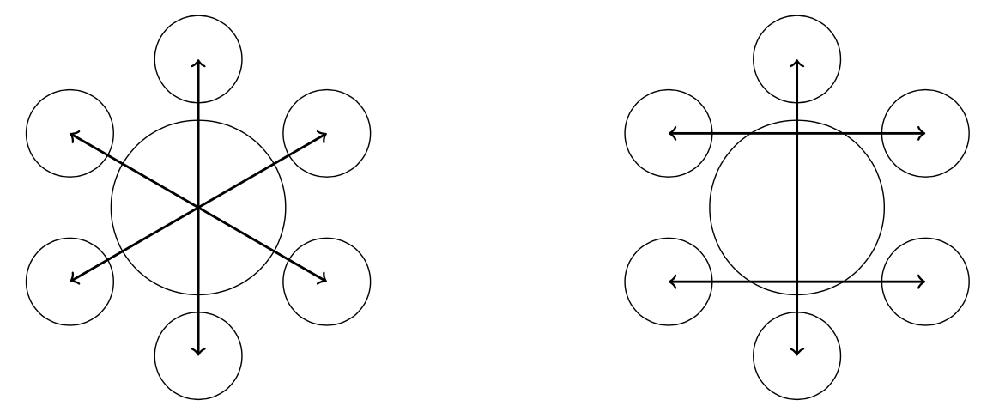

# (APPENDIX) Appendix {-}

# Solutions to Exercises

## Chapter 1 {-}

### Solutions to [Class 1 Exercises] {-}

#### Solution to exercise \@ref(exr:cards40) {-}
In some cases there are multiple different, but equivalent answers. Let $A$ be the event the drawn card shows a "W" and $B$ be the event the drawn card shows a "X". 

1. The event $A\cap B$ is the card show "W" and "X", which cannot occur; that is, $A \cap B = \emptyset\subseteq \Omega$.

2. The event $A^c$ is the outcome the card does not show a "W".


#### Solution to exercise \@ref(exr:dice1) {-}
In this case, $\Omega = \{1, 2, 3, 4, 5, 6\}$. Let $A$ be the event $A=\{2,4\}$ and $B=\{2,4,6\}$; that is, the dice shows an even number. Then $A\subseteq B$; that is, is the event that if the dice shows 2 or 4, then the dice shows an even number.


#### Solution to exercise \@ref(exr:dice2) {-}

1. $E_1 = B \setminus C$.

2. $E_2 = C \setminus B = C \cap A$.

3. $E_3 = D \setminus A = D \cap B = D \cap C$.

4. $E_4 = A \setminus (C \cup D)$.

5. $E_5 = (B \cap C) \setminus D = C \setminus (A \cup D)$.

6. $E_6 = D \setminus B = D \setminus C = A \cap D$.


#### Solution to exercise \@ref(exr:dice3) {-}
The set $\displaystyle\bigcap_{k=1}^n A_k$ is the event that every roll results is a 6. This contains one sample point, namely $\omega = (6,\ldots, 6)$ and
\[
\mathbf{P} \left(
\bigcap_{k=1}^n A_k
\right)
=
\frac{1}{6^n}.
\]


#### Solution to exercise \@ref(exr:integer) {-}
The sample space is $\Omega = \{ 1, 2, \ldots, 50 \}$ and $| \Omega | = 50$. The required event is $A = \{ 12, 24, 36, 48 \}$ with $|A| = 4$. Therefore,
\[
\mathbf{P}(A) = \frac{ |A| }{|\Omega|} = \frac{4}{50} = \frac{2}{25}.
\]


### Solutions to [Class 2 Exercises] {-}

#### Solution to exercise \@ref(exr:twoevents) {-}
This question is an application of Theorem\@ref(thm:propertiesofmeasures) and the principles used in its proof.

1. Observe that $A = (A \cap B) \cup (A \cap B^c)$ with $A\cap B$ and $A \cap B^c$ disjoint. Therefore, using additivity,
\[
\mathbf{P}( A ) = \mathbf{P} ( (A \cap B) \cup (A \cap B^c) ) = \mathbf{P}(A\cap B) + \mathbf{P}(A \cap B^c)
\]
Hence,
\[
\mathbf{P}(A \cap B) = \mathbf{P}(A) - \mathbf{P}(A \cap B^c) = \frac{1}{4} - \frac{1}{10} = \frac{15}{100}.
\]

2. Observe that $B^c = (A^c \cap B^c) \cup (A \cap B^c)$ with the union being disjoint. Then using the same methods as part 1 we have
\[
\mathbf{P}(A^c \cap B^c) = \mathbf{P}(B^c) - \mathbf{P}(A \cap B^c) = 1 - \mathbf{P}(B) - \mathbf{P} (B^c \cap A) = 1 - \frac{8}{10} - \frac{1}{10} = \frac{1}{10}.
\]


#### Solution to \@ref(exr:satprobmeasure) {-}
No. Notice that for disjoint $A$ and $B$
\[
\mathbf{P}(A \cup B) = \left(
\frac{\mbox{area}(A) + \mbox{area}(B)}{\mbox{area}(\Omega)}
\right)^2 \neq \mathbf{P}(A) +  \mathbf{P}(B)
\]


#### Solution to \@ref(exr:equallylikely) {-}
Let $A$ be an event. Then $|A| = k$ for some $k \in \{ 1, 2, \ldots n \}$ and $A$ has the form $A = \{ \omega_{i_1}, \omega_{i_2}, \ldots ,\omega_{i_k}\}$, where $1 \leq i_1 < i_2 < \ldots i_k \leq n$. Then
\[
\mathbf{P}(A) = \mathbf{P} \left( \bigcup_{j=1}^k \{ \omega_{i_j} \} \right) = \sum_{j=1}^k \mathbf{P} ( \{ \omega_{i_j} \} ) = \sum_{j=1}^k \frac{1}{n} = \frac{k}{n} = \frac{| A |}{| \Omega |}.
\]


#### Solution to \@ref(exr:twoevents2) {-}
Since $A \subseteq A \cup B$ we have $1 = \mathbf{P}(A) \leq \mathbf{P} (A \cup B)$. Since $\mathbf{P} (A \cup B) \leq 1$, if follows that $\mathbf{P}(A \cup B) =1$. Furthermore,  
\[
\mathbf{P}(A \cap B) = \mathbf{P}(A) + \mathbf{P}(B) - \mathbf{P}(A \cup B) = 1 + 1 - 1 = 1.
\]


### Solutions to [Class 3 Exercises] {-}

#### Solution to exercise \@ref(exr:tablecoin) {-}
Let $A_1$ be the the event that the coin crosses a horizontal side and $A_2$ the event that the coin crosses a vertical side. Then the probability that the coin will cross a side is $\mathbf{P}(B) = \mathbf{P}(A_1\cup A_2)$. The following diagram illustrates the sample space and the events $A_1$ and $A_2$.

```{r, out.width = "50%", fig.align='center', fig.cap = 'Geometry of the problem', echo=FALSE, fig.pos="H"} 
knitr::include_graphics('images/ST111_C1_Geometric_Probability_Example.png')
```

Note, you can compute $\mathbf{P}(A_1)$, $\mathbf{P}(A_2)$ and $\mathbf{P}(A_1\cap A_2)$ directly and the use $\mathbf{P}(A_1\cup A_2 ) = \mathbf{P}(A_1) + \mathbf{P}(A_2) - \mathbf{P}(A_1 \cap A_2)$. If you take this approach then $\mathbf{P}(A_1) = \dfrac{1}{5}$, $\mathbf{P}(A_2) = \dfrac{1}{10}$, $\mathbf{P}(A_1\cap A_2) = \dfrac{1}{50}$ and thus
\[
\mathbf{P}(A_1 \cup A_2) = \mathbf{P}(A_1) + \mathbf{P}(A_2) - \mathbf{P}(A_1 \cap A_2) = \frac{1}{5} + \frac{1}{10} - \frac{1}{50} = \frac{7}{25}. 
\]


#### Solution to exercise \@ref(exr:newgame) {-}
We may assume that the numbers in the envelops are 1, 2, 3 and 4. Thus, the sample space is $\Omega = \{ (a,b,c,d) \mid a,b,c,d \in \{1,2,3,4\}\mbox{ and } a\neq b\neq c \neq d \neq a\}$. Let $(n_1,n_2,n_3,n_4)$  be such that $\{n_1,n_2,n_3,n_4\} = \{1,2,3,4\}$ and $n_k = i$ if participant $k$ receives the $i$th participant's envelop. (For example, $(2,4,1,3)$ means participant 1 gets the 2nd participant's envelope.)

Let $A_i = \{ (n_1,n_2,n_3,n_4) : n_i = i \}$. Then $A_i$ is the event that participant $i$ receives their envelope. Let 
\[
B = \bigcup_{i = 1,2,3,4} A_i.
\]
This is the event that at least one participant receives their gives, thus we shall determine $B^c$ and then (since $\Omega$ is finite)
\[
\mathbf{P}(B^c) = \frac{|\Omega| - |B|}{|\Omega|}.
\]
Note that the events $A_1$, $A_2$, $A_3$ and $A_4$ are not disjoint, so we use the inclusion--exclusion formula; that is,
\[
|B| = \left(\sum_{i=1}^4 |A_i|\right) - \left(\sum_{1\leq i< j\leq 4} |A_i \cap A_j|\right) + \left(\sum_{1\leq i_1< i_2<i_3\leq 4} |A_{i_1} \cap A_{i_2}\cap A_{i_3}|\right) - |A_1\cap A_2 \cap A_3 \cap A_4|.
\]
We proceed in stages.

- Firstly, $|A_i| = 6$. To see this note that one $n_i$ is fixed leaving 3 terms to vary freely from a selection of three numbers. In total there are 4 sets $A_i$.
- Next, for $i\neq j$, $|A_i \cap A_j | = 2$. (Both $i$ and $j$ are fixed which leaves a choice of 2 prizes for the for 2 people, but as soon as one is selected the final one is forced.). In total there are 6 sets $A_i\cap A_j$. %So by the inclusion-exclusion formula $|A_i \cup A_j| = |A_i| + |A_j| - |A_i \cap A_j| = 6+6-2 = 10$. 
- Note that for $i\neq j\neq k\neq i$ (so $k$ is not equal to $i$ either), $|A_i \cap A_j \cap A_k| = 1$; that is, three of the components of $(n_1,n_2,n_3,n_4)$ are fixed leaving one free to be chosen from a choice of 1 number. There are four sets $A_i \cap A_j \cap A_k$.
- Finally $|A_1\cap A_2 \cap A_3 \cap A_4|=1$.
- Therefore, 
\begin{align*}
|B| &= \left(\sum_{i=1}^4 |A_i|\right) - \left(\sum_{1\leq i< j\leq 4} |A_i \cap A_j|\right) + \left(\sum_{1\leq i_1< i_2<i_3\leq 4} |A_{i_1} \cap A_{i_2}\cap A_{i_3}|\right) - |A_1\cap A_2 \cap A_3 \cap A_4| \\
&= 4\times 6 - 6\times 2 + 4\times 1 - 1 \\
&= 15
\end{align*}
Therefore,  $|B^c| = 24 - 15 = 9$.

Therefore, 
\[
\mathbf{P}(B^c) = \frac{9}{24} = \frac{3}{8}.
\]


### Solutions to [Chapter 1 Consolidation Questions] {-}

#### Solution to exercise \@ref(exr:repeatedroll) {-}
The sample space is $\Omega = \{1, 2, \ldots, 6\}^n$ and contains $6^n$ sample points.
a. Let $A$ be the event that the $n$th roll produces the first 6. Then $A = \{ (\omega_1, \ldots, \omega_{n-1}, 6) \}$, where $\omega_i \in \{ 1, 2, 3, 4, 5 \}$ for $1 \leq i \leq n-1$. Then $|A| = 5^{n-1}$ and 
\[
\mathbf{P}(A) = \frac{|A|}{|\Omega|} = \frac{5^{n-1}}{6^n} = \left( \frac{5}{6} \right)^{n-1}\times\frac{1}{6}.
\] 
b. Let $A = \{ (\omega_1, \ldots, \omega_{n-1}, 6) \}$, where $\omega_i \in \{ 1, 2, 3, 4, 5 \}$ for $1 \leq i \leq n-1$ and there exists $1\leq j \leq n-1$ such that $\omega_j = 5$. Note that $|A| = |A^c|$. That is, $A$ is the event that a 5 arises before a 6, but since the die is fair, the number of ways this occurs must equal the number of ways a 6 occurs before a 5; that is, the event $A^c$. Thus since $\mathbf{P}(A) + \mathbf{P}(A^c) = 1$, $\mathbf{P}(A) = \dfrac{1}{2}$. 


#### Solution to exercise \@ref(exr:fourplayers) {-}
Let $H$ denote the outcome that the coin shows a head and $T$ denote the outcome that the coin shows a tail. 

a. Note that player 1 can only win if the first two tosses are both heads. In this case the sample space is $\Omega = \{H,T\}^2$ and contains $2^2=4$ sample points. Let $A=\{(H,H)\}$ be the event that the first two coin tosses are heads, then
\[
\mathbf{P}(A) = \frac{|E|}{|\Omega|} = \frac{1}{4}.
\]
Therefore, the probability that $P_1$ wins is $\dfrac{1}{4}$.

b. (Summary solution, you should write it out formally). If the first two coin tosses are both heads, then $P_1$ must win. If the first two tosses are both tails, then $P_3$ must win. If the first two tosses are head then tail or tail then head, then either $P_2$ or $P_4$ must win. In all cases and following the same reasoning as above, each probability is $\dfrac{1}{4}$.


#### Solution to exercise \@ref(exr:cardcollection) {-}
The sample space $\Omega$ is all arrangements of $1, 2, \ldots, m$; that is, $\Omega = \{ (a_1,a_2,a_3,a_4,\ldots, a_m) \mid \{a_1,a_2,a_3,a_4,\ldots, a_m\} = \{1,2,3,4,\ldots, m\} \}$. Note $|\Omega | = m!$. Introduce the notation $n_k$, where $n_k = i$ if row position $k$ has the $i$th labelled card. Let $E_i = \{ (n_1,\ldots, n_m) \mid n_i = i \}$. Then $E_i$ is the event the card labelled $i$ is in the $i$th position in the row. We wish to determine 
\[
\mathbf{P} \left( \bigcup_{1\leq i \leq m} E_i \right).
\]
Using the inclusion-exclusion formula gives
\begin{align*}
\mathbf{P} \left( \bigcup_{1\leq i \leq n} E_i \right) &= n\times \frac{1}{n} - {n \choose 2} \times \frac{1}{n(n-1)} + {n \choose 3}\times \frac{1}{n(n-1)(n-2)} - \ldots + (-1)^{m+1}\times \frac{1}{m!} \\
&= 1 - \frac{1}{2!} + \frac{1}{3!} - \ldots + (-1)^{m+1}\frac{1}{m!}.
\end{align*}
To see this in another way. The set $E_{i_1} \cap E_{i_2} \cap \ldots \cap E_{i_k}$ is the event that the cards $i_1, i_2, \ldots, i_k$ are in the correct position. By the fundamental multiplication rule for counting, this can occur in $(m-k)!$ ways. (That is, $k$ cards must return to their original positions leaving $m-k$ cards free to be placed anyway, giving $(m-k)!$ ways.) Since there are $m$ cards we have
\[
\P (E_{i_1} \cap E_{i_2} \cap \ldots \cap E_{i_k}) = \frac{(m - k)!}{m!}.
\]
Furthermore, the summation $\displaystyle \sum_{1\leq i_1 < i_2 < \ldots < i_k \leq m} \P (E_{i_1} \cap E_{i_2} \cap \ldots \cap E_{i_k})$ contains ${m \choose k}$ terms. Therefore,
\[
\sum_{1\leq i_1 < i_2 < \ldots < i_k \leq m} \P (E_{i_1} \cap E_{i_2} \cap \ldots \cap E_{i_k}) = \frac{m!}{(m-k)!k!}\times \frac{(m-k)!}{m!} = \frac{1}{k!}.
\]
So, for example, $P_1 = \frac{1}{1!}$, $P_2 = \frac{1}{2!}$ and so on.


#### Solution to exercise \@ref(exr:largesquare) {-}
This question is very similar to an earlier example and an appropriate diagram is almost identical. For this reason we sketch out the solutions.

a. In this case the the centre of the coin must land in a central square with side lengths $a-2r$. Hence the probability is $\dfrac{(a-2r)^2}{a^2}$.
b. In this case determine the probability of the complementary event; that is, the coin's centre comes to rest in one of the four corner squares with side $r$. Therefore, the require probability is $1 - 4\left( \dfrac{r}{a} \right)^2$.


#### Solution to exercise \@ref(exr:largesquare2) {-}
This question is very similar to an earlier example and an appropriate diagram is almost identical. For this reason we sketch out the solutions.

a. In this case the the centre of the coin must land in a central square with side lengths $a-2r$. Hence the probability is $\dfrac{(a-2r)^2}{a^2}$.

b. In this case determine the probability of the complementary event; that is, the coin's centre comes to rest in one of the four corner squares with side $r$. Therefore, the require probability is $1 - 4\left( \dfrac{r}{a} \right)^2$.


## Chapter 2 {-}

### Solutions to [Class 4 Exercises] {-}

#### Solution to exercise \@ref(exr:finitesets) {-}
Fix an element $x \in A$. There are $m$ choices for $f(x)$. Hence, by the fundamental multiplication rule, the total number of functions from $A$ to $B$ is $m^n$.


#### Solution to exercise \@ref(exr:finitesets2) {-}

1.. Recall, $f$ is injective if $f(x) = f(y)$ implies $x=y$, or equivalently $x\neq y$ implies $f(x) \neq f(y)$. Hence, there are $m \choose n$ choices of the elements of $B$ that elements of $A$ can map to. Each selection of $n$ element of $B$ has $n!$ possible allocations of the image elements of $A$. Therefore, the number of injective functions is 
\[
{m\choose n} n!. 
\]
2. Suppose $m=n$. There are $n!$ allocations of the image elements of $A$. Therefore, the number of surjective functions from $A$ to $B$ is $n!$.


#### Solution to exercise \@ref(exr:paths) {-}
1. A path is described by stating which of the 16 edges it passes along are followed upwards and which are followed rightwards, noting that there must be exactly 8 of each. So paths can be encoded by subsets of $\{1, 2, \ldots , 16\}$ having exactly 8 elements.
There are ${16 \choose 8}= 12870$ such subsets.
2. A path that passes through the centre of the board can be selected by first choosing path from the bottom/left to the centre and then choosing a path from the centre to the top/right. There are ${8 \choose 4} = 70$ possible paths for each of these choices and hence $70^2 = 4900$ paths through the centre. This gives a probability of $\dfrac{4900}{12870} \approx  0.38$.


### Solutions to [Class 5 Exercises] {-}

#### Solution to exercise \@ref(exr:twins) {-}
As with all questions of this type, there are many different correct solutions. A clear argument is key in all cases.

1. In this case call the teams A and B. For each pair of twins, make a choice as to which one goes into team A. The membership of team B is then forced. The total number of outcomes is $2^6$. However, we do not care which is team A and which is team B, so each possible division of the players into two sides of size 6 has happened twice (with the roles of A and B swapped). The correct answer is then $\frac{2^6}{2} = 2^5 = 32$.
2. In this case call the teams A, B and C. Suppose the teacher makes a selection for team A first. Initially there are 12 choices, once the teacher has selected one twin for team A there are 10 choices for the next member of team A, then 8 and finally 6. However, the order in which these choices are made does not matter. So, the number of ways of forming team A is
\[
\frac{12 \times 10 \times 8 \times 6}{4\times 3 \times 2 \times 1} = 240.
\]
Now, move onto team B. Once team A is formed there are four pairs of twins whose twin is already in team A and there are two pairs neither of which have been selected. To ensure that team C avoids putting any pair of twins into the same team, the teacher must select one twin from each of the two remaining pairs and 2 of the twins from the other 4 pairs. There are $2^2$ ways of selecting one twin from each of the two remaining pairs and ${4\choose 2}$ ways of selecting two twins from the other 4 pairs, so there are
\[
2^2 \times {4\choose 2} = 2^2\times 6 = 24
\]
ways to form team B. 

Once the selection for team B is made, team C is forced. 

Finally we must remember, as we did in the first part, that the team A, B and C are not specified and our method counts each division into three teams $3! = 6$ times. Therefore, the number of ways the class tutor can divide the twins into three teams of four is
\[
\frac{240\times 24}{6} = 960.
\]
(There are lots of other arguments for this question.)


#### Solution to exercise \@ref(exr:gardenparty) {-}
We sketch out the key points

1. Let $T^i_1$ and $T^i_2$ denote the individuals in twin pair $i$, where $i=1,2,3$. Place $T^1_1$ in any seat, then there are $5!=120$ ways to place the remaining individuals. If each twin sits next to each other, then $T^1_2$ can sit in two seats. There are then four choices for who sits next to $T^1_2$. There are then two choices for the person opposite $T^1_1$, with the final choice forced. Therefore, there are $2\times 4\times 2 = 16$ ways for each twin to sit next to each other. Therefore, the probability is $\dfrac{16}{120} = \dfrac{2}{15}$.
2. For the moment, assume that $T^1_1$ and $T^1_2$ are not siting next to each other and the two remaining twins are sitting next to each other. Place $T_1^1$ in a seat, then to ensure the second condition there must be a gap of 2 to both the left and right of $T_1^1$; that is, $T_2^1$ is sat opposite $T_1^1$ and one pair sits to the left and the other to the right. There are two choices for how the pair of twins sat opposite are arranged. There are two choices for which pair of twins goes on the left/right. Finally, there are two choices for how an individual pair of twins arrange themselves once sat next to each other. Therefore, there are $2\times2\times 2 = 8$ ways to seat the twins with $T^1_1$ and $T^1_2$ separated, so overall there are $3\times 8=24$ ways in which one pair of twins are separated. Thus the probability is
\[
\frac{24}{120} = \frac{1}{5}.
\] 
3. There are two approaches: find the probability directly or find the probability that exactly one pair of twins sit next to each other. We have seen the complementary event used, so we compute the probability directly, you may wish to use the complementary events. If no twins sit next to each other, then there are two possible configurations, see Figure \@ref(fig:config).

```{r config, out.width = "50%", fig.align='center', fig.cap = 'Twin configuration', echo=FALSE, fig.pos="H"}

```

In the first case, fix one of the twins, $T_1^1$ say, then there are $2\times2\times 2= 8$ ways to arranging the twins with $T_1^1$ fixed. A different choice of $T_1^1$ just produces a rotation of one of the stated 8 configurations and thus there are no further configurations. In the second case, the cases are not symmetrical. If $T_1^1$ is in the `top' seat, then there are 8 ways to seat the other twins. Since there are three choices for which pair of twins sit opposite each other, there are $3\times 8 = 24$ arrangements. Therefore, the probability is
\[
\frac{8+24}{120} = \frac{4}{15}.
\]


#### Solution to exercise \@ref(exr:internships) {-}

1. Let $\Omega = \{ 1, 2, \ldots, N\}$. Here $1$ is the highest rank and $N$ the lowest rank of the $N$ individuals after stage 1. Let $A=\{ \omega_1, \omega_2,\ldots,\omega_n\mid \omega_i = 1\mbox{ for some} i\}$ be the event that the $i$th individual in the first $n$ individuals has rank 1. There are $n$ elements in $A$, so
\[
\mathbf{P}(A) = \frac{n}{N}.
\]
2. Let $A_1$ be the event the highest ranked individual is among the first $n$ selected. Let $A_2$ be the event the second-highest ranked individual is among the first $n$ selected. Then $A_1 \cup A_2$ is the event that the highest ranked individual in this group of $n$ individuals is the overall highest or second-highest ranked from stage 1. Now $\mathbf{P}(A_1 \cup A_2) = \mathbf{P}(A_1) + \mathbf{P}(A_2) - \mathbf{P}(A_1 \cap A_2)$. Thus
\[
\mathbf{P}(A_1 \cup A_2) = \frac{{N-1 \choose n-1}}{{N \choose n}} + \frac{{N-1 \choose n-1}}{{N \choose n}} - \frac{{N-2 \choose n-2}}{{N \choose n}} = \frac{(2N - n - 1)n}{N(N-1)}.
\]


### Solutions to [Class 6 Exercises] {-}

#### Solution to exercise \@ref(exr:die8) {-}
In each toss of a fair die, there are 6 possible outcomes. Hence, by the fundamental multiplication rule, the total number of outcomes is equal to $6^8$. The number of outcomes that have exactly three 1’s, two 2’s and three 5’s is equal to
\[
{8 \choose 3}{5\choose 2}.
\]
Since all outcomes are equally likely, the probability of obtaining exactly three 1's, two 2's and three 5's is
\[
\frac{{8 \choose 3}{5\choose 2}}{6^8} = \frac{ \frac{8!}{3!3!2!}}{6^8}.
\]


#### Solution to exercise \@ref(exr:rolldie) {-}

1. Let $\Omega$ be the sample space. Then 
\[
\Omega = \{ (i,j) : 1\leq i,j \leq 6 \} = \{ 1,2,3,4,5,6\}^2.
\]
Note that $| \Omega | = 6\times 6 = 36$. By the fundamental multiplication rule, the number of outcomes with different scores on two dice is $6\times 5$. Therefore, the probability of the event that the score in two throws are different is equal to 
\[
\frac{6\times 5}{6\times 6} = \frac{5}{6}.
\]

2. Let $\Omega$ denote the sample space. Then 
\[
\Omega = \{ (i,j,k) : 1 \leq ij,k \leq 6 \} = \{ 1,2,3,4,5,6 \}^3
\]
Note that $| \Omega | = 6^3 = 216$. By the fundamental multiplication rule, the number of outcomes with different scores on three dice is $6\times 5\times 4$. Therefore, the probability of the event that the score in two throws are different is equal to 
\[
\frac{6\times 5\times 4}{6\times 6\times 6} = \frac{5}{9}.
\]


#### Solution to exercise \@ref(exr:books6) {-}
Let $A$, $B$ and $C$ be the events
\begin{align*}
A &= \{ \mbox{the two selected books are on the same subject} \}, \\
B &= \{ \mbox{the two selected books are art books} \}, \\
C &= \{ \mbox{the two chosen books are mathematics books} \}, \\
\end{align*}
Then,

1. We have
\[
\mathbf{P}(A) = \mathbf{P}(B) + \mathbf{P}(C) = \frac{ { 3\choose 2 } }{ {6 \choose 2} } + \frac{ {2\choose 2} }{ {6 \choose 2} } = \frac{4}{15}.
\]

2. Next 
\[
\mathbf{P}(A^c) = 1 - \mathbf{P}(A) = 1 - \frac{4}{15} = \frac{11}{15}.
\]


#### Solution to exercise \@ref(exr:social) {-}

1. Let $A_i$, $i=1, \ldots n$ denote the event that the $i$th individual selects their own mobile phone. The event that at least one individual selects their own mobile phone is 
\[
E = \bigcup_{i=1}^{n} A_i.
\]
By the inclusion-exclusion formula
\[
\mathbf{P} \left( E = \bigcup_{i=1}^{n} A_i\right) = P_1 - P_2 + P_3 - \ldots + (-1)^{n+1}P_n
\]
where for $1\leq k \leq n$
\[
P_k = \sum_{1\leq i_1 < i_2 < \ldots < i_k \leq n} \mathbf{P} (A_{i_1} \cap A_{i_2} \cap \ldots \cap A_{i_k}) 
\]
In this case, $A_{i_1} \cap A_{i_2} \cap \ldots \cap A_{i_k}$ is the event that the individuals $i_1, i_2, \ldots, i_k$ select their own mobile phone. By the fundamental multiplication rule for counting, this can occur in $(n-k)!$ ways. Since there are $n$ individual we have
\[
\mathbf{P} (A_{i_1} \cap A_{i_2} \cap \ldots \cap A_{i_k}) = \frac{(n - k)!}{n!}.
\]
Furthermore, the summation $\displaystyle \sum_{1\leq i_1 < i_2 < \ldots < i_k \leq n} \mathbf{P} (A_{i_1} \cap A_{i_2} \cap \ldots \cap A_{i_k})$ contains $\displaystyle {n\choose k}$ terms. Therefore,
\[
\sum_{1\leq i_1 < i_2 < \ldots < i_k \leq n} \mathbf{P} (A_{i_1} \cap A_{i_2} \cap \ldots \cap A_{i_k}) = \frac{n!}{(n-k)!k!}\times \frac{(n-k)!}{n!} = \frac{1}{k!}.
\]
Therefore, $P_k = \frac{1}{k!}$ and
\[
L (n) = \mathbf{P} \left( \bigcup_{i=1}^{n} A_i\right) = P_1 - P_2 + P_3 - \ldots + (-1)^{n+1}P_n = 1 - \frac{1}{2!} + \frac{1}{3!} - \ldots + (-1)^{n+1}\frac{1}{n!}.
\]

2. Note that as $n\rightarrow \infty$, $1 - L(n) \rightarrow e^{-1}$. Therefore, $L(n) \rightarrow 1 - e^{-1}$ as $n\rightarrow \infty$. (This is approximately 0.63.)


#### Solution to exercise \@ref(exr:coin100) {-}

1. We have
\[
E=\bigcup_{i=1}^{91 } A_i.
\]

2. We have $|A_i| =2^{90}$, because the results of $10$ tosses are fixed if $A_i$ occurs and $90$ remain that can be either head or tails. Thus ${\mathbf P}( A_i)= 2^{90}/ 2^{100}=(1/2)^{10}$. Then using the upper bound on the probability from the class
\[
 {\mathbf P}\left( \bigcup_{i=1}^{91} A_i\right) \leq \sum_{i=1}^{91} {\mathbf P}(A_i)
\] 
gives the desired result.


3. Note that if $i <j \leq i+10$ then $|B_i \cap B_j|=0$ because   for this event to occur the result of the $j$th toss needs to be both a head and tail. If, on the otherhand $j > i+10$, then   ${\mathbf P}( B_i \cap B_j)= (1/2)^{22}$. To make use of the lower bound from the class we need to count how many pairs  $(i,j)$ there are  with $j > i+10$.  For each $1\leq i \leq 79$ there are $80-i$ choices of $j$  ($j$ can range from $i+11$ to $90$)  giving $1+2+3+\ldots + 79= 79\times80/2= 3160$ pairs in total.  
Now 
\begin{align*}
{\mathbf P}(E) &\geq {\mathbf P}\left( \bigcup_{i=1}^{90} B_i\right) \\
&\geq \sum_{i=1}^{90} {\mathbf P}(B_i)- 
\sum_{1\leq i<j\leq 90} {\mathbf P}(B_i\cap B_j) 
\\
&=
90 \times (1/2)^{11} - 3160 \times (1/2)^{22}.
\end{align*}
which is about 0.0432.

4. The lower bound  we obtain  using $A_i$ is 
\[
{\mathbf P}(E) \geq \sum_{i=1}^{91} {\mathbf P}(A_i)- 
\sum_{1\leq i<j\leq 91} {\mathbf P}(A_i\cap A_j)
\]
But ${\mathbf P}(A_i\cap A_{i+1})= 2^{-11}$  ,  ${\mathbf P}(A_i\cap A_{i+2})= 2^{-12}$ etc, and if $j > i+9$ then ${\mathbf P}(A_i\cap A_{j})= 2^{-20}$.  There are $3321$    pairs  $(i,j)$   with $j > i+9$  so the lower bound is 
\[
91.2^{-10}- 90.2^{-11} - 89.2^{-12}- 88.2^{-13}- 87.2^{-14}- 86.2^{-15} - 85.2^{-16} -84.2^{-17}- 83.2^{-18} - 82.2^{-19}-3321.2^{-20}<0,
\]
which is useless since probabilities are always non-negative.


### Solutions to [Chapter 2 Consolidation Questions]

#### Solution to exercise \@ref(exr:smalltown) {-}
Before you sneak down to look at the answer, try this simplified version

**Simplified version**. Let's consider a simplified version that we can do directly. There are 5 voters, and the winner (W) gets 3 votes and loser (L) gets 2 votes; that is n=3 and m=2. There are ten possibilities for the order of the votes, explicitly
 
- WWWLL
- WWLLW 
- WLLWW
- LLWWW 
- WWLWL
- WLWLW 
- LWLWW 
- WLWWL
- LWWLW 
- LWWWL 
 
Now the winner must always be strictly ahead of the loser. This leaves the following possibilities WWWLL and WWLWL. This gives a probability of 2/10 or 1/5. Now, it is true that 6 of the 10 sequences start with W and only 4 start with L. But this is not what matters, it is the fact there are the same number of sequences that tie: 4 start with L and 4 start with W. It is these sequences that are equally likely to occur and help us solve this problem.

**Sketch.** A sketch answer of the main points is as follows.

1. We may consider vote counting as a path on a rectangular grid (like the chess board example) from $(0,0)$ to $(100,80)$. Label the winning candidate $A$ and the second-placed candidate $B$. Starting from $(0,0)$, each time a vote for $A$ is counted we move one step to the right and each time a vote for $B$ is counted we move one step up, eventually reaching the point (100,80). 
   Let $D = \{(i,i) \mid i \in \{1, \ldots,80\}\}$ be the set of vertices on the diagonal excluding the origin. If $A$ stays ahead of $B$ throughout the ballot counting, then the corresponding path must not include any points on or above this diagonal. We will call a path **non-favourable** if it describes a ballot counting configuration where $A$ does not stay ahead of $B$.

   Consider the first move to either $(0,1)$ or $(1,0)$. If the move is upwards to $(0,1)$ ($B$ gets a vote), then the path is non-favourable. If the move is to the right to (1,0) ($A$ gets a vote), then the path is non-favourable if in one of the following steps it visits a vertex in the set $D$. Using reflection, we can create a one-to-one correspondence between a non-favourable path that goes through $(1,0)$, say Path 1, and one that goes through $(0,1)$, call it Path 2. Let $P$ be the first vertex in $D$ visited by Path 1. Simply reflect the section of Path 1 from the origin to $P$ through the diagonal (draw a quick diagram).  As this establishes a one-to-one correspondence between non-favourable paths visiting (1,0) and paths visiting (0,1), there must be an equal number of such paths.

   The total number of paths is ${180\choose 80}$ (or ${180\choose 100}$) which are equally likely. There are ${179\choose 79}$ paths from $(0,0)$ to $(100,80)$ that go through $(1,0)$. As any non-favourable path either visits $(1,0)$ or $(0,1)$, but not both, and there are as many non-favourable paths visiting $(1,0)$ as there are visiting $(0,1)$, it follows that the probability of a non-favourable path occurring is
\begin{align*}
\mathbf{P}(\mbox{non-favourable}) &= \mathbf{P}(\mbox{non-favourable visits (0,1)}) + \mathbf{P}(\mbox{non-favourable visits (1,0)}) \\
&= 2\mathbf{P}(\mbox{non-favourable visits (1,0)}) \\
&= 2\times\frac{{179\choose 79}}{{180\choose 80}} \\
&= 2\times \frac{160}{180} = \frac{8}{9}.
\end{align*}
   Therefore, the probability that $A$ stays ahead of $B$ is $1-\dfrac{8}{9} = \dfrac{1}{9}$.
2. Using exactly the same argument and extending it to the given general cases gives the required probability as 
\[
\frac{1 - \frac{m}{n}}{1 + \frac{m}{n}}.
\]
Notice how the result from our simplified version satisfies 
\[
\frac{1 - \frac{2}{3}}{1 + \frac{2}{3} } = \frac{3 -2}{3 + 2} = \frac{1}{5}, 
\] 
which agrees with our result.

**Alternative.** Let's look at the problem on the grid, or you can just think of it abstractly. For W (winner) to be strictly ahead of L (loser) throughout the counting process there must be no ties. We know that any sequence that starts with an L must reach a tie at some point; W eventually wins. For any sequence that begins with W and reaches a tie, now switch the W and Ls to obtain a sequence that starts with an L (and hence a sequence that we know must also tie). Therefore, every sequence that begins with a W and reaches a tie is in a one-to-one correspondence (bijection) with a sequence that begins with an L. The probability that a sequence starts with a L is 
\[
\frac{m}{n + m}.
\]
As noted any sequence that starts with L must tie and corresponds to a sequence starts with W and ties. Let A be the event that a tie occurs. Then A is the disjoint union of the event that the sequence starts with W and ties (call this B) and the event that the sequence starts with L and ties (call this C). As argued above, 
\[
\mathbf{P}(B) = \mathbf{P}(C)  = \frac{m}{n + m}.
\]
Hence, the probability that W always leads is (sorry for the abused notation, forgive me)
\begin{align*}
1 - \mathbf{P}(A)  &= 1 - \mathbf{P}(B\cup C) \\
&= 1 - (\mathbf{P}(B) + \mathbf{P}(C) )  \\
&= 1 - 2 \frac{m}{n + m} \\
&= \frac{n+ m - 2m}{n + m} \\
&= \frac{n - m}{n + m}.
\end{align*}
This agrees with our generalised result. 


#### Solution to exercise \@ref(exr:statdep) {-}
A sketch answer of the main points is as follows.

This is sampling without replacement. Label the row positions 1 to $n$. There are $n!$ different sequences. 

1. There are $r$ different selection for student in position 1 and $r-1$ different selections for the student in position $n$. There are $(n-2)!$ arrangements for the remaining positions from 2 to $n-1$ all of which generate equivalent arrangements. Therefore, the probability is
\[
\frac{r(r-1)(n-2)!}{n!} = \frac{r(r-1)}{n(n-1)}.
\]

2. Imagine the tennis players as one block of $r$ students. This block of $r$ leaves $n-r+1$ unallocated places (don't forget the end points, so for $n=4$, $r=2$ we have 3 places where we can insert the block of $r=2$ tennis players: either end or the middle.). There are $r!$ arrangements for the tennis players in their block. There are $(n-r+1)!$ different arrangements for the non-tennis playing students and $r!$  Therefore, the probability is
\[
\frac{(n - r + 1)!r!}{n!} = \frac{n - r + 1}{{n\choose n-r}}.
\]

3. Imagine the non-tennis players lined up next to each other. This process leaves $n-r +1$ slots into which we can insert the tennis players (don't forget the ends). We shall need to distinguish two cases, where there are sufficient gaps for the tennis players and when there are not. In order to have sufficient gaps we require $n-r+1\geq r$; that is, $n+1 \geq 2r$. If this condition fails, then there are insufficient gaps and the probability is 0. Now suppose $n+1 \geq 2r$, there are
\[
{n-r+1\choose r}
\]
ways to place the $r$ tennis players, but the tennis players can be in any one of $r!$ possible ways, giving
\[
{n-r+1\choose r}r! = \frac{(n - r + 1)!}{(n-r + 1 - r)!} = \frac{(n - r + 1)!}{(n - 2r + 1)!}
\]
Note, this is only defined for $n+1 \geq 2r$.  There are $(n-r)!$ ways to arrange the non-tennis players. Therefore, the probability is
\[
\frac{\frac{(n - r + 1)!}{(n - 2r + 1)!}\times (n-r)!}{n!} = \frac{ (n-r+1)!(n-r)!}{n!(n-2r+1)!}
\]
(Note this second probability is only defined when $n+1 \geq 2r$ as expected.)


#### Solution to exercise \@ref(exr:nballs) {-}
A sketch answer of the main points is as follows.

The claim is that whichever five balls are selected, it is always possible to choose three of them so that the sum of the numbers on these three balls is a multiple of 3 and therefore the probability is 1.

Any integer has the form $3k$, $3k + 1$ or $3k + 2$, for some integer $k$; that is, any integer leaves a remainder 0, 1 or 2 when divided by 3. We know that given two integers $a$ and $b$ their sum $a+b$ is a multiple of 3 if, and only if, the sum of their remainders is divisible by 3. So, any selection of five balls will result in a collection of five different positive integers, each of these different integers will leave remainder 0, 1 or 2 when divided by 3. There are now cases to consider.

1. Suppose three of the balls have the same remainder, then their sum will be divisible by 3 and we are done. 

2. If three of the balls do not have the same remainder, then there must exist three balls with different remainders. (There can be at most two balls with identical remainder, there are five balls and three potential remainders meaning there must be at least one of each remainder.) That is, there is a pair of integers with remainder $x$, a pair of integers with remainder $y$ and a remaining integer with remainder $z$, where $x$, $y$ and $z$ are 0, 1 and 2 in some order. This means there are three balls which leave remainder 0, 1 and 2 when divide by 3 and so their sum will be divisible by 3.

Hence, in either case, we have a choice of three of the five balls who sum is a multiple of 3. Therefore, the probability is 1.


#### Solution to exercise \@ref(exr:integers) {-}
We have
\begin{align*}
f(k_1) &= \frac{{n_1 \choose k_1}{N-n_2 \choose k-k_2}}{{N \choose k}} \\
&= \frac{ n_1! }{ k_1! (n_1 - k_1)! }\frac{ (n - n_1)! }{ (k - k_1)! (n - n_1 - (k - k_1)!} \frac{k! (n - k)!}{n!}\\% correct
&= {k \choose k_1} \frac{ n_1! }{ (n_1 - k_1)! }\frac{ (n - n_1)! }{ (n - n_1 - (k - k_1)!} \frac{(n - k)!}{n!}\\% correct
&= {k \choose k_1} \frac{\frac{ n_1! }{ (n_1 - k_1)! } }{\frac{n!}{(n - k_1)!}} \frac{(n - n_1)!(n - k)!}{(n - k_1)! (n - n_1 - (k - k_1))!}\\%correct
&= {k\choose k_1} \frac{\frac{ n_1! }{ (n_1 - k_1)! } }{\frac{n!}{(n - k_1)!}} \frac{ \frac{( n - n_1)!}{(n - n_1 - (k - k_1))!}}{ (n - k + (k - k_1))!}{(n - k)!}\\%complete
&= {k\choose k_1} \prod_{i=1}^{k_1} \frac{ n_1 -k + i }{n - k_1 + i} \prod_{j=1}^{k - k_1} \frac{ n - n_1 - (k - k_1) + j)}{n - k + j}\\% complete 
\end{align*}
For large $n$ with $p$ fixed, 
\[
\frac{ n_1 -k + i }{n - k_1 + i} \approx p\quad\mbox{and}\quad \frac{ n - n_1 - (k - k_1) + j)}{n - k + j} \approx 1 - p.
\]
Therefore,
\[
f(k_1) = {k\choose k_1} \prod_{i=1}^{k_1} \frac{ n_1 -k + i }{n - k_1 + i} \prod_{j=1}^{n - k_1} \frac{ n - n_1 - (k - k_1) + j)}{n - k + j}
\approx {k\choose k_1} p^{k_1} (1-p)^{k - k_1}.
\]


